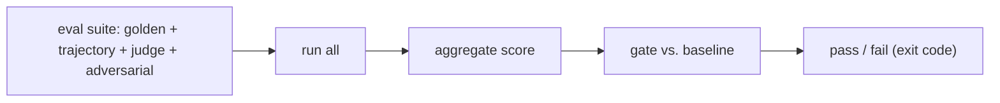

# Use it: an eval harness you run on every change

> **Motto** — One command runs golden, trajectory, judge, and adversarial evals and gates the result.

*Part of Phase 15 — Evals & Testing the Harness. Completes the phase.*

## The Problem

The pieces (golden, trajectory, judge, adversarial, gate) are only useful assembled into one
**eval harness** you run with a single command — locally before a change and in CI to block
regressions. This is the productized form of the phase: `run_evals()` → an aggregate score
and a pass/fail you can wire into the same workflow as your tests.

## The Concept



## Build It / Use It

`code/eval_harness.py` composes the phase into one runnable suite:

```python
def run_evals(suites):
    """suites: {name: callable()->score 0..1}. Returns aggregate + per-suite."""
    scores = {name: fn() for name, fn in suites.items()}
    agg = sum(scores.values()) / len(scores)
    return {"aggregate": round(agg, 3), "suites": scores}

def gate(current, baseline, tol=0.02):
    return current >= baseline - tol
```

```python
suites = {
    "golden": lambda: 0.92,
    "trajectory": lambda: 1.0,
    "adversarial": lambda: 1.0,
}
report = run_evals(suites)
print(report, "PASS" if gate(report["aggregate"], 0.93) else "FAIL")
```

In a real setup each suite runs the actual cases from lessons 01–05; `run_evals` aggregates
and `gate` (lesson 04) turns it into a CI pass/fail.

## Use It

Add `python eval_harness.py` to your CI next to the tests, and run it locally before changing
`CLAUDE.md`, a skill, a tool, or the model. For a Claude Code / Codex user this closes the
loop the whole course has been building toward: you change the harness, the evals tell you —
with a number and a gate — whether it got better or worse. Evals are how harness engineering
stays engineering.

## Ship It

[`code/eval_harness.py`](../../06-eval-harness/code/eval_harness.py) — a one-command eval suite
+ gate.

## Check Yourself

**Q1.** What does the eval harness produce?

- A) a longer prompt
- B) an aggregate score + per-suite breakdown + a pass/fail gate
- C) a new model
- D) nothing

<details><summary>Answer</summary>B — measure, aggregate, gate.</details>

**Q2.** When should you run it?

- A) never
- B) locally before a harness change and in CI to block regressions
- C) only at release
- D) once

<details><summary>Answer</summary>B — every change, automatically.</details>

**Challenge.** Wire the real lesson 01–05 runners into `suites`, store the baseline in the
repo, and add it as a required CI check (Phase 18).

## Related

- Builds on: the whole phase
- Wired into CI in: Phase 18 — Production & Deployment
- Phase complete → next: Phase 16 — [Observability & Cost](../../../../ROADMAP.md)
- [Roadmap](../../../../ROADMAP.md)
