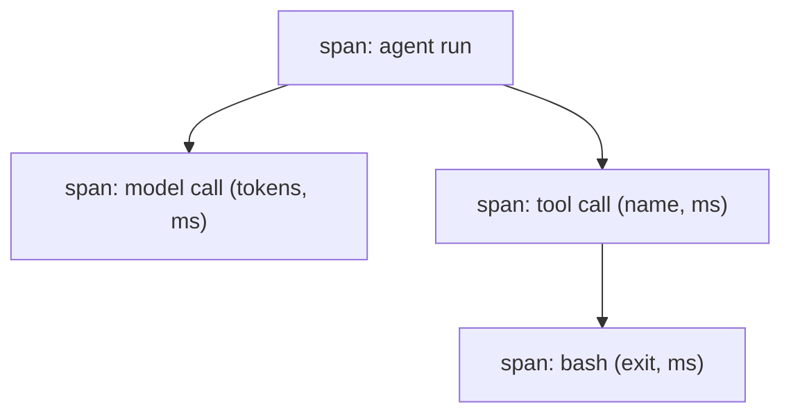

# Tracing & spans for an agent

> **Motto** — A trace is the agent's flight recorder: nested spans for every call, timed and tagged.

*Part of Phase 16 — Observability & Cost.*

## The Problem

When an agent run goes wrong — slow, expensive, wrong answer — you need to see *what
happened*: which steps ran, how long each took, what each model/tool call did. Without
**tracing** you're debugging blind. A trace records a tree of **spans** (the loop, each
model call, each tool call), each with a start/end time and attributes (tokens, tool name),
so you can reconstruct and diagnose any run.

## The Concept



Spans nest (a tool span inside the run span), each carrying timing + attributes — the same
model as distributed tracing, applied to an agent loop.

## Build It

`code/tracing.py` — a minimal nested-span tracer (a context manager):

```python
import time
from contextlib import contextmanager

class Tracer:
    def __init__(self):
        self.spans = []
        self._stack = []

    @contextmanager
    def span(self, name, **attrs):
        rec = {"name": name, "attrs": attrs, "children": [], "ms": None}
        (self._stack[-1]["children"] if self._stack else self.spans).append(rec)
        self._stack.append(rec)
        start = time.perf_counter()
        try:
            yield rec
        finally:
            rec["ms"] = round((time.perf_counter() - start) * 1000, 1)
            self._stack.pop()
```

```python
t = Tracer()
with t.span("run"):
    with t.span("model_call", tokens=120):
        pass
    with t.span("tool_call", tool="bash"):
        pass
print(t.spans[0]["name"], "->", [c["name"] for c in t.spans[0]["children"]])
```

The tracer builds a tree you can render or export: each span knows its duration and
attributes, so "why was this run slow?" becomes "which span dominated the time?".

## Use It

Claude Code / Codex (and the Agent SDK) emit traces/telemetry you can inspect; for a custom
harness you wrap each model and tool call in a span. Trajectory evals (Phase 15) run over
these traces. In production you export spans to a backend (lesson 05) so every run is
diagnosable after the fact.

## Ship It

[`code/tracing.py`](../../01-tracing/code/tracing.py) — a nested-span tracer.

## Check Yourself

**Q1.** What is a span?

- A) the whole conversation
- B) a timed, attributed unit of work (a model/tool call) that nests into a trace tree
- C) a token
- D) a prompt

<details><summary>Answer</summary>B — the building block of a trace.</details>

**Q2.** Why trace an agent run?

- A) for fun
- B) to reconstruct and diagnose what happened (slow/expensive/wrong) after the fact
- C) to slow it down
- D) no reason

<details><summary>Answer</summary>B — observability enables diagnosis.</details>

**Challenge.** Add a `render()` that prints the span tree indented with durations, so a slow
run shows at a glance which span dominated.

## Related

- Builds on: Phase 2 — [The Agent Loop](../../../02-the-agent-loop/01-agent-loop/docs/en.md)
- Next: [Token & cost accounting](../../02-cost-accounting/docs/en.md)
- Used by: Phase 15 — trajectory evals
- [Roadmap](../../../../ROADMAP.md)
