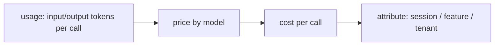

# Token & cost accounting

> **Motto** — Every call has a price — attribute it per session, feature, and tenant.

*Part of Phase 16 — Observability & Cost.*

## The Problem

Agents spend money per token, and a coding agent can burn a lot. Without **cost accounting**
you can't answer "what did this run cost?", "which feature is expensive?", or "is this tenant
profitable?" — and you can't enforce budgets (Phase 14) meaningfully. The harness must
convert token usage into dollars and attribute it along the dimensions you care about.

## The Concept



Pricing is per-model and per-direction (input vs. output, plus cache reads); attribution tags
each cost with who/what it was for.

## Build It

`code/cost.py` — a cost accountant with per-model pricing and attribution:

```python
PRICES = {  # USD per 1M tokens (illustrative — verify current pricing)
    "claude-opus-4-8": {"in": 5.0, "out": 25.0},
    "claude-haiku-4-5-20251001": {"in": 0.8, "out": 4.0},
}

class CostMeter:
    def __init__(self):
        self.by_tag = {}

    def record(self, model, in_tokens, out_tokens, tag="default"):
        p = PRICES[model]
        cost = (in_tokens * p["in"] + out_tokens * p["out"]) / 1_000_000
        self.by_tag[tag] = self.by_tag.get(tag, 0.0) + cost
        return cost

    def report(self):
        return {tag: round(c, 6) for tag, c in self.by_tag.items()}
```

```python
m = CostMeter()
m.record("claude-opus-4-8", 10_000, 2_000, tag="feature:refactor")
m.record("claude-haiku-4-5-20251001", 50_000, 5_000, tag="feature:search")
print(m.report())     # cost attributed per feature
```

Tagging each `record` lets you slice spend by feature/session/tenant — the input to pricing
decisions and per-tenant budgets.

## Use It

The SDK returns real `usage` (input/output/cache tokens) on every response; feed it to a
meter like this, tagged by the session/feature/tenant. For a Claude Code / Codex user this is
why long autonomous runs cost what they do, and why model routing (Phase 14) matters — a
cheaper model on routine work is a direct line-item saving. Always verify current prices.

## Ship It

[`code/cost.py`](../../02-cost-accounting/code/cost.py) — a token→cost meter with attribution.

## Check Yourself

**Q1.** Cost depends on…

- A) total tokens only
- B) model + direction (input vs. output, cache reads), times token counts
- C) wall-clock time
- D) number of tools

<details><summary>Answer</summary>B — per-model, per-direction pricing.</details>

**Q2.** Why attribute cost by tag (feature/tenant)?

- A) decoration
- B) to answer which feature/tenant is expensive and enforce per-tenant budgets
- C) it's required
- D) no reason

<details><summary>Answer</summary>B — attribution drives pricing and budgets.</details>

**Challenge.** Add cache-read pricing (cheaper than fresh input) and show the savings when a
big stable prefix is cached (Phase 1 L8).

## Related

- Builds on: Phase 1 — [Tokens](../../../01-llm-io-foundations/02-tokens-and-context-window/docs/en.md), Phase 14 — [Budgets](../../../14-reliability-engineering/04-budgets/docs/en.md)
- Next: [Latency](../../03-latency/docs/en.md)
- Other tracks: [Cost attribution](../../../../../content/04-evals-observability/cost-attribution.md) · [Incidents & postmortems](../../../../../technical-product-management/incidents-and-postmortems.md) — attributing spend and operating what you measure.
- [Roadmap](../../../../ROADMAP.md)
