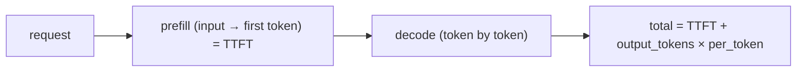

# Latency: prefill vs. decode, TTFT

> **Motto** — Latency has two halves: time to the first token, then time per token after.

*Part of Phase 16 — Observability & Cost.*

## The Problem

"The agent feels slow" is not actionable. Model latency decomposes into **prefill** (process
the input → produce the first token, measured as **TTFT**, time-to-first-token) and **decode**
(generate each subsequent token). Long input → slow prefill; long output → slow decode.
Measuring them separately tells you whether to trim context or shorten output — different
fixes.

## The Concept



Big context inflates TTFT (and is why prompt caching, Phase 1 L8, helps); long generations
inflate decode (and is why streaming, Phase 1 L4, improves *perceived* latency).

## Build It

`code/latency.py` — measure TTFT vs. total from a (simulated) streamed call:

```python
import time

def measure(stream, now=time.perf_counter):
    start = now()
    ttft = None
    tokens = 0
    for _ in stream:
        if ttft is None:
            ttft = now() - start          # first token arrived
        tokens += 1
    total = now() - start
    decode = total - (ttft or 0)
    return {"ttft_s": round(ttft or 0, 4), "total_s": round(total, 4),
            "tokens": tokens,
            "per_token_ms": round(decode / max(tokens - 1, 1) * 1000, 2)}
```

```python
def fake_stream():
    time.sleep(0.05)            # prefill
    for _ in range(5):
        time.sleep(0.01)        # decode per token
        yield "tok"
print(measure(fake_stream()))   # ttft ~0.05s, then ~10ms/token
```

Now "slow" is quantified: a high TTFT points at input size (trim context / cache); a high
per-token points at output length (shorten / stream).

## Use It

The SDK's streaming API (Phase 1 L4) is how you observe TTFT in practice — first delta = TTFT.
For a Claude Code / Codex user, streaming makes long generations *feel* fast even when total
latency is high, and a lean, cached context keeps TTFT low. Track p50/p95 TTFT and total in
your traces (lesson 01) to catch latency regressions.

## Ship It

[`code/latency.py`](../../03-latency/code/latency.py) — a TTFT / decode latency meter over a
stream.

## Check Yourself

**Q1.** A high TTFT points at…

- A) output length
- B) input size / prefill — trim context or use caching
- C) the network only
- D) nothing

<details><summary>Answer</summary>B — prefill dominates TTFT; shrink/cache input.</details>

**Q2.** Streaming improves…

- A) total latency
- B) *perceived* latency — the user sees tokens immediately even if total is unchanged
- C) cost
- D) accuracy

<details><summary>Answer</summary>B — perceived, via early first token.</details>

**Challenge.** Aggregate `measure` over many runs and report p50/p95 TTFT and per-token, so
you can alert on latency regressions.

## Related

- Builds on: Phase 1 — [Streaming](../../../01-llm-io-foundations/04-streaming/docs/en.md), [Prompt caching](../../../01-llm-io-foundations/08-prompt-caching/docs/en.md)
- Next: [Drift detection](../../04-drift/docs/en.md)
- [Roadmap](../../../../ROADMAP.md)
