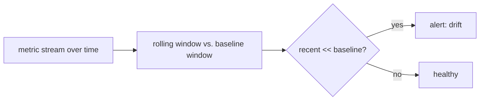

# Drift detection

> **Motto** — Quality erodes silently — watch the metric over time and alert when it slips.

*Part of Phase 16 — Observability & Cost.*

## The Problem

Even with regression gates (Phase 15), production quality can **drift**: a model update, a
changing input distribution, or a stale retrieval index slowly degrades results over days or
weeks — no single PR to blame. Drift detection watches a live metric (eval score, success
rate, user thumbs) over rolling windows and alerts when the recent window falls below the
baseline.

## The Concept



## Build It

`code/drift.py` — compare a recent window to a baseline window:

```python
def detect_drift(history, window=5, threshold=0.05):
    """history: list of metric values over time (oldest→newest)."""
    if len(history) < window * 2:
        return {"drift": False, "reason": "not enough data"}
    baseline = history[-window * 2:-window]
    recent = history[-window:]
    b, r = sum(baseline) / window, sum(recent) / window
    drift = (b - r) > threshold
    return {"drift": drift, "baseline": round(b, 3), "recent": round(r, 3),
            "delta": round(r - b, 3)}
```

```python
healthy = [0.9, 0.91, 0.9, 0.92, 0.9, 0.91, 0.9, 0.9, 0.91, 0.9]
drifting = [0.9, 0.9, 0.91, 0.9, 0.9, 0.82, 0.8, 0.81, 0.79, 0.8]
print(detect_drift(healthy))    # drift False
print(detect_drift(drifting))   # drift True (recent window dropped)
```

The detector flags when the recent average falls a threshold below the prior baseline — a
trend, not a single bad data point — so you investigate before users complain.

## Use It

Feed drift detection a live signal: periodic eval-set runs, task success rate, or user
feedback, tagged in your traces (lesson 01) and cost/quality dashboards. For a Claude Code /
Codex user, the practical version is noticing your agent's success rate slipping after a model
or prompt change and re-running the eval suite (Phase 15) to localize it. Regression gates
catch drift *at merge*; drift detection catches it *in production*.

## Ship It

[`code/drift.py`](../../04-drift/code/drift.py) — a rolling-window drift detector.

## Check Yourself

**Q1.** How is drift different from a regression caught by a CI gate?

- A) same thing
- B) drift is gradual degradation in production over time, with no single PR to blame
- C) drift is faster
- D) drift is about cost only

<details><summary>Answer</summary>B — gates catch it at merge; drift is the slow
production slide.</details>

**Q2.** Drift detection compares…

- A) one data point to zero
- B) a recent window's average to a baseline window's average
- C) tokens to dollars
- D) nothing

<details><summary>Answer</summary>B — windowed trend comparison.</details>

**Challenge.** Add a minimum-sample and a statistical test (e.g. a simple t-test) so small
noisy windows don't trigger false drift alerts.

## Related

- Builds on: [Tracing](../../01-tracing/docs/en.md); Phase 15 — [Evals](../../../15-evals-and-testing-the-harness/06-eval-harness/docs/en.md)
- Next: [Use It: OpenTelemetry for agents](../../05-opentelemetry/docs/en.md)
- [Roadmap](../../../../ROADMAP.md)
