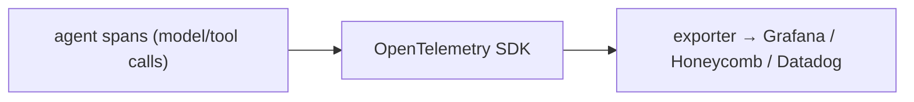

# Use it: OpenTelemetry for agents

> **Motto** — Emit your spans in a standard format and any observability backend can read them.

*Part of Phase 16 — Observability & Cost. Completes the phase.*

## The Problem

Your hand-built tracer (lesson 01) is great for understanding, but in production you want
spans in your existing dashboards (Grafana, Honeycomb, Datadog) — not a bespoke format.
**OpenTelemetry (OTel)** is the industry standard: emit spans with attributes via the OTel
SDK and export them anywhere. This is the production end-state of the phase.

## The Concept



You instrument once with OTel; the backend is a config choice.

## Build It / Use It

OTel is a library, so this is **Use It**. `code/otel_tracing.py` shows the shape (install
`opentelemetry-sdk` to run) — the same nested spans as lesson 01, now standard:

```python
from opentelemetry import trace
from opentelemetry.sdk.trace import TracerProvider
from opentelemetry.sdk.trace.export import SimpleSpanProcessor, ConsoleSpanExporter

trace.set_tracer_provider(TracerProvider())
trace.get_tracer_provider().add_span_processor(SimpleSpanProcessor(ConsoleSpanExporter()))
tracer = trace.get_tracer("harness")

def run(query):
    with tracer.start_as_current_span("agent.run") as run_span:
        run_span.set_attribute("query", query)
        with tracer.start_as_current_span("model.call") as s:
            s.set_attribute("gen_ai.usage.input_tokens", 120)   # semantic conventions
            s.set_attribute("gen_ai.request.model", "claude-opus-4-8")
        with tracer.start_as_current_span("tool.call") as s:
            s.set_attribute("tool.name", "bash")
```

The structure mirrors your scratch tracer; OTel adds standard **semantic conventions** (e.g.
`gen_ai.*` attributes for LLM calls) so backends understand your agent spans out of the box.

## Use It

Instrument the harness's model and tool calls with OTel spans + `gen_ai.*` attributes, point
the exporter at your backend, and you get latency (lesson 03), token/cost (lesson 02), and
drift (lesson 04) signals in dashboards you already run. The Agent SDK and many MCP servers
emit OTel-compatible telemetry; you consume it the same way. This is observability you don't
have to build from scratch — because you understand what's underneath.

## Ship It

[`code/otel_tracing.py`](../../05-opentelemetry/code/otel_tracing.py) — agent spans via the
OpenTelemetry SDK.

## Check Yourself

**Q1.** Why use OpenTelemetry instead of a custom trace format?

- A) it's trendy
- B) standard spans + semantic conventions export to any backend you already run
- C) it's faster to type
- D) no reason

<details><summary>Answer</summary>B — portability to standard backends.</details>

**Q2.** What do `gen_ai.*` semantic conventions provide?

- A) nothing
- B) a standard vocabulary for LLM-call attributes (model, tokens) backends understand
- C) faster models
- D) lower cost

<details><summary>Answer</summary>B — standardized LLM telemetry attributes.</details>

**Challenge.** Swap `ConsoleSpanExporter` for an OTLP exporter pointed at a local collector,
and add `gen_ai.usage.output_tokens` + cost as span attributes.

## Related

- Builds on: the whole phase
- Phase complete → next: Phase 17 — [Security & Alignment](../../../../ROADMAP.md)
- [Roadmap](../../../../ROADMAP.md)
