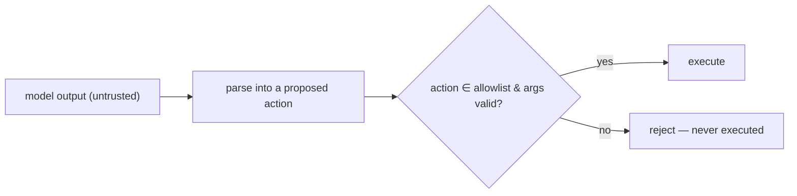

# Treating model output as data, never control flow

> **Motto** — The model proposes; the harness disposes — model text is a request, not a command.

*Part of Phase 17 — Security & Alignment.*

## The Problem

The deepest injection defense is architectural: **never let model output directly drive
privileged control flow**. If the harness `eval()`s the model's text, or runs whatever shell
string it emits, an injected instruction becomes code execution. Instead, model output is
*data* the harness validates against an allowlist of permitted actions before anything
happens. This is the structural reason the permission layer (Phase 8) exists.

## The Concept



The model can *ask* for any action; only allowlisted, validated actions run. Injection can
change the *request* but not the *policy*.

## Build It

`code/output_as_data.py` — dispatch model proposals through an allowlist, never `eval`:

```python
ALLOWED = {"read_file", "list_dir"}        # safe, allowlisted actions

def safe_dispatch(proposed_action, args, tools):
    if proposed_action not in ALLOWED:
        return f"denied: '{proposed_action}' is not an allowed action"
    return tools[proposed_action](**args)  # only allowlisted actions ever run

def NEVER_do_this(model_text):
    # eval(model_text)  # ← arbitrary code execution from untrusted text. Never.
    raise RuntimeError("never execute model output as code")
```

```python
tools = {"read_file": lambda path: f"contents of {path}"}
print(safe_dispatch("read_file", {"path": "a.py"}, tools))   # runs
print(safe_dispatch("delete_everything", {}, tools))         # denied — not allowlisted
```

Even if the model is fully hijacked and "decides" to delete everything, `safe_dispatch`
refuses because the action isn't on the allowlist — the policy lives in the harness, not in
the model's text.

## Use It

This is why Claude Code / Codex route every model-requested action through the permission
system (Phase 8) and typed tools (Phase 3) rather than executing free-form text: the model
can request, but an allowlist + validation + permission gate decide. The rule to internalize:
**model output is data**; treat it as untrusted input to your dispatcher, never as code.

## Ship It

[`code/output_as_data.py`](../../02-output-as-data/code/output_as_data.py) — an allowlisted
dispatcher (the output-as-data pattern).

## Check Yourself

**Q1.** Why must model output never drive control flow directly?

- A) it's slow
- B) an injected instruction would become real action/code execution
- C) it's untidy
- D) no reason

<details><summary>Answer</summary>B — output-as-control-flow turns injection into
exploitation.</details>

**Q2.** What decides whether a model-requested action runs?

- A) the model's confidence
- B) the harness: allowlist + arg validation + permission gate
- C) the prompt
- D) nothing

<details><summary>Answer</summary>B — policy lives in the harness, not the text.</details>

**Challenge.** Combine with Phase 8: route `safe_dispatch` through the `PermissionGate` so an
allowlisted-but-risky action (e.g. `write_file`) still prompts for confirmation.

## Related

- Builds on: [Prompt injection](../../01-prompt-injection/docs/en.md); Phase 8 — [Permissions](../../../08-permissions-and-safety-gating/01-permission-modes/docs/en.md)
- Next: [Data exfiltration & egress guards](../../03-exfiltration/docs/en.md)
- [Roadmap](../../../../ROADMAP.md)
