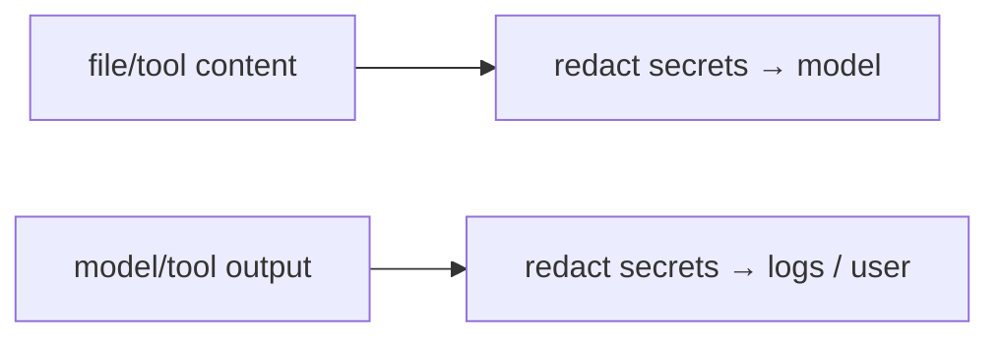

# Secret redaction in context & logs

> **Motto** — A secret the model never sees can't be leaked — and a secret never logged can't escape later.

*Part of Phase 17 — Security & Alignment.*

## The Problem

Secrets sneak into two dangerous places: the **context** (a config file the agent read
contains an API key, now in the prompt) and the **logs/traces** (you record the
conversation, key and all). Either is a leak waiting to happen. **Redaction** scrubs
secret-shaped strings on the way in (before the model sees them) and on the way out (before
anything is logged or returned).

## The Concept



Redaction is pattern-based (key formats, tokens) plus known-value masking (your actual
secrets), applied at both boundaries.

## Build It

`code/redact.py` — redact common secret patterns and known values:

```python
import re

PATTERNS = [
    re.compile(r"sk-[A-Za-z0-9]{16,}"),                  # API-key-ish
    re.compile(r"ghp_[A-Za-z0-9]{20,}"),                 # GitHub token
    re.compile(r"-----BEGIN[ A-Z]+PRIVATE KEY-----[\s\S]+?-----END[ A-Z]+PRIVATE KEY-----"),
    re.compile(r"AKIA[0-9A-Z]{16}"),                     # AWS access key id
]

def redact(text, known_values=()):
    for v in known_values:
        if v:
            text = text.replace(v, "[REDACTED]")
    for rx in PATTERNS:
        text = rx.sub("[REDACTED]", text)
    return text
```

```python
import os
s = "key=sk-abc123def456ghi789 and token=ghp_0123456789abcdef01234"
print(redact(s, known_values=[os.getenv("ANTHROPIC_API_KEY")]))
# key=[REDACTED] and token=[REDACTED]
```

Apply `redact` when injecting file/tool content into context *and* when writing traces (Phase
16) or returning output — both boundaries, so a secret is scrubbed coming and going.

## Use It

Wire redaction into a PostToolUse hook (Phase 8) so tool output is scrubbed before it enters
context or logs, and into your trace exporter (Phase 16). For a Claude Code / Codex user this
complements the `.env` block (Phase 0): even if a secret lands in some file the agent reads,
redaction keeps it out of the model and the logs. Combine with rotating any secret that *was*
exposed.

## Ship It

[`code/redact.py`](../../04-secret-redaction/code/redact.py) — a secret-redaction filter
(patterns + known values).

## Check Yourself

**Q1.** Where must redaction be applied?

- A) only in logs
- B) both inbound (into context) and outbound (into logs/output)
- C) only the system prompt
- D) nowhere

<details><summary>Answer</summary>B — both boundaries.</details>

**Q2.** If a secret *was* exposed in context/logs, you should also…

- A) ignore it
- B) rotate it (redaction stops future leaks; the exposed one is already compromised)
- C) log it again
- D) email it

<details><summary>Answer</summary>B — rotate exposed secrets.</details>

**Challenge.** Add entropy-based detection (flag high-entropy tokens that don't match a known
pattern) and measure its false-positive rate on real code.

## Related

- Builds on: Phase 0 — [Secrets & env](../../../00-setup-and-tooling/03-secrets-and-env/docs/en.md); Phase 16 — [Tracing](../../../16-observability-and-cost/01-tracing/docs/en.md)
- Next: [Multi-tenant isolation](../../05-multitenancy/docs/en.md)
- [Roadmap](../../../../ROADMAP.md)
