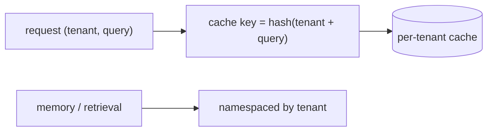

# Multi-Tenant Isolation & Cache Contamination

> **Motto** — Never let one tenant's data — or cache entry — leak into another's session.

*Part of Phase 17 — Security & Alignment.*

## The Problem

If your harness serves multiple users/tenants, the worst failure is **cross-tenant leakage**:
tenant A's data appears in tenant B's session. The sneakiest vector is the **cache** — a
semantic or prompt cache keyed without the tenant id can serve A's cached response to B. The
fix is to scope every cache key, memory store, and retrieval index by tenant, so isolation is
structural, not hopeful.

## The Concept



Every shared resource (cache, memory, index) gets the tenant id baked into its key/namespace.

## Build It

`code/isolation.py` — a tenant-scoped cache that can't cross-contaminate:

```python
import hashlib

class TenantCache:
    def __init__(self):
        self._store = {}

    def _key(self, tenant, query):
        return hashlib.sha256(f"{tenant}::{query}".encode()).hexdigest()

    def get(self, tenant, query):
        return self._store.get(self._key(tenant, query))

    def set(self, tenant, query, value):
        self._store[self._key(tenant, query)] = value
```

```python
c = TenantCache()
c.set("tenantA", "secret report", "A's data")
print(c.get("tenantB", "secret report"))   # None — B cannot see A's cached entry
print(c.get("tenantA", "secret report"))   # 'A's data'
```

Because the tenant id is part of the key, the *same* query from a different tenant is a
*different* key — A's cached value is unreachable by B. Apply the same namespacing to memory
(Phase 9) and retrieval indexes (Phase 13).

## Use It

For a single-developer Claude Code / Codex user this is less acute, but the moment you build a
multi-user product on the harness, it's critical — and it's the exact "cache contamination"
failure from the AI-engineering conceptual track. Audit every shared store: is the tenant id
in the key? If not, that's a leak waiting to happen.

## Ship It

[`code/isolation.py`](../../05-multitenancy/code/isolation.py) — a tenant-scoped cache.

## Check Yourself

**Q1.** The sneakiest cross-tenant leak vector is…

- A) the system prompt
- B) a cache keyed without the tenant id, serving one tenant's response to another
- C) the model name
- D) latency

<details><summary>Answer</summary>B — unkeyed caches cross-contaminate.</details>

**Q2.** The structural fix for cross-tenant leakage is…

- A) a longer prompt
- B) bake the tenant id into every cache key / memory / index namespace
- C) a bigger model
- D) hope

<details><summary>Answer</summary>B — namespace every shared resource by tenant.</details>

**Challenge.** Extend isolation to the retrieval index (Phase 13): ensure a tenant's
`search_code` can only return chunks from that tenant's files.

## Related

- Builds on: Phase 9 — Memory, Phase 13 — Retrieval; Phase 1 — [Caching](../../../01-llm-io-foundations/08-prompt-caching/docs/en.md)
- Next: [Use It: a security-review skill](../../06-security-review/docs/en.md)
- [Roadmap](../../../../ROADMAP.md)
