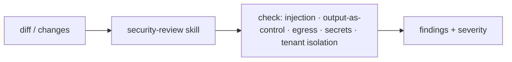

# Use It: A Security-Review Skill

> **Motto** — Make the agent review its own diff for the exact threats this phase taught.

*Part of Phase 17 — Security & Alignment. Completes the phase.*

## The Problem

You've built injection evals, output-as-data, egress guards, redaction, and tenant isolation.
The payoff is a **security-review skill** the agent runs on a diff (its own or a PR's) to
catch the vulnerabilities this phase covers — before they ship. It turns the phase's knowledge
into a repeatable check, the way `/security-review` works in Claude Code.

## The Concept

## Build It / Use It

The artifact is `outputs/SKILL.md` — a `/security-review` skill whose checklist *is* this
phase: it scans a diff for executing model output as code, unbounded egress, hardcoded
secrets, missing tenant scoping, and unsafe handling of untrusted content, reporting findings
with severity and a fix.

## Use It

Run `/security-review` before merging anything that touches tool dispatch, network calls,
auth, caching, or untrusted-input handling. In Claude Code this mirrors the built-in
`/security-review`; installing this skill focuses it on *harness* threats specifically. Pair
it with the injection eval (lesson 01) in CI — the skill is the human-in-the-loop review, the
eval is the automated gate.

## Ship It

[`outputs/SKILL.md`](../../06-security-review/outputs/SKILL.md) — a `/security-review` skill
covering the phase's threats.

## Check Yourself

**Q1.** What does the security-review skill check a diff for?

- A) formatting
- B) injection, output-as-control-flow, egress, secrets, tenant isolation
- C) test coverage only
- D) nothing

Answer
B — the phase's threat checklist.

**Q2.** Skill vs. eval for security?

- A) same thing
- B) the skill is the human-facing review; the injection eval is the automated CI gate
- C) neither matters
- D) only the skill

Answer
B — review + gate, complementary.

**Challenge.** Add a severity rubric (critical/high/low) and have the skill block (advise
"do not merge") on any critical finding, mirroring the review agent from Phase 10.

## Related

- Builds on: the whole phase
- Related: Phase 10 — review agent, Phase 15 — adversarial evals
- Phase complete → next: Phase 18 — [Production & Deployment](../../../../ROADMAP.md)
- [Roadmap](../../../../ROADMAP.md)
