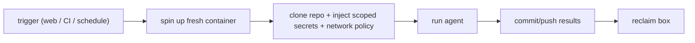

# Remote / sandboxed execution environments

> **Motto** — Run the agent in a fresh, isolated, ephemeral box — not on your laptop with your keys.

*Part of Phase 18 — Production & Deployment.*

## The Problem

Running an autonomous agent on your own machine, with your full filesystem and credentials,
is the highest-blast-radius option. Production agents run in **remote, sandboxed, ephemeral**
environments: a container cloned fresh from the repo, with a scoped network policy and
injected secrets, reclaimed after the run. This is the deployment form of the sandboxing
(Phase 7) and security (Phase 17) lessons.

## The Concept

Key properties: ephemeral (no state survives), isolated (can't reach your laptop), scoped
(network policy + least-privilege secrets), and reproducible (fresh clone each time).

## Use It

This is exactly how **Claude Code on the web / Codex cloud** run — and the environment *this
very curriculum was built in*: a fresh clone, a chosen network policy, injected env, and a
box reclaimed after inactivity (which is why anything worth keeping must be committed and
pushed). The artifact is an environment config that captures these choices.

`outputs/environment.md` documents the deployment contract: trigger, base image, setup
script, network policy, secrets, and the "commit or lose it" rule.

## Ship It

[`outputs/environment.md`](../../01-remote-execution/outputs/environment.md) — a remote-execution
environment spec.

## Check Yourself

**Q1.** Why run a production agent in an ephemeral remote container, not locally?

- A) it's faster
- B) isolation + least privilege limit blast radius; ephemerality means no leaked state
- C) laptops are slow
- D) no reason

Answer
B — contain the agent away from your machine and
keys.

**Q2.** On an ephemeral box, results survive only if you…

- A) leave them in /tmp
- B) commit and push them before the box is reclaimed
- C) print them
- D) nothing

Answer
B — persist to the repo; the container is
temporary.

**Challenge.** Write an `environment.md` for your own project: base image, setup script,
network policy (no-net vs. allowlist), which secrets are injected, and the test command.

## Related

- Builds on: Phase 7 — [Sandboxing](../../../07-shell-and-sandbox-execution/05-sandboxing/docs/en.md), Phase 17 — Security
- Next: [GitHub integration & CI triggers](../../02-github-ci/docs/en.md)
- [Roadmap](../../../../ROADMAP.md)
