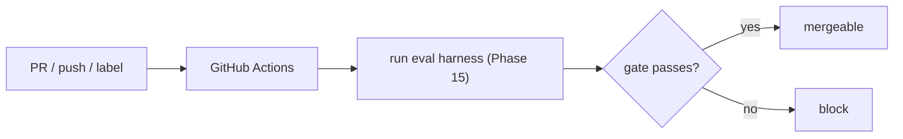

# GitHub integration & CI triggers

> **Motto** — Wire the agent and its evals into the same CI that guards your code.

*Part of Phase 18 — Production & Deployment.*

## The Problem

A harness reaches production through GitHub: it opens PRs, responds to issues, and — crucially
— its **evals run in CI** as a required check (Phase 15). You also trigger agent work from
GitHub events (a label, a comment, a failing build). This lesson wires the eval gate into a
GitHub Actions workflow so a change that regresses the harness can't merge.

## The Concept



## Build It

The artifact is a CI workflow. `outputs/evals.yml` runs the Phase 15 eval harness on PRs and
fails the build on regression:

```yaml
name: Harness Evals
on:
  pull_request:
  workflow_dispatch:
jobs:
  evals:
    runs-on: ubuntu-latest
    steps:
      - uses: actions/checkout@v4
      - uses: actions/setup-python@v5
        with: { python-version: "3.12" }
      - name: Run eval gate
        run: python3 harness-engineering/phases/15-evals-and-testing-the-harness/06-eval-harness/code/eval_harness.py
```

The eval harness exits nonzero on a regression (Phase 15 L6), so the job fails and the PR is
blocked — evals become a required check exactly like unit tests.

## Use It

For the GitHub side of an agent (opening PRs, reading issues, posting reviews) you use the
**GitHub MCP server** or the `gh` CLI — the agent's GitHub actions flow through MCP tools
(Phase 12). Triggering: a workflow on `issues`/`pull_request`/`label` events can dispatch an
agent run (e.g. "Claude, fix this"). The discipline: agent *output* still goes through review
and the eval gate before it merges.

## Ship It

[`outputs/evals.yml`](../../02-github-ci/outputs/evals.yml) — a GitHub Actions workflow running
the eval gate on PRs.

## Check Yourself

**Q1.** Why run the eval harness in CI?

- A) for logs
- B) to block PRs that regress the harness, like a required test check
- C) to slow merges
- D) no reason

<details><summary>Answer</summary>B — evals as a required, blocking check.</details>

**Q2.** How does an agent perform GitHub actions (PRs, comments)?

- A) it can't
- B) via the GitHub MCP server or `gh` CLI (tools, Phase 12)
- C) by editing git internals
- D) email

<details><summary>Answer</summary>B — GitHub MCP / `gh` as tools.</details>

**Challenge.** Add a workflow that triggers on an issue labeled `agent`, runs the agent to
propose a fix on a branch, and opens a PR — leaving the eval gate + human review as the
guards before merge.

## Related

- Builds on: Phase 15 — [Eval harness](../../../15-evals-and-testing-the-harness/06-eval-harness/docs/en.md), Phase 12 — MCP
- Next: [Webhooks & event-driven agents](../../03-webhooks/docs/en.md)
- [Roadmap](../../../../ROADMAP.md)
