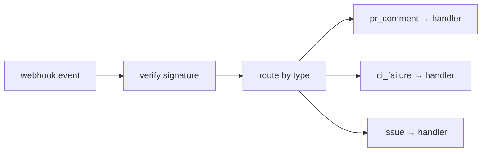

# Webhooks & event-driven agents

> **Motto** — Let events wake the agent — a comment, a CI failure, a push — and route each to a handler.

*Part of Phase 18 — Production & Deployment.*

## The Problem

A production agent isn't only invoked by a human typing; it reacts to **events**: a PR
comment, a failing CI run, a new issue, a merge. An event-driven harness receives webhooks,
authenticates them, routes each event type to a handler, and acts — turning the agent into a
service that responds to your systems. The risk: untrusted event payloads (Phase 17), so
treat their content as data.

## The Concept



## Build It

`code/webhooks.py` — a typed event router:

```python
class EventRouter:
    def __init__(self):
        self.handlers = {}

    def on(self, event_type):
        def deco(fn): self.handlers[event_type] = fn; return fn
        return deco

    def dispatch(self, event):
        t = event.get("type")
        handler = self.handlers.get(t)
        if not handler:
            return f"ignored: no handler for {t!r}"
        return handler(event)               # event payload is untrusted DATA (Phase 17)
```

```python
router = EventRouter()
@router.on("ci_failure")
def fix_ci(e): return f"investigating failure in {e['run']}"
@router.on("pr_comment")
def reply(e): return f"considering comment: {e['body'][:20]}"

print(router.dispatch({"type": "ci_failure", "run": "build #42"}))
print(router.dispatch({"type": "push"}))     # ignored
```

The router maps event types to handlers; unknown events are ignored (not errored). In
production you'd verify the webhook signature before dispatch and treat every payload field as
untrusted input.

## Use It

This is how agents "watch" a PR or repo — the same pattern behind the PR-activity events a
Claude Code session can subscribe to (CI results, review comments arrive as events and wake
the agent). For your own deployment, a webhook endpoint + this router turns the harness into a
service. Always: verify signatures, treat payloads as data, and gate any action the handler
takes (Phase 8).

## Ship It

[`code/webhooks.py`](../../03-webhooks/code/webhooks.py) — a typed webhook event router.

## Check Yourself

**Q1.** An unknown event type should be…

- A) an error that crashes the service
- B) ignored gracefully (no handler → no-op)
- C) executed anyway
- D) logged as critical

<details><summary>Answer</summary>B — ignore unhandled events.</details>

**Q2.** A webhook payload's fields should be treated as…

- A) trusted instructions
- B) untrusted data (verify signature; don't act on payload text as commands)
- C) the system prompt
- D) secrets

<details><summary>Answer</summary>B — untrusted data (Phase 17).</details>

**Challenge.** Add HMAC signature verification (reject events whose signature doesn't match a
shared secret) before dispatch.

## Related

- Builds on: Phase 17 — [Output as data](../../../17-security-and-alignment/02-output-as-data/docs/en.md), Phase 8 — Permissions
- Next: [Config, settings & feature flags](../../04-config-flags/docs/en.md)
- [Roadmap](../../../../ROADMAP.md)
