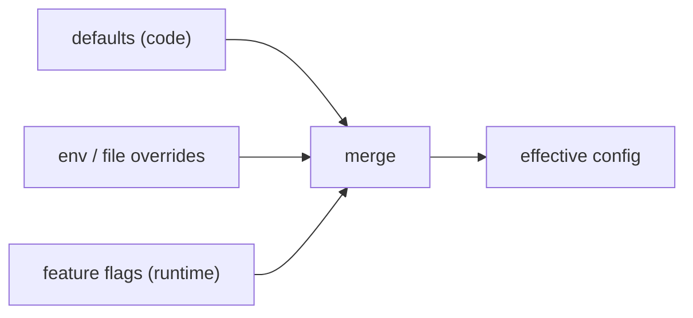

# Config, Settings & Feature Flags

> **Motto** — Change behavior with config, not a redeploy — and roll features without shipping code.

*Part of Phase 18 — Production & Deployment.*

## The Problem

A production harness has knobs: which model, which tools enabled, budgets, prompt version,
new features. Hardcoding them means a redeploy for every change and no way to turn something
off fast. **Layered config + feature flags** let you change behavior at runtime — defaults in
code, overrides per environment, and flags to enable a feature for some/all traffic.

## The Concept



Later layers override earlier ones; flags gate features independently of a deploy.

## Build It

`code/config.py` — layered config + a percentage feature flag:

```python
import hashlib

def load_config(defaults, *overrides):
    cfg = dict(defaults)
    for o in overrides:
        cfg.update({k: v for k, v in o.items() if v is not None})
    return cfg

def flag_enabled(name, unit_id, percent):
    """Stable per-unit rollout: same unit_id always gets the same answer."""
    h = int(hashlib.sha256(f"{name}:{unit_id}".encode()).hexdigest(), 16) % 100
    return h < percent
```

```python
cfg = load_config({"model": "haiku", "max_steps": 10},
                  {"model": "claude-opus-4-8"})        # env override
print(cfg["model"], cfg["max_steps"])                  # opus, 10

# enable a feature for ~30% of users, stably
print([flag_enabled("new_planner", u, 30) for u in ["u1", "u2", "u3", "u4"]])
```

Config merges deterministically (last layer wins); the flag hashes the unit id so a given
user consistently sees the feature on or off — the basis for canary rollout (next lesson).

## Use It

For Claude Code / Codex this maps to `settings.json` layering (user / project / local) plus
env vars — the same defaults→overrides model. In a custom harness, flags let you ship a new
prompt version or tool to 10% of traffic and watch the metrics (Phase 16) before going to
100%. Config-as-data keeps behavior changes reviewable and reversible.

## Ship It

[`code/config.py`](../../04-config-flags/code/config.py) — layered config + percentage feature
flags.

## Check Yourself

**Q1.** Why feature-flag a change instead of hardcoding it?

- A) it's prettier
- B) you can enable/disable at runtime (and per-percentage) without a redeploy
- C) it's required
- D) no reason

<details><summary>Answer</summary>B — runtime control + gradual rollout.</details>

**Q2.** Why hash the unit id for a percentage flag?

- A) security
- B) so the same user stably gets the same on/off answer (no flicker)
- C) speed
- D) no reason

<details><summary>Answer</summary>B — stable per-unit assignment.</details>

**Challenge.** Add config layering precedence matching Claude Code (enterprise → user →
project → local) and show which wins on a conflicting key.

## Related

- Builds on: Phase 8 — [settings.json](../../../08-permissions-and-safety-gating/06-settings-json/docs/en.md), Phase 5 — [Prompt versioning](../../../05-prompt-instruction-architecture/06-prompt-versioning/docs/en.md)
- Next: [Rollout, canary & kill switches](../../05-rollout/docs/en.md)
- [Roadmap](../../../../ROADMAP.md)
