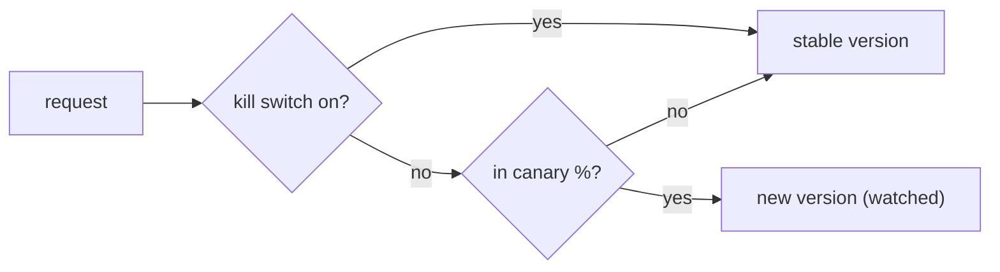

# Rollout, Canary & Kill Switches

> **Motto** — Ship to a few, watch, then ship to all — and keep a switch to turn it off instantly.

*Part of Phase 18 — Production & Deployment.*

## The Problem

A new prompt version, tool, or model can regress in ways evals missed (Phase 15) — you find
out in production. **Canary rollout** limits the blast radius: route a small % of traffic to
the new version, watch the metrics (Phase 16), and ramp up only if healthy. A **kill switch**
lets you revert to the known-good version instantly when something goes wrong — no redeploy.

## The Concept



## Build It

`code/rollout.py` — canary routing + kill switch (builds on the flag from lesson 04):

```python
import hashlib

class Rollout:
    def __init__(self, stable, candidate, percent=10):
        self.stable, self.candidate, self.percent = stable, candidate, percent
        self.killed = False

    def kill(self):
        self.killed = True            # instant revert to stable

    def version_for(self, unit_id):
        if self.killed:
            return self.stable
        h = int(hashlib.sha256(unit_id.encode()).hexdigest(), 16) % 100
        return self.candidate if h < self.percent else self.stable
```

```python
r = Rollout("prompt-v3", "prompt-v4", percent=20)
sample = [r.version_for(u) for u in [f"u{i}" for i in range(10)]]
print(sample.count("prompt-v4"), "of 10 on canary")
r.kill()
print(set(r.version_for(u) for u in [f"u{i}" for i in range(10)]))   # all stable
```

Canary sends ~20% to v4; if metrics dip, `kill()` routes everyone back to v3 instantly. Ramp
by raising `percent` once the canary looks healthy.

## Use It

For prompt/skill/model changes (Phase 5 versioning), roll out as a canary keyed by user/repo,
watch the eval/drift signals (Phase 15/16), and keep the kill switch wired to a config flag
(lesson 04) so revert is one toggle — not a redeploy. This is how you ship harness changes to
real users without betting everything on the first %.

## Ship It

[`code/rollout.py`](../../05-rollout/code/rollout.py) — canary routing + kill switch.

## Check Yourself

**Q1.** What does a canary rollout limit?

- A) cost only
- B) blast radius — only a small % hits the new version until it's proven healthy
- C) latency
- D) nothing

<details><summary>Answer</summary>B — contain risk, then ramp.</details>

**Q2.** A kill switch lets you…

- A) delete the repo
- B) revert to the known-good version instantly, no redeploy
- C) increase the canary
- D) nothing

<details><summary>Answer</summary>B — instant revert.</details>

**Challenge.** Auto-kill: wire the rollout to the drift detector (Phase 16 L4) so a metric
drop on the canary trips the kill switch automatically.

## Related

- Builds on: [Config & flags](../../04-config-flags/docs/en.md), Phase 5 — [Prompt versioning](../../../05-prompt-instruction-architecture/06-prompt-versioning/docs/en.md), Phase 16 — Drift
- Next: [Use It: deploy the capstone agent](../../06-deploy/docs/en.md)
- [Roadmap](../../../../ROADMAP.md)
