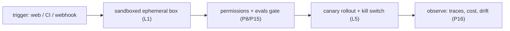

# Use it: deploy the capstone agent

> **Motto** — Put it all together: a triggered, sandboxed, gated, observable, reversible deployment.

*Part of Phase 18 — Production & Deployment. Completes the phase.*

## The Problem

The phase's pieces — remote execution, CI, webhooks, config/flags, rollout — combine into one
**deployment pipeline** for the coding agent you build in Phase 19. This lesson is the
checklist that takes the capstone agent from "runs on my machine" to "runs safely in
production," each item pointing at the lesson that justifies it.

## The Concept

## Build It / Use It

The artifact is `outputs/deploy-checklist.md` — a go-live checklist for the capstone:

- **Environment (L1):** runs in a fresh, isolated, ephemeral container; commit/push results.
- **CI gate (L2/P15):** eval harness runs on every change and blocks regressions.
- **Triggers (L3):** webhook/CI events route to handlers; payloads treated as data.
- **Config (L4):** model, budgets, prompt version, features behind layered config + flags.
- **Rollout (L5):** ship behind a canary keyed by user/repo; kill switch wired to a flag.
- **Permissions (P8) & security (P17):** least privilege, `.env` blocked, egress allowlist.
- **Observability (P16):** traces, token/cost accounting, drift detection live.
- **Reliability (P14):** retries, budgets, degraded mode on.

## Use It

Run the checklist before pointing real traffic (or a real repo's PRs) at your agent. For a
Claude Code / Codex user, much of this is provided by the platform (sandboxed cloud
execution, permissions, network policy); your job is the project-level config (`settings.json`,
`CLAUDE.md`, hooks, evals in CI) and knowing which guarantees come from where. The capstone
(Phase 19) is what you deploy with it.

## Ship It

[`outputs/deploy-checklist.md`](../../06-deploy/outputs/deploy-checklist.md) — a production go-live
checklist for the agent.

## Check Yourself

**Q1.** Before pointing real traffic at the agent, you should have…

- A) just the code
- B) sandbox + eval gate + permissions/security + observability + rollout/kill switch
- C) a bigger model
- D) nothing

Answer
B — the full production checklist.

**Q2.** For a Claude Code / Codex user, which parts are platform-provided?

- A) none
- B) sandboxed cloud execution, permissions, network policy — you supply project config + evals
- C) all of it
- D) only the model

Answer
B — platform gives the runtime; you bring config + evals.

**Challenge.** Turn the checklist into a script that verifies as many items as possible
automatically (eval gate passes, `.env` blocked, budgets set) and reports the rest.

## Related

- Builds on: the whole phase + Phases 8, 14, 15, 16, 17
- Phase complete → next: Phase 19 — [Capstone](../../../../ROADMAP.md)
- [Roadmap](../../../../ROADMAP.md)
