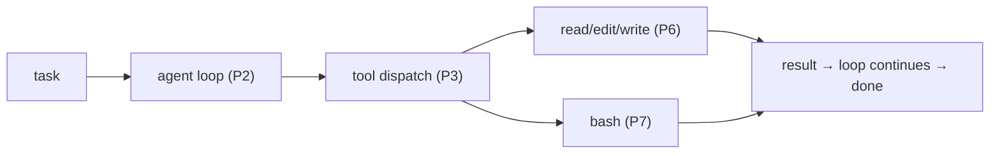

# Minimal Coding Agent (Loop + Tools + Files)

> **Motto** — The smallest real coding agent: a loop that reads, edits, and runs code.

*Part of Phase 19 — Capstone. Combines Phase 2 (loop), 3 (tools), 6 (files), 7 (shell).*

## The Problem

You've built every piece in isolation. The capstone proves they compose. Project 1 is the
**minimal coding agent**: the agent loop (P2) dispatching file tools (P6) and a bash tool (P7)
through a typed registry (P3), driving a real task end-to-end — read a file, edit it, run it —
on a real (temp) directory. No new concepts; just integration.

## The Concept



## Build It

`code/agent.py` — a self-contained minimal coding agent. A scripted model stands in for the
real one (swap in the Phase 2 L5 SDK loop), so it runs offline and demonstrates the full
read→edit→run cycle on a temp file:

```python
# tools: read, edit (exact-string), bash — the P6/P7 primitives
TOOLS = {
    "read":  lambda path: open(path).read(),
    "edit":  lambda path, old, new: _edit(path, old, new),
    "bash":  lambda cmd: subprocess.run(cmd, shell=True, capture_output=True, text=True).stdout,
}

def run(task, model, max_steps=10):
    history = [{"role": "user", "content": task}]
    for _ in range(max_steps):
        msg = model(history)                       # P2 loop
        history.append({"role": "assistant", "content": msg["text"]})
        if not msg["tool_calls"]:
            return msg["text"]
        for call in msg["tool_calls"]:             # P3 dispatch
            out = dispatch(call["name"], call["args"])
            history.append({"role": "tool", "content": out})
```

The scripted model reads a buggy file, edits the bug, and runs it to confirm — the agent loop
from Phase 2 wired to the real file/shell tools from Phases 6–7. Run `python3 agent.py` to
watch it fix and verify a file.

## Use It

This is Claude Code / Codex at its core: a loop, tools, files, shell. Everything else in the
curriculum (context, memory, permissions, subagents, evals, deploy) is a *layer* on this
skeleton — which is exactly what projects 02–04 add. Swap the scripted model for the Phase 2
L5 SDK loop and it's a real agent.

## Ship It

[`code/agent.py`](../../01-minimal-agent/code/agent.py) — a runnable minimal coding agent
(loop + tools + files + shell).

## Check Yourself

**Q1.** What four phases does the minimal agent combine?

- A) any four
- B) the loop (P2), tools (P3), file ops (P6), shell (P7)
- C) only the loop
- D) evals and deploy

<details><summary>Answer</summary>B — the core execution skeleton.</details>

**Q2.** Everything else in the course relates to this skeleton how?

- A) it replaces it
- B) it's a layer added on top (context, memory, permissions, evals, deploy)
- C) it's unrelated
- D) no relation

<details><summary>Answer</summary>B — layers on the core loop.</details>

**Challenge.** Replace the scripted model with the Phase 2 L5 Anthropic SDK loop and give it
a real bug to fix in a small repo.

## Related

- Combines: Phase 2, 3, 6, 7
- Next: [Add context, memory & permissions](../../02-context-memory-permissions/docs/en.md)
- [Roadmap](../../../../ROADMAP.md)
