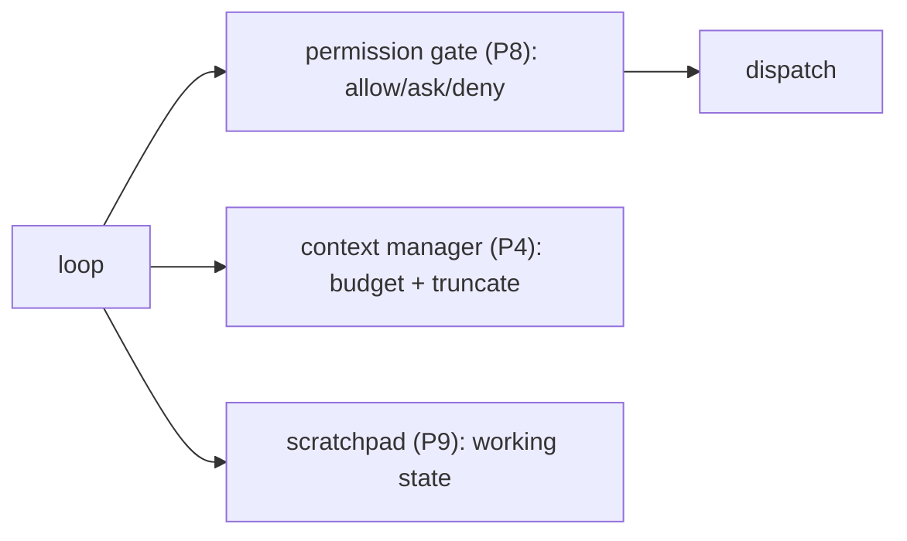

# Add Context, Memory & Permissions

> **Motto** — A safe agent that remembers: gate every action, manage the window, keep a scratchpad.

*Part of Phase 19 — Capstone. Combines Phase 4 (context), 8 (permissions), 9 (memory).*

## The Problem

The minimal agent (project 01) is unsafe (it'll run anything), forgetful (no memory), and
context-blind (it'd overflow on a big task). Project 02 wraps it with three layers from the
curriculum: a **permission gate** (P8) on every tool call, a **scratchpad** (P9) for working
state, and **context budgeting/truncation** (P4) so long runs don't blow the window — turning
a toy into something you'd let near a real repo.

## The Concept



## Build It

`code/agent.py` (project 02) wraps project 01's dispatch with the gate, adds a scratchpad,
and trims history each step:

```python
DENY = ["rm -rf", "git push"]                 # P8 denylist
def gate(name, args):
    blob = f"{name} {args}"
    if any(d in blob for d in DENY):
        return False, f"denied: matched denylist"
    return True, None

def run(task, model, scratch, max_steps=12, budget_chars=8000):
    history = [{"role": "user", "content": task}]
    for _ in range(max_steps):
        history = truncate(history, budget_chars)        # P4
        msg = model(history, scratch)
        history.append({"role": "assistant", "content": msg["text"]})
        if not msg["tool_calls"]:
            return msg["text"]
        for call in msg["tool_calls"]:
            ok, reason = gate(call["name"], call["args"])  # P8
            out = reason if not ok else dispatch(call["name"], call["args"])
            history.append({"role": "tool", "content": out})
```

The gate blocks dangerous calls (a denied `rm -rf` returns a message, not destruction), the
scratchpad carries facts across steps, and `truncate` keeps the window bounded. Run
`python3 agent.py` to see a denied dangerous command and a remembered note.

## Use It

This mirrors how you actually run Claude Code / Codex: permissions on every action
(`settings.json`), the agent's todo/scratch state, and automatic context compaction. Project
02 is the minimal agent made *operable* — the difference between a demo and something you trust
on a codebase.

## Ship It

[`code/agent.py`](../../02-context-memory-permissions/code/agent.py) — the agent with
permissions, memory, and context management.

## Check Yourself

**Q1.** What three layers does project 02 add?

- A) more tools
- B) permission gating (P8), scratchpad memory (P9), context budgeting (P4)
- C) evals
- D) deploy

<details><summary>Answer</summary>B — safety, memory, context.</details>

**Q2.** A denied dangerous tool call results in…

- A) the command running anyway
- B) a denial message returned to the model (no destructive action)
- C) a crash
- D) silent skip

<details><summary>Answer</summary>B — gated, returns data, never executes.</details>

**Challenge.** Replace the denylist with the Phase 8 `PermissionGate` (allow/ask/deny + rules)
and add an `ask` path that prompts before edits.

## Related

- Combines: Phase 4, 8, 9
- Builds on: [Minimal agent](../../01-minimal-agent/docs/en.md)
- Next: [Add subagents, MCP & retrieval](../../03-subagents-mcp-retrieval/docs/en.md)
- [Roadmap](../../../../ROADMAP.md)
