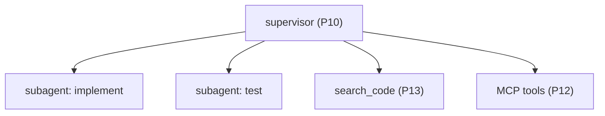

# Add Subagents, MCP & Retrieval

> **Motto** — Scale the agent out: delegate to subagents, plug in MCP servers, find code by meaning.

*Part of Phase 19 — Capstone. Combines Phase 10 (subagents), 12 (MCP), 13 (retrieval).*

## The Problem

The operable agent (project 02) still works alone, with only its built-in tools, and finds
code by grep. Project 03 scales it: a **supervisor** spawns **subagents** (P10) for parallel
sub-tasks, an **MCP client** (P12) adds external tools, and a **retrieval tool** (P13) lets it
find code by meaning. This is the jump from "an agent" to "an agent system."

## The Concept



## Build It

`code/agent.py` (project 03) adds a supervisor that decomposes and dispatches subagents,
merges MCP-discovered tools, and exposes `search_code`:

```python
def supervise(goal, run_subagent, search_code, max_workers=3):
    tasks = decompose(goal)                       # P10
    # locate relevant code first (P13)
    for t in tasks:
        t["context"] = search_code(t["text"])
    results = []
    for batch in chunked(tasks, max_workers):     # bounded parallelism
        results += [run_subagent(t) for t in batch]
    return aggregate(results)
```

```python
# subagents are isolated runs (bounded roles, P10); search_code is P13; MCP tools merge via P12
print(supervise("add and test a /health route",
                run_subagent=lambda t: {"task": t["text"], "ok": True},
                search_code=lambda q: "routes.py:1"))
```

The supervisor decomposes the goal, retrieves relevant code per sub-task, and dispatches
isolated subagents in bounded batches — composing the orchestration, retrieval, and MCP
layers onto the safe agent from project 02.

## Use It

This is the agent-team pattern (Phase 10) on top of the coding agent, with retrieval and MCP
making it effective in a large repo with external capabilities — the same shape as a Claude
Code session that spawns subagents, uses MCP servers, and navigates the codebase. Project 03
is the agent at full capability.

## Ship It

[`code/agent.py`](../../03-subagents-mcp-retrieval/code/agent.py) — the agent with supervisor,
subagents, MCP, and retrieval.

## Check Yourself

**Q1.** What does the supervisor do before dispatching subagents?

- A) nothing
- B) decompose the goal and retrieve relevant code per sub-task
- C) merge files
- D) deploy

<details><summary>Answer</summary>B — decompose + retrieve, then dispatch.</details>

**Q2.** Subagents run…

- A) sharing one context
- B) isolated (bounded roles), in bounded-size batches
- C) sequentially only
- D) unbounded

<details><summary>Answer</summary>B — isolated + bounded (P10).</details>

**Challenge.** Wire the real Phase 13 `search_code` and a Phase 12 MCP client into the
supervisor so subagents get retrieved context and external tools.

## Related

- Combines: Phase 10, 12, 13
- Builds on: [Context/memory/permissions](../../02-context-memory-permissions/docs/en.md)
- Next: [Add evals, observability & ship it](../../04-evals-observability-ship/docs/en.md)
- [Roadmap](../../../../ROADMAP.md)
