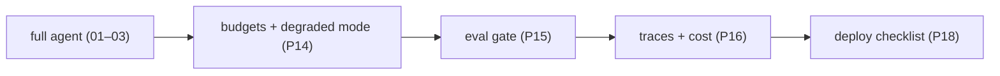

# Add evals, observability & ship it

> **Motto** — Make it measurable, observable, and deployable — then it's a real product, not a demo.

*Part of Phase 19 — Capstone. Combines Phase 14 (reliability), 15 (evals), 16 (observability), 18 (deploy).*

## The Problem

The full-capability agent (project 03) is powerful but unproven and unobservable. The final
project wraps it with the production layers: **budgets + degraded mode** (P14) so it can't run
away, an **eval suite + gate** (P15) so changes are measured, **traces + cost** (P16) so runs
are diagnosable, and a **deploy checklist** (P18) so it ships safely. This is the curriculum,
complete: an agent you understand, trust, measure, and deploy.

## The Concept



## Build It

`code/agent.py` (project 04) wraps the agent run with a budget, a tracer, and a cost meter,
and is gated by an eval suite:

```python
def run_observed(task, agent, budget, tracer, cost):
    with tracer.span("agent.run", task=task):
        if budget.exceeded():
            return {"status": "degraded", "reason": "budget"}     # P14
        out = agent(task)
        cost.record("claude-opus-4-8", 1000, 200, tag="capstone") # P16
        return {"status": "complete", "result": out,
                "trace": tracer.spans, "cost": cost.report()}
```

```python
report = run_observed("fix the bug", agent=lambda t: "fixed",
                      budget=Budget(), tracer=Tracer(), cost=CostMeter())
print(report["status"], report["cost"])     # complete, with cost attributed + a trace
# Then: eval_gate(run_evals(...)) before shipping (P15), deploy checklist (P18).
```

Every run is now bounded (budget), observable (trace + cost), and only ships if the eval gate
passes — the production wrapper around the agent you built in projects 01–03.

## Use It

This is the end state: a coding agent with the full harness — loop, tools, files, shell,
context, memory, permissions, subagents, MCP, retrieval, reliability, evals, observability, and
a deploy path. For a Claude Code / Codex user, it's the mental model of *everything the
platform does for you* plus *everything you add* (`settings.json`, `CLAUDE.md`, hooks, skills,
MCP servers, CI evals). You finished the course — you can now build, operate, and reason about
a harness end to end.

## Ship It

[`code/agent.py`](../../04-evals-observability-ship/code/agent.py) — the production-wrapped
capstone agent (budget + trace + cost + eval gate).

## Check Yourself

**Q1.** What makes project 04 production-ready vs. project 03?

- A) nothing
- B) budgets/degraded mode, an eval gate, traces+cost, and a deploy checklist
- C) more tools
- D) a bigger model

<details><summary>Answer</summary>B — the reliability/eval/observability/deploy layers.</details>

**Q2.** The completed capstone is, in one phrase…

- A) a chatbot
- B) a coding agent with the full harness — built, measured, observable, deployable
- C) a prompt
- D) a single tool

<details><summary>Answer</summary>B — the whole curriculum, working.</details>

**Challenge.** Wire the real Phase 14 `Budget`, Phase 15 `run_evals`/`gate`, and Phase 16
`Tracer`/`CostMeter` into one runnable script, and add the Phase 18 `evals.yml` so it's gated
in CI. Then deploy it per the Phase 18 checklist.

## Related

- Combines: Phase 14, 15, 16, 18 (and every prior phase)
- Builds on: [Subagents/MCP/retrieval](../../03-subagents-mcp-retrieval/docs/en.md)
- 🎉 Course complete — see the [Roadmap](../../../../ROADMAP.md) for the full map.
- [Roadmap](../../../../ROADMAP.md)
