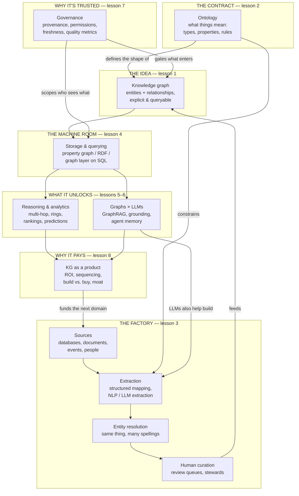

# Knowledge graphs for the product leader

Every company already *has* a knowledge graph — it's just scattered across forty
databases, a CRM, a wiki, and the heads of its senior people. Customers connect to
contracts, contracts to products, products to suppliers, suppliers to risks. The
connections are where the value lives: the churn risk you'd spot if support tickets were
linked to renewal dates, the fraud ring you'd see if devices were linked to accounts, the
cross-sell you'd make if usage were linked to entitlements. A **knowledge graph** is the
decision to make those connections explicit, queryable, and owned — to treat *what the
company knows* as a product with a data model, a quality bar, and a roadmap.

This module is the product leader's map of that territory. It teaches what a knowledge
graph actually is (and when a plain database is honestly fine), why the ontology is a
product decision disguised as a technical one, where the real cost hides (construction
and curation, not storage), what becomes computable once knowledge is connected, and how
graphs and LLMs fix each other's weaknesses — grounding on one side, extraction at scale
on the other. It closes with the capstone every CPO needs: the business case, the
sequencing, and the honest list of reasons *not* to build one.

## The knowledge graph (about knowledge graphs)

Fittingly, the module *is* one. Every lesson hangs off this picture:

Read it in three passes. **The asset:** an ontology defines what things mean, a
construction pipeline turns scattered sources into one connected graph, and storage makes
it queryable — that pipeline, not the database, is where most of the money goes. **The
payoff:** once knowledge is connected, you can compute what tables can't cheaply express —
multi-hop questions, fraud rings, recommendations — and you can ground LLMs in facts your
company actually stands behind. **The flywheel:** governance keeps the asset trustworthy,
the product wins fund the next domain, and the graph compounds — which is the whole
strategic argument.

## The lessons

- [**What is a knowledge graph?**](./what-is-a-knowledge-graph.md) — things, not strings;
  entities, relationships, and triples; and the honest test for when you need one.
- [**Ontologies & data modeling**](./ontologies-and-data-modeling.md) — the ontology as a
  product contract: what your product can ever answer, and who has to agree on it.
- [**Building the graph**](./building-the-graph.md) — the construction pipeline:
  extraction, entity resolution, curation — where 80% of the budget actually goes.
- [**Storage & querying**](./storage-and-querying.md) — property graphs vs. RDF vs. a
  graph layer on your existing database; picking without the vendor fog.
- [**Reasoning & analytics**](./reasoning-and-analytics.md) — what becomes computable:
  multi-hop questions, rings and communities, rankings, link prediction, inference.
- [**Knowledge graphs & LLMs**](./knowledge-graphs-and-llms.md) — GraphRAG and grounding
  on one side, LLM-powered construction on the other; agent memory in between.
- [**Governance, quality & trust**](./governance-quality-and-trust.md) — provenance,
  permissions, freshness, and the quality metrics that belong on your dashboard.
- [**Knowledge graphs as a product**](./knowledge-graphs-as-a-product.md) — the capstone:
  ROI, sequencing, build vs. buy, team shape, and when *not* to build one.

Each lesson pairs the mechanics with a **🎯 For the product leader** briefing — why it
matters, the decision it changes, the sharp question to ask your data team, and the risk
if you ignore it — plus a diagram to make it concrete. The AI-retrieval side connects
directly to [RAG & retrieval](../content/03-rag/README.md) and the
[Agentic AI track](../agentic-ai/README.md); the data-modeling instincts build on
[Data & the data model](../technical-product-sense/data-and-the-data-model.md).

**📌 Close out the module:** [Recap & real-world examples](./recap.md).
