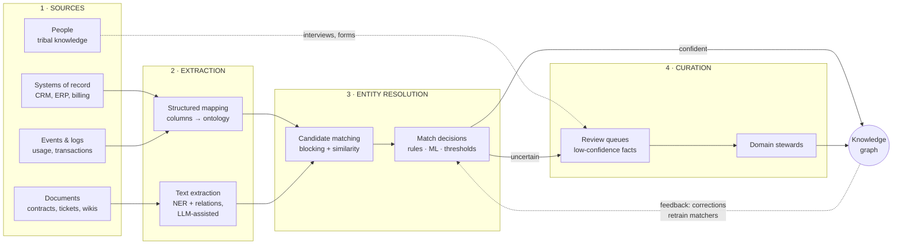

# Building the graph

*Part of [Knowledge graphs for the product leader](./README.md)*

## TL;DR

A knowledge graph is not installed; it is **manufactured** — continuously, from your
messiest raw material. The factory has four stations: **ingest** knowledge from sources
(databases, documents, events, people), **extract** entities and relationships from them
(cheap and reliable from structured sources; harder and probabilistic from text),
**resolve identity** so that "Acme Corp," "ACME Inc." and "acme-corp-2019" become one
node — the hardest, most underestimated step in the entire discipline — and **curate**
with human review where confidence is low or stakes are high. Then do it all again
tomorrow, because knowledge changes. This pipeline, not the graph database, is where
roughly 80% of the money and nearly all of the schedule risk lives. When a
knowledge-graph project is late, over budget, or quietly untrusted, the cause is almost
always here — usually at entity resolution — and never in the storage layer the vendor
demo focused on.

> 🎯 **For the product leader**
>
> **Why it matters** — Vendor demos show query speed on a graph that already exists.
> Your cost lives in *making* the graph exist and keeping it true. Misjudge this and
> the project is 3× over budget before the first feature ships — with the spend hidden
> in "data cleanup" line items nobody connected to the graph decision.
>
> **What it changes in your decisions** — You budget and staff the pipeline as the
> product, and the database as a detail. You ask every scoping conversation to
> commit to numbers: how many sources, what extraction accuracy, what match precision,
> what human review load per week.
>
> **Ask yourself** — *"For our first domain: which sources, what fraction is free text,
> and who exactly reviews the low-confidence matches every week?"*
>
> **Risk if ignored** — The classic arc: a slick pilot on hand-cleaned data, a funded
> rollout, then eighteen months of entity-resolution whack-a-mole; the graph ships with
> duplicate customers, the first executive demo shows Acme twice with different revenue,
> and trust — the only currency a knowledge product has — never recovers.

## The pipeline

Two structural truths about this picture. First, it's a **loop, not a line** — sources
update, extractions get corrected, matchers retrain on steward decisions. Budget for the
loop or the graph starts decaying the day it launches
([freshness](./governance-quality-and-trust.md)). Second, **each station has a different
economics**: structured mapping is cheap and nearly perfect; text extraction is
per-document cost with real error rates; entity resolution is quadratic-shaped work that
blocking makes tractable; curation is salaried humans. Knowing which station dominates
*your* domain is the difference between a real estimate and a hopeful one.

## Station by station

**Sources.** Rank them by value density, not availability. A CRM export is easy and
thin; the contract repository is painful and rich. The classic mistake is ingesting
whatever has an API first — the graph fills with low-value facts while the killer
queries starve. Start from the [three killer queries](./what-is-a-knowledge-graph.md)
and work backwards to the minimum set of sources that answer them.

**Extraction.** From structured sources this is mapping: column → property, foreign key
→ edge, guided by the [ontology](./ontologies-and-data-modeling.md). From text it's
information extraction — finding entity mentions and the relationships asserted between
them. LLMs have genuinely changed this station: extraction that took a bespoke NLP team
now works via prompting at useful accuracy
([lesson 6](./knowledge-graphs-and-llms.md) covers the mechanics and limits). But
extraction from text is *never* free of errors, so every extracted fact needs a
confidence score and a source pointer — the raw material of
[provenance](./governance-quality-and-trust.md).

**Entity resolution.** The heart of the matter: deciding when two records refer to one
real-world thing. Names collide ("Acme" the customer vs. "Acme" the supplier), formats
drift, subsidiaries blur, people share names. The machinery — blocking to avoid
comparing everything to everything, similarity features, a match model, thresholds —
is standard; the *decisions* are yours:

- **Precision vs. recall of matches.** A false merge (two real companies fused into
  one) silently corrupts every query touching that node and is brutal to unpick. A
  missed merge (one company appearing twice) is visible and fixable. **Default to
  precision** — duplicates embarrass, false merges poison.
- **Where the thresholds sit.** Above the upper threshold: auto-merge. Below the lower:
  keep separate. Between: a human decides. The width of that band *is* your curation
  headcount.
- **Survivorship.** When merged records disagree (two addresses, two owners), which
  source wins? That's a per-field trust ranking of your own systems — an
  organizationally spicy document worth writing down early.

**Curation.** Not a temporary scaffold — a permanent, sized function. The good news:
review effort concentrates (a small fraction of entities generate most conflicts), tooling
makes stewards fast, and every decision becomes training data that shrinks tomorrow's
queue. The non-negotiable: stewards must sit in the *domain* (sales ops for customers,
procurement for suppliers), not in a generic data team — recognizing that two suppliers
are the same company is domain knowledge, not data hygiene.

## Cold start vs. steady state

Plan them as different projects. The **cold start** is a bounded backfill: one domain,
its sources, an intense resolution-and-curation push — weeks to months, and the right
place for consultants or a services-heavy vendor. The **steady state** is a product
team's forever job: incremental ingestion, drift monitoring, ontology evolution, queue
management. Teams that staff only for the cold start ship a graph that is accurate on
launch day and misleading by the next quarter — and a misleading graph is worse than
none, because [people act on it](./governance-quality-and-trust.md).

## Failure modes

- **Pilot-to-production cliff** — the pilot ran on 5,000 hand-cleaned records; production
  has 4 million dirty ones. Extraction accuracy and match rates do not transfer; re-estimate
  from production samples before funding the rollout.
- **False-merge contamination** — thresholds tuned for recall quietly fuse distinct
  entities; months later, revenue reports are wrong and nobody can say why.
- **Ingest-everything greed** — twenty sources connected, none curated; the graph is
  large, impressive in node count, and untrusted in every meeting that matters.
- **Curation as afterthought** — no named stewards, so low-confidence facts either flood
  in unreviewed (quality collapses) or pile up unmerged (coverage collapses).
- **One-shot build** — the backfill ships, the team disbands, the graph is a snapshot of
  last year wearing this year's dashboard.

## Practitioner checklist

- [ ] For the first domain: sources ranked by value density, with the free-text fraction
      and per-source extraction accuracy estimated from *real samples*?
- [ ] Entity-resolution thresholds chosen deliberately — and biased toward precision on
      the entities that appear in executive-facing numbers?
- [ ] Survivorship rules written down: when sources disagree, which one wins, per field?
- [ ] Curation sized and named: who reviews, how many items per week, in which tool —
      and is it in the domain team, not a generic pool?
- [ ] Steady-state budget separate from backfill budget — and does the steady state
      survive the pilot team moving on?
- [ ] Does every extracted fact carry confidence + source, so downstream features can
      choose their own quality bar?

## Related lessons

- [Ontologies & data modeling](./ontologies-and-data-modeling.md) — the template the
  pipeline fills.
- [Knowledge graphs & LLMs](./knowledge-graphs-and-llms.md) — LLM-powered extraction,
  and its supervision costs.
- [Governance, quality & trust](./governance-quality-and-trust.md) — the metrics that
  tell you the factory is working.
