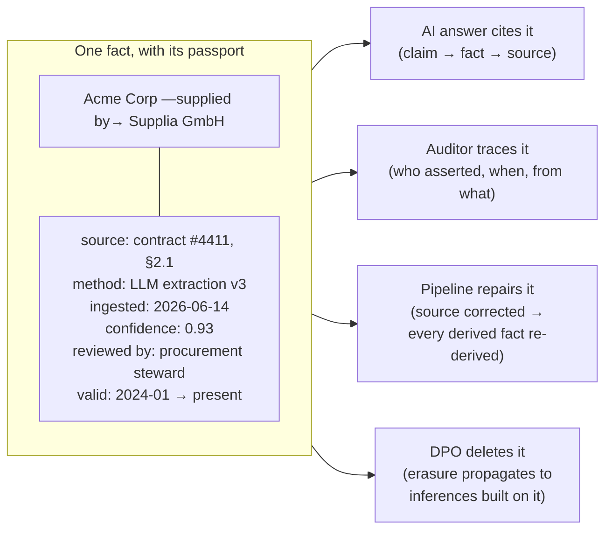

# Governance, quality & trust

*Part of [Knowledge graphs for the product leader](./README.md)*

## TL;DR

A knowledge graph is a **trust product**: the moment one executive meeting catches it
wrong — Acme listed twice, a dead subsidiary alive, revenue attached to the wrong
parent — usage quietly collapses, and no amount of coverage wins it back. Trust is
manufactured by four disciplines. **Provenance:** every fact carries where it came from,
when, via what, at what confidence — the difference between "the graph says" and "the
graph shows." **Quality metrics:** coverage, correctness, freshness, and resolution
precision, measured per domain and reported like product KPIs, because "is the graph
good?" is otherwise unanswerable. **Permissions:** the graph aggregates your most
connected view of customers and people, which means it aggregates risk — access must be
scoped at the node-and-edge level, and connection-making itself audited, because a graph
can *infer* what no single source was allowed to say. **Ownership:** named stewards per
domain and an ontology owner, or quality is everyone's job and therefore no one's. None
of this is bureaucracy bolted on after launch; it's the operating system that keeps the
asset an asset.

> 🎯 **For the product leader**
>
> **Why it matters** — The graph's entire value proposition is *being believable* —
> to your teams, your AI features, and your auditors. Governance is what converts a
> pile of extracted facts into something a regulated enterprise will let near a
> customer. It is also, increasingly, what your buyers' security reviews grade.
>
> **What it changes in your decisions** — Quality gets a dashboard and a bar, not a
> vibe: features declare the confidence tier they consume, launches gate on domain
> quality metrics, and privacy review treats *inferred* connections as data in their
> own right — not just the sources they came from.
>
> **Ask yourself** — *"If a customer, a regulator, or the DPO asked why the graph
> asserts this fact about them — can we show source, time, method, and who was allowed
> to see it?"*
>
> **Risk if ignored** — The quiet death: no incident, no postmortem — just teams
> drifting back to spreadsheets because the graph was wrong twice; or the loud one — a
> re-identification or leakage finding, because nobody treated the *connections* as
> personal data.

## Provenance: every fact shows its work

The unit of governance is not the dataset — it's the individual fact. Each edge carries
its passport:

Four consumers justify the cost. **Citations** — an
[AI feature](./knowledge-graphs-and-llms.md) can ground every claim. **Audit** — in
regulated domains, "how do you know this?" is a legal question with a deadline.
**Repair** — when a source turns out wrong, provenance is the blast-radius map: find
every fact and [inference](./reasoning-and-analytics.md) downstream and re-derive.
**Erasure** — data-subject deletion must reach not just copied records but *conclusions
drawn from them*; without provenance, right-to-erasure over a graph is archaeology.
Provenance is cheap at [construction time](./building-the-graph.md) and brutally
expensive to retrofit — it goes in the pipeline from day one or effectively never.

## Quality: four numbers on a dashboard

"Is the graph good?" decomposes into four measurable questions, each with a different
fix when it dips:

| Metric | The question | How it's measured | When it dips |
| --- | --- | --- | --- |
| **Coverage** | Of the entities/relationships the killer queries need, what share is in the graph? | Sample against systems of record & known universes, per domain | [Pipeline](./building-the-graph.md) gap: missing source or under-extracting |
| **Correctness** | Of the facts asserted, what share is true? | Standing sample audits by domain stewards ([golden-set logic](../content/04-evals-observability/evals.md)) | Extraction drift, source decay, threshold too loose |
| **Resolution precision** | Of the merges made, what share was right? | Audited merge samples; duplicate-rate spot checks for the recall side | False merges: tighten thresholds, widen review band |
| **Freshness** | How old is the graph's view vs. reality, where it matters? | Per-domain staleness: time since source sync vs. domain's rate of change | Sync breakage, batch cadence mismatch, dead source |

Three practices turn the numbers into governance. **Report per domain, not globally** —
"94% correct overall" hides the 71%-correct supplier domain your risk feature reads.
**Tier the consumption** — features declare the quality bar they need (an internal
explorer tolerates draft facts; an [AI answer to a customer](./knowledge-graphs-and-llms.md)
reads only reviewed, fresh, high-confidence tiers). This one mechanism lets exploration
and rigor share a graph without either poisoning the other. **Gate launches on the
metric** — a graph-backed feature ships when its domain hits the bar, which converts
quality from aspiration into a schedule input.

## Permissions: the graph aggregates risk

The graph's superpower — connecting everything — is precisely its risk profile. Three
problems are graph-specific, and standard database access control solves none of them:

- **Aggregation.** Each source was individually innocuous; connected, they profile a
  person or expose a strategy. Fifty siloed facts about an employee were fine;
  the *joined* fifty are a dossier. Access must scope at node/edge level (which
  subgraph, which relationship types), not "graph: yes/no."
- **Inference.** [Reasoning](./reasoning-and-analytics.md) mints *new* facts — and can
  derive what no source was permitted to state ("these two 'unrelated' accounts share a
  beneficial owner"). Inferred facts need classification and review *as data*, and
  re-identification risk assessed on the connected whole — the
  [DPDP/GDPR lens](../technical-product-sense/security-and-privacy.md) applies to
  conclusions, not just records.
- **The AI backdoor.** An assistant grounded on the full graph *answers* with anything
  it can reach; retrieval-time permission filtering
  ([lesson 6](./knowledge-graphs-and-llms.md)) is the enforcement point, and it must
  mirror source-system entitlements rather than inventing looser ones. The graph should
  never be the path by which someone learns what their CRM role hid — that's
  [leakage](../content/05-safety-multitenancy/safety-engineering.md) with better
  tooling.

## Ownership: the operating roles

Governance without names is a slideware ritual. The minimum viable cast: an **ontology
owner** (arbitrates [meaning](./ontologies-and-data-modeling.md), versions the
contract), **domain stewards** (own correctness and the
[review queues](./building-the-graph.md) for their entity types — sitting in the
domain, not a central data office), a **platform owner** (pipeline, store, SLOs), and a
**privacy/security reviewer** with standing over inferred data. Small graphs run this
as hats, not headcount — what matters is that each question ("what does this mean?",
"is this true?", "who may see it?") has exactly one desk it lands on. It's the same
lesson every [data platform](../technical-product-sense/data-and-the-data-model.md)
learns: assets without owners become swamps.

## Failure modes

- **The quiet death** — no dashboard, no stewards; two visible errors in front of the
  wrong audience, and the org routes back to spreadsheets without ever filing a ticket.
- **Provenance retrofit** — launched without source pointers "to move fast"; the first
  audit, erasure request, or bad-source repair becomes a quarter-long dig.
- **Global averages hiding local rot** — the overall correctness number looks fine
  while the one domain your flagship feature reads decays below usability.
- **Access modeled on sources, not aggregation** — everyone who could see *a* source
  can see the *joined* view; the dossier problem ships as a feature.
- **Inferred facts skipping privacy review** — "we only derived it" is not a defense
  the regulator recognizes.
- **Erasure that misses inferences** — the record is deleted; the conclusions built on
  it live on, citing a source that no longer exists.

## Practitioner checklist

- [ ] Does every fact carry source, method, timestamp, confidence, and reviewer — from
      the pipeline's first day?
- [ ] Are coverage, correctness, resolution precision, and freshness on a dashboard,
      *per domain*, with named stewards behind each?
- [ ] Do features declare the quality/confidence tier they consume — and do
      customer-facing AI surfaces read only the top tier?
- [ ] Is access scoped at node/edge level, mirrored from source entitlements, and
      enforced at retrieval for AI features?
- [ ] Have inferred connections been through privacy review as data in their own right —
      including re-identification risk on the joined view?
- [ ] Can an erasure request propagate through provenance to derived facts — and has
      that path been *tested*, not just designed?

## Related lessons

- [Building the graph](./building-the-graph.md) — where provenance and quality are
  manufactured (or forfeited).
- [Knowledge graphs & LLMs](./knowledge-graphs-and-llms.md) — retrieval-time
  permissions and citation chains in action.
- [Security & privacy sense](../technical-product-sense/security-and-privacy.md) — the
  broader privacy instincts this lesson sharpens for graphs.
