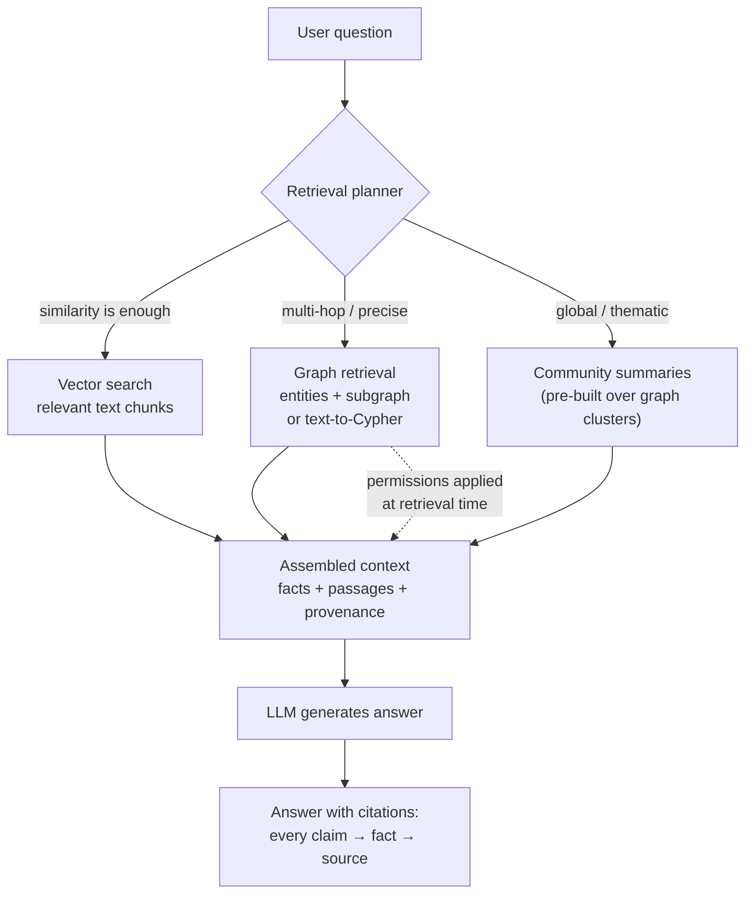

# Knowledge graphs & LLMs

*Part of [Knowledge graphs for the product leader](./README.md)*

## TL;DR

Knowledge graphs and language models fix each other's defining weaknesses, in both
directions. **Graph → LLM:** a model's knowledge is latent, frozen, and unattributable —
it will state your customer count fluently and wrongly; a graph supplies explicit,
current, *citable* facts to ground generation, via GraphRAG (retrieve subgraphs, not
just text chunks), text-to-query (the model translates a natural-language question into
Cypher/SPARQL and the *database* answers), and graph-shaped
[memory for agents](../agentic-ai/context-and-memory.md). **LLM → graph:** construction
was always the bottleneck, and extraction — reading contracts and tickets and drafting
entities, relationships, and mappings — is exactly the labor LLMs made an order of
magnitude cheaper. The circle closes into a flywheel: the model helps build the graph;
the graph keeps the model honest. The discipline holding it together: **LLM-drafted
facts enter the graph only through the
[confidence-and-review pipeline](./building-the-graph.md)** — never straight from
generation into "truth" — because a hallucinated fact, once stored, launders itself
into every downstream answer with a straight face.

> 🎯 **For the product leader**
>
> **Why it matters** — This intersection is why knowledge graphs left the semantic-web
> ghetto and landed on CPO roadmaps. "Our assistant answers from *our* facts, with
> citations, respecting *our* permissions" is a product claim vector-only RAG makes
> weakly and a graph makes strongly — and your enterprise buyers can tell the
> difference in the security review.
>
> **What it changes in your decisions** — Grounding stops being a model-quality
> line-item ("reduce hallucinations") and becomes an asset decision: what knowledge do
> we own, how fresh is it, and which answers must be *provably* sourced? It also
> reprices graph construction: the pre-LLM cost estimates in your old business case are
> stale.
>
> **Ask yourself** — *"When our AI feature answers a customer, can it cite the fact,
> the fact's source, and the reason this user was allowed to see it?"*
>
> **Risk if ignored** — An assistant that hallucinates policy in your brand's voice —
> or the quieter failure: an LLM-built graph whose unreviewed errors surface a year
> later as confidently cited "facts" in front of your biggest account.

## Direction one: the graph grounds the model

Plain [RAG](../content/03-rag/rag-architecture.md) retrieves text chunks that *look
similar* to the question. That fails structurally on two question types: **multi-hop**
("which of our customers are exposed to Supplia's recall?" — no single chunk contains
the answer, because the answer is a *path* across systems) and **global** ("what are
the main themes in this quarter's tickets?" — the answer is a summary over everything,
not any retrievable passage). Graph-augmented retrieval answers both by retrieving
*structure*:

Three patterns to know by name:

- **GraphRAG** — resolve the question's entities, pull their neighborhood subgraph, and
  hand the model *facts* alongside text. Microsoft's 2024 GraphRAG work added the
  global-question trick: pre-summarize graph
  [communities](./reasoning-and-analytics.md) so "themes across the corpus" becomes
  retrievable. The honest caveat: it adds an indexing stage that costs real money and
  must be [kept fresh](./governance-quality-and-trust.md) — reach for it when multi-hop
  and global questions are actually on your roadmap, not because the acronym is warm.
- **Text-to-query** — the model writes Cypher/SPARQL; the database executes it. The
  numbers come from the *store*, not the model's imagination — the right pattern for
  anything quantitative ("how many contracts renew in Q3?"). Constrain it to the
  [ontology](./ontologies-and-data-modeling.md), validate before executing, and eval it
  like code.
- **Hybrid retrieval** — in practice you run vectors *and* graph: vectors for fuzzy
  recall, the graph for precision, joined by cross-references (chunks link to the
  entities they mention). The [retrieval-eval discipline](../content/03-rag/retrieval-evals.md)
  applies unchanged — you're just adding a second retriever with different failure
  modes.

Two properties make this pattern enterprise-grade rather than merely accurate:
**provenance flows through** (claim → fact → source document — auditable answers), and
**permissions apply at retrieval** — the graph knows who may see which subgraph, so the
assistant's knowledge shrinks to the asker's entitlements
([the leakage problem](../content/05-safety-multitenancy/safety-engineering.md), solved
at the right layer). For agentic products, the same graph serves as
[structured memory](../agentic-ai/context-and-memory.md): facts an agent learns get
written back as triples with provenance — queryable and reviewable — instead of
accumulating in an unauditable text scratchpad.

## Direction two: the model builds the graph

[Construction](./building-the-graph.md) was always the cost center, and its most
expensive station — reading unstructured text and drafting structured facts — is now
LLM work: entity and relationship extraction from contracts and tickets, schema-mapping
suggestions, even candidate scoring for entity resolution. Teams that shelved
knowledge-graph plans in 2019 because "we'd need an NLP team" should re-run that math;
this repricing is a big part of why the field revived.

The discipline that keeps it from backfiring:

- **Extraction drafts; the pipeline decides.** LLM output enters as *candidate* facts
  with confidence and source, flows through the same thresholds and
  [review queues](./building-the-graph.md) as any extractor's output, and only then
  becomes knowledge. The graph's whole value is being the thing you *don't* have to
  second-guess; one unreviewed hallucination path breaks that contract.
- **The ontology is the leash.** Free-range extraction invents creative relationship
  types faster than any committee can review them. Constrain extraction to the
  ontology's types; route genuinely new patterns to the
  [ontology owner](./ontologies-and-data-modeling.md) as proposals.
- **Sample-audit forever.** Extraction accuracy drifts with document mix and model
  versions. A standing sample audit (measured, per source type) is the smoke detector —
  and the same [golden-set logic](../content/04-evals-observability/evals.md) you run
  on any AI feature.

## Choosing your grounding posture

| Posture | What it is | Right when | Watch out |
| --- | --- | --- | --- |
| Vector RAG only | Chunks + similarity | Q&A over documents; single-hop answers; speed to ship | Multi-hop and aggregate questions quietly wrong; weak citation granularity |
| + Text-to-query | Model writes queries against structured stores | Quantitative questions with a clean schema | Query errors need validation + evals; schema sprawl hurts |
| + GraphRAG | Subgraphs & community summaries in context | Multi-hop, cross-entity, global questions; citation and permission rigor | Indexing cost; freshness burden; needs a graph worth querying |
| Fine-tuning | Bake knowledge into weights | Style, format, domain *language* | Wrong tool for facts: stale on arrival, unattributable — see [fine-tune vs. RAG](../content/06-strategy-tradeoffs/finetune-vs-icl-vs-rag.md) |

The postures stack — most serious deployments end at "hybrid" — and the sequencing
advice is unglamorous: start with vector RAG, *measure* where it fails
([retrieval evals](../content/03-rag/retrieval-evals.md)), and let the observed failure
types — multi-hop, quantitative, global — justify each graph investment in order.

## Failure modes

- **Hallucination laundering** — LLM-extracted facts written straight to the graph;
  future answers cite them with perfect provenance chains ending in a hallucination.
- **GraphRAG as fashion** — the expensive indexing pipeline built for a workload that
  was 95% single-hop document Q&A vectors already handled.
- **Ungoverned text-to-query** — generated queries executed raw: wrong answers
  delivered with database confidence, and a prompt-injection surface into your store
  ([injection](../content/05-safety-multitenancy/safety-engineering.md) applies to
  query generation too).
- **Grounding on a stale graph** — the assistant faithfully cites facts eighteen
  months old; provenance makes the wrongness *look* authoritative.
- **Two sources of truth** — vector index and graph drift apart until they disagree;
  answers depend on which retriever won the race.

## Practitioner checklist

- [ ] For each AI answer surface: which claims must be cited, and does the chain run
      claim → fact → source without gaps?
- [ ] Are retrieval-time permissions enforced, so the assistant knows only what the
      asker may know?
- [ ] Does every LLM-drafted fact pass through confidence scoring and review before
      becoming graph truth — no exceptions for demos?
- [ ] Is text-to-query validated, sandboxed, and evaluated like code?
- [ ] Did observed vector-RAG failures (multi-hop, quantitative, global) justify each
      step up the grounding ladder — with the eval data to show it?
- [ ] Is there one freshness story covering both the graph and any derived
      indexes/summaries?

## Related lessons

- [RAG architecture](../content/03-rag/rag-architecture.md) — the baseline this lesson
  extends.
- [Building the graph](./building-the-graph.md) — the pipeline LLM extraction plugs
  into.
- [Context & memory](../agentic-ai/context-and-memory.md) — the agent-side view of
  graph-shaped memory.
