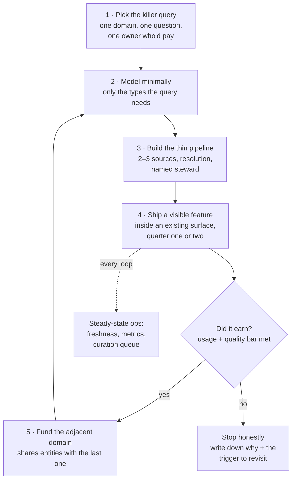

# Knowledge graphs as a product

*Part of [Knowledge graphs for the product leader](./README.md)*

## TL;DR

The capstone question is never "should we have a knowledge graph?" — it's "which
product bets get cheaper, better, or possible if our knowledge were connected, and what
does that cost end to end?" Run it like any platform investment, with three honest
numbers: **cost** (dominated by [construction and curation](./building-the-graph.md),
forever — storage is a rounding error), **value** (features shipped on top; the graph
itself earns nothing), and **compounding** (each new domain makes every previous domain
more valuable — the property that separates graphs from ordinary data projects, *if*
you sequence for it). The playbook that survives contact: start with one killer query
in one domain, ship a visible feature in a quarter or two, let each win fund the next
domain, and treat the ontology-plus-curated-graph as the moat — competitors can buy
your database vendor tomorrow; they can't buy your resolved entities or the
organizational agreement encoded in your ontology. And hold the honest exit: if the
questions are single-hop, the domain fits one system, or nobody owns curation, the
right call is *no* — written down, with the trigger that would reopen it.

> 🎯 **For the product leader**
>
> **Why it matters** — This is the lesson where the other seven become a budget line
> and a roadmap. Knowledge graphs fail at the portfolio level far more often than the
> technical level: funded as infrastructure with no feature attached, or starved as a
> side quest when the compounding needed patience.
>
> **What it changes in your decisions** — The graph never appears on your roadmap as
> itself; only features do, each carrying its slice of graph cost. Sequencing changes
> too: domain order is chosen for *adjacency* (shared entities with the last domain),
> not for whichever VP shouted loudest.
>
> **Ask yourself** — *"What's the first feature, in which quarter, that a user will
> notice — and does each next domain reuse entities the graph already resolved?"*
>
> **Risk if ignored** — The two canonical deaths: the *platform mirage* (two years of
> foundation-building, zero shipped features, budget yanked at the first CFO review)
> and the *pilot orphan* (a great demo nobody funded to steady state, decaying into
> the [quiet death](./governance-quality-and-trust.md)).

## The business case, in three honest numbers

**Cost — construction dominates, forever.** The end-to-end shape:
[pipeline and extraction](./building-the-graph.md) engineering, entity-resolution
tuning, *permanent* curation staffing, [ontology](./ontologies-and-data-modeling.md)
stewardship, plus the smallest line — [storage and compute](./storage-and-querying.md).
LLMs [repriced extraction](./knowledge-graphs-and-llms.md) meaningfully, but they moved
the construction share of budget from perhaps 80% to 60-70%; the steady-state curation
tail they reduce only somewhat, since LLM-drafted facts *increase* review volume. Any
business case whose cost model is mostly database licensing was written by the database
vendor.

**Value — features, attributed honestly.** The graph monetizes only through what ships
on top: the fraud feature's loss reduction, the assistant's deflection rate, the
360-view's expansion revenue, the risk dashboard's audit pass. Attribute each feature's
graph-share the same way you'd
[attribute model cost per feature](../content/04-evals-observability/cost-attribution.md) —
without that discipline, the graph is unfundable at every budget review and
indispensable in every architecture diagram, simultaneously.

**Compounding — the strategic argument, with a condition.** Domain two reuses domain
one's resolved customers; the supplier domain connects to both; each addition raises
the value of every prior query. That's the moat logic — the curated, resolved,
agreed-upon graph is expensive to replicate *because your competitor must redo the
organizational work, not just the software*. But compounding only happens if domains
are chosen adjacent (shared entities) and quality holds
([trust, once lost, un-compounds](./governance-quality-and-trust.md) faster than it
built).

## The sequencing playbook

The loop deserves three annotations. **Ship inside an existing surface** — the first
graph feature should improve a screen people already use (the account view gains
"supply-chain exposure"), not launch a "graph explorer" destination nobody visits;
graphs are middleware, and middleware wins by disappearing. **A quarter or two, not a
year** — if the first visible feature is further out, the scope is wrong, not the
timeline. **The loop is also the org design** — each turn adds a domain steward and
expands the [governance](./governance-quality-and-trust.md) cast; the team grows with
proven value, never ahead of it. Prioritize the queue like any other
[roadmap under constraint](../technical-product-management/prioritization-and-roadmaps.md) —
the graph earns no exemption from ROI ordering.

## Build, buy, and the LLM-only challenge

| Option | What you get | Right when | The catch |
| --- | --- | --- | --- |
| Build (on managed infra) | Your ontology, your resolution, your moat | The graph *is* competitive knowledge: your customers, catalog, network | You own the curation tail forever |
| Buy data | Pre-built external graphs: company registries, risk data, product catalogs | The knowledge is public and undifferentiated — never rebuild the world's company list | Licensing terms, and the seam where their identities meet yours |
| Buy platform | Vendor suites bundling pipeline + store + governance | Team is thin and the domain is standard (customer 360, MDM-adjacent) | The [lock-in calculus](./storage-and-querying.md), now covering your pipeline too |
| LLM-only (no graph) | Model + [vector RAG](../content/03-rag/rag-architecture.md), maybe [text-to-SQL](./knowledge-graphs-and-llms.md) | Single-hop Q&A over documents; facts that fit one system | Multi-hop, citable, permission-scoped answers degrade exactly where graphs are strong |

In practice the answer is a seam, not a box: build the differentiating core, buy the
commodity edges (external identifiers double as resolution anchors), and let the
[measured failures of LLM-only retrieval](./knowledge-graphs-and-llms.md) tell you when
the graph investment turns on. The strategic instinct is the same one behind every
[build-vs-buy call](../technical-product-sense/economics-of-infrastructure.md): own
what differentiates, rent what doesn't.

## When the answer is no

Say no crisply when: the valuable questions are **single-hop** (a good schema wins);
the domain **fits one system of record** (the connective layer connects nothing); the
knowledge **changes faster than curation can follow** (the graph would always lie);
**nobody will own stewardship** (an orphaned graph is a liability with a dashboard); or
the honest goal is **"AI strategy" optics** (a graph built for the board deck dies the
quarter attention moves). A written no — with the trigger that reopens it ("when
support tickets require joining three systems," "when the assistant's multi-hop
failure rate crosses X") — is a strategy artifact worth as much as a build.

## Failure modes

- **The platform mirage** — "first we build the foundation, then the features." The
  foundation takes two years; the features never arrive; the budget dies at review.
- **The pilot orphan** — a demo that wowed, funded as a project not a product; no
  steady state, no steward, quiet death by staleness.
- **Non-adjacent domain hopping** — each new domain chosen politically, sharing no
  entities with the last; costs stack linearly, value doesn't compound.
- **The unattributed platform** — no feature carries graph cost, so the graph looks
  free until it looks expensive; first budget squeeze kills it.
- **Moat mistaken for database** — believing the store is the asset; the actual moat —
  resolved identities, agreed ontology, curation muscle — goes unfunded.
- **No written no** — the graph idea returns every planning cycle, burns a discovery
  spike each time, and is never either built or buried.

## Practitioner checklist

- [ ] Is the first visible feature named, scoped to one killer query, and landing
      inside an existing surface within two quarters?
- [ ] Does the cost model show construction + permanent curation as the dominant lines —
      and does steady state survive the pilot team's departure?
- [ ] Is every subsequent domain adjacent — reusing entities the graph already
      resolved — and does the value narrative show compounding, not stacking?
- [ ] Does each graph-backed feature carry its attributed share of graph cost through
      budget reviews?
- [ ] Is the build/buy seam explicit: differentiating core built, commodity knowledge
      bought, LLM-only baseline measured before each escalation?
- [ ] If the answer is no: is it written, with the reopening trigger — and if yes: can
      I defend the moat in one sentence that doesn't mention a database?

## Related lessons

- [What is a knowledge graph?](./what-is-a-knowledge-graph.md) — the killer-query test
  this capstone operationalizes.
- [Governance, quality & trust](./governance-quality-and-trust.md) — the steady state
  the business case must fund.
- [Prioritization & roadmaps](../technical-product-management/prioritization-and-roadmaps.md) —
  the portfolio discipline the sequencing loop plugs into.
