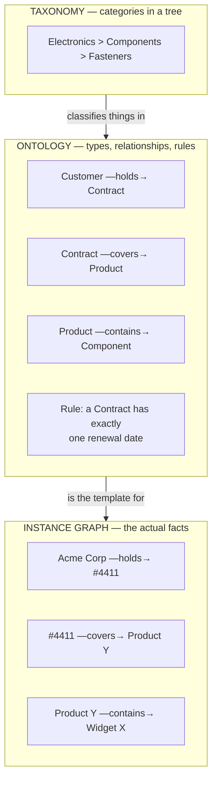

# Ontologies & data modeling

*Part of [Knowledge graphs for the product leader](./README.md)*

## TL;DR

The **ontology** is the graph's data model: the agreed list of entity types (Customer,
Product, Supplier), the relationship types allowed between them (*holds*, *supplies*,
*depends on*), and the rules that make facts mean the same thing everywhere. It sounds
like a technical artifact; it is actually a **product contract** — it fixes, in advance,
the set of questions your graph can ever answer and the set of teams who have to agree on
vocabulary. Ontology design is therefore a negotiation, not a specification: sales'
"account," finance's "billing entity," and legal's "counterparty" are three views of one
thing, and someone has to decide how they map. The craft is scoping: model the handful of
entity types your first killer queries need, borrow standard vocabularies where they
exist, version the ontology like an API, and let it grow one proven domain at a time.
The failure mode has a name in every data team — *boiling the ocean* — and it has killed
more knowledge-graph programs than any technology choice.

> 🎯 **For the product leader**
>
> **Why it matters** — Every question your product will ever answer from the graph must
> be expressible in the ontology's vocabulary. If "subsidiary" isn't modeled, no query
> about corporate families will ever run — no matter how good the database is. The
> ontology is where product strategy silently becomes data architecture.
>
> **What it changes in your decisions** — You treat ontology reviews the way you treat
> API reviews: as product decisions needing your input, not plumbing to delegate. And
> you resource them accordingly — the scarce skill is someone who can hold both the
> domain and the modeling discipline.
>
> **Ask yourself** — *"Which questions on next year's roadmap can this ontology not
> express — and are we choosing that on purpose?"*
>
> **Risk if ignored** — A modeling committee runs for a year producing a 400-type
> enterprise ontology nobody uses; or the opposite — three teams each invent their own
> definition of 'customer' and the graph faithfully connects things that don't mean the
> same thing.

## Three layers: taxonomy, ontology, instances

The words get used interchangeably; they shouldn't be:

- **Taxonomy** — a classification tree: categories and subcategories. Useful, familiar
  (every e-commerce catalog has one), and strictly weaker than an ontology: a tree gives
  each thing one parent, and knowledge is a web.
- **Ontology** — the type system: which kinds of things exist, which relationships are
  allowed between which types, and what constraints hold ("every Contract has exactly one
  renewal date," "*subsidiary of* is transitive"). This is the layer this lesson is about.
- **Instance graph** — the millions of actual facts, shaped by the ontology the way rows
  are shaped by a schema.

The product consequence: taxonomy debates ("where does this SKU go?") are cheap and
reversible; ontology debates ("what *is* a customer?") are expensive and load-bearing.
Budget your attention accordingly.

## The ontology is a negotiation

"Customer" means the paying legal entity to finance, the user organization to product,
the buying committee to sales, and the counterparty to legal. All four are right. An
ontology doesn't pick a winner — it models the distinctions explicitly: a `LegalEntity`
*pays for* a `Subscription` *used by* an `Organization` *containing* `Users`. The work
is getting four departments to *agree that this decomposition captures what they each
mean* — which is organizational alignment wearing a data-modeling costume.

This is why ontology projects run by engineering alone stall: the blockers aren't
technical. Practical rules that keep the negotiation shippable:

- **Anchor on questions, not completeness.** Take the three killer queries from
  [lesson 1](./what-is-a-knowledge-graph.md) and model *only* the types and edges they
  need. An ontology is done enough when the queries run, not when the domain is
  fully described.
- **Name an owner per entity type.** Finance owns `LegalEntity`, product owns
  `Feature`, HR owns `Employee`. Disputes get a decider, and
  [governance](./governance-quality-and-trust.md) gets a hook.
- **Borrow before inventing.** Public vocabularies exist for people and organizations
  (schema.org), industries (NAICS), products (GS1), finance (FIBO), medicine (SNOMED).
  Borrowing buys interoperability and skips six months of committee.
- **Version it like an API.** The ontology *is* an interface — downstream queries,
  pipelines, and features depend on it. Additive changes are cheap; renames and
  semantic changes are breaking changes and deserve the same ceremony as
  [API contract changes](../technical-product-sense/apis-and-contracts.md).

## Design decisions that echo for years

A few modeling choices come up in every domain, and each is secretly a product decision:

| Decision | The choice | What it decides for the product |
| --- | --- | --- |
| Granularity | Is "Acme Corp" one node or a family (HQ, subsidiaries, brands)? | Whether corporate-family questions (total exposure, group discounts) are ever answerable |
| Reification | Is a purchase an edge (`Customer —bought→ Product`) or an entity (`Order` with date, price, channel)? | Whether you can attach evidence, time, and amount to the fact — usually you must |
| Time | Do edges have validity intervals (*worked at, 2019–2022*)? | Whether history and "as-of" questions exist, or the graph only knows the present |
| Confidence | Do facts carry certainty and [provenance](./governance-quality-and-trust.md)? | Whether extracted (vs. curated) knowledge can safely coexist with system-of-record facts |
| Negation & absence | Is "no known relationship" stored or inferred? | Whether compliance can ask "prove we *don't* deal with X" — absence of an edge is not evidence of absence |

You don't need to resolve all five up front — you need to know which ones your roadmap
will hit, because retrofitting time or provenance onto a live graph is a migration, not
a patch.

## How deep to model: the pragmatism dial

Formal ontology languages (OWL, SHACL) support machine reasoning: define "*supplies* is
transitive through *subsidiary of*" and the system infers indirect exposure
automatically ([reasoning lesson](./reasoning-and-analytics.md)). That power has a cost —
formal modeling talent is rare, and heavyweight ontologies are slow to change. Most
successful product graphs sit deliberately low on the formality dial: a well-named set
of types and edges, a handful of constraints, documentation humans actually read — and
formality added *only* where automated inference pays for it (compliance, medicine,
engineering). "As formal as the killer queries require, and no more" is the right
default; academic completeness is how graphs die in committee.

## Failure modes

- **Boiling the ocean** — the enterprise-wide ontology program that must model
  everything before anything ships. Eighteen months later: a beautiful document, no
  graph, no users, no budget.
- **The committee ontology** — every stakeholder's vocabulary included verbatim to avoid
  conflict; the result has four flavors of "customer" and connects none of them.
- **Engineering-only modeling** — technically elegant types that don't match how the
  business actually talks; adoption dies at the first demo.
- **The frozen ontology** — treated as finished after v1; two years later half the new
  product's concepts don't fit, and teams route around the graph.
- **Untyped edges** — everything connected by "related to." The graph draws nicely and
  answers nothing; a relationship type that means anything means nothing.

## Practitioner checklist

- [ ] Is every entity type and relationship in our ontology *required by a named query
      or feature* — and can I point to the ones we cut on purpose?
- [ ] Does each entity type have a single accountable owner for its definition?
- [ ] Which of the five echo decisions (granularity, reification, time, confidence,
      negation) does next year's roadmap force — and have we made them deliberately?
- [ ] Did we check for a standard vocabulary before inventing our own?
- [ ] Is the ontology versioned, with breaking changes treated like API breaks?
- [ ] Can a new PM read the ontology doc and correctly predict what the graph can and
      cannot answer?

## Related lessons

- [What is a knowledge graph?](./what-is-a-knowledge-graph.md) — the killer queries the
  ontology must serve.
- [Building the graph](./building-the-graph.md) — the pipeline the ontology constrains.
- [APIs & contracts](../technical-product-sense/apis-and-contracts.md) — the versioning
  discipline this lesson borrows.
