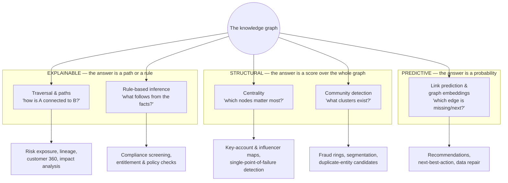

# Reasoning & analytics

*Part of [Knowledge graphs for the product leader](./README.md)*

## TL;DR

The payoff for all that construction: once knowledge is a graph, whole families of
questions become *computable* that tables and documents can't express at any price.
Five families cover nearly everything on a product roadmap: **traversal** (follow chains:
exposure, lineage, "how are these two connected?"), **centrality** (which nodes matter
most — the PageRank family), **community detection** (which nodes cluster — fraud rings,
customer segments, duplicate candidates), **link prediction** (which edges are missing or
likely next — recommendations, next-best-action), and **rule-based inference** (facts
that follow logically from stated facts — "subsidiary of a sanctioned entity is
sanctioned-adjacent"). Each maps to a product capability you can name in a roadmap
review, and each has a different trust profile: traversal and inference produce
*explainable* answers you can show a regulator; predictions produce *probabilistic* ones
you should ship as suggestions, not facts. Knowing which family a proposed feature sits
in tells you its cost, its latency, and how much explanation your UX owes the user.

> 🎯 **For the product leader**
>
> **Why it matters** — "Graph analytics" sounds like a data-science luxury. It's
> actually the menu of what your graph investment can *ship*: the fraud feature, the
> recommendation engine, the risk-exposure dashboard are all entries on this menu. If
> you can't name the families, you can't spot which roadmap items the graph makes cheap —
> or be appropriately suspicious when a pitch calls a prediction a fact.
>
> **What it changes in your decisions** — Roadmap items get tagged with their family,
> which sets three things at once: compute pattern (real-time query vs. batch job),
> explainability (deterministic vs. probabilistic), and eval burden (correctness vs.
> [precision/recall on a golden set](../content/04-evals-observability/evals.md)).
>
> **Ask yourself** — *"For this graph-powered feature: is the answer traversed, inferred,
> or predicted — and does the UX honestly reflect which one it is?"*
>
> **Risk if ignored** — A link *prediction* ships rendered like a stored *fact*; a
> customer asks "why does your product say we work with X?"; and the honest answer —
> "an algorithm guessed" — lands in a complaint, or a headline.

## The five families, as product capabilities

**Traversal** is the workhorse — the multi-hop questions from
[lesson 1](./what-is-a-knowledge-graph.md), plus the underrated *pathfinding* form:
"show every chain connecting this customer to this sanctioned entity." The answer is the
path itself — evidence you can put in front of an auditor. Runs live, in the request
path, if [depth-capped](./storage-and-querying.md).

**Centrality** ranks importance by structure. PageRank and its relatives find the
supplier whose failure cascades furthest, the person the org actually routes through
(rarely the org chart's answer), the account whose loss would unravel a network. Batch
computation, refreshed on a schedule, consumed as a score.

**Community detection** finds dense clusters no one labeled: accounts that share
devices, addresses, and payment methods (a fraud ring, structurally, *before* any
individual account misbehaves — the reason graph analytics is standard kit in financial
crime); customers that cluster by actual usage rather than firmographics; and — a nice
dogfooding touch — probable duplicates the [resolution pipeline](./building-the-graph.md)
missed.

**Link prediction** guesses edges that are missing or coming: customers-who-look-like-this
also-need-that (recommendations), this person likely-knows that person, this record is
probably the same entity as that one. The modern machinery is **graph embeddings** —
compressing each node's neighborhood into a vector so "structurally similar" becomes
computable — and increasingly graph neural networks. Powerful, and *probabilistic to the
bone*: these are suggestions wearing math.

**Rule-based inference** derives facts logically: *part-of* chains roll up, ownership
percolates through corporate trees, "handles EU personal data" propagates to every
system downstream of one that does. Deterministic, auditable, and the reason
[formal ontologies](./ontologies-and-data-modeling.md) exist; in regulated domains this
family is the product.

## The trust gradient

The families differ most in *what kind of answer* they produce — and your UX, evals,
and compliance posture must track it:

| Family | Answer type | Show the user | Eval discipline |
| --- | --- | --- | --- |
| Traversal | Deterministic path | The path itself — it *is* the explanation | Correctness + freshness of underlying facts |
| Inference | Deterministic derivation | The rule and the facts it fired on | Rule review + regression tests, like code |
| Centrality / community | Structural score | Rank or grouping, framed as analysis | Stability across runs; sanity panels with domain experts |
| Link prediction | Probability | A *suggestion*, with a why-shown ("shares 3 suppliers with...") | [Precision/recall on golden sets](../content/04-evals-observability/evals.md), online acceptance rates |

The gradient also sets *where* mistakes hurt. A wrong stored fact corrupts every family
downstream — which is why [construction quality](./building-the-graph.md) outranks
algorithm choice. A wrong prediction, honestly framed as a suggestion, costs a shrug.
The catastrophic combination is a prediction *stored back into the graph as a fact*:
the guess launders itself into evidence, and six months later nobody remembers it was a
guess. If predictions must be persisted, they carry their
[confidence and provenance](./governance-quality-and-trust.md) forever.

## Operational shape

Two compute patterns, two cost profiles. **Query-time** work (traversal, inference on
demand) lives in the request path: milliseconds, depth caps, timeouts — feature latency
is graph latency. **Batch** work (centrality, communities, embeddings, prediction
scoring) runs on schedules and ships scores: cheap to serve, but *stale by design* —
the fraud ring detected nightly is invisible for up to 24 hours, and whether that's fine
is a product decision, not an infrastructure one. Most platforms bundle these algorithms
into libraries, so the engineering lift is usually integration, not invention; the real
work is choosing thresholds and owning what the scores *mean*.

## Failure modes

- **Predictions cosplaying as facts** — the link-prediction output rendered in the same
  UI as curated knowledge; trust in the whole graph dies with the first bad guess.
- **Garbage in, insight out** — centrality and community algorithms run happily on a
  graph full of [false merges](./building-the-graph.md); the "key supplier" is two
  companies fused by a resolution bug.
- **Celebrity-node blowups** — the mega-hub (the bank everyone uses, the component in
  everything) makes traversals explode and communities meaningless; dense nodes need
  modeling care, caps, or exclusion rules.
- **Unstable scores presented as truth** — community boundaries shift run to run;
  yesterday's "Segment 7" is today's "Segment 12," and downstream teams built process on
  the labels.
- **Batch cadence mismatch** — a real-time decision (payment approval) fed by a
  nightly score; the ring that formed at 9 a.m. clears payments all day.

## Practitioner checklist

- [ ] Is every graph-powered roadmap item tagged with its family — and therefore its
      compute pattern, explainability, and eval plan?
- [ ] Do predictive features *look* predictive in the UX (suggestion framing,
      why-shown), and are they never silently persisted as facts?
- [ ] For path-and-rule features: can the product show its work — the path or the rule —
      to a user, an auditor, or a regulator?
- [ ] Are batch cadences matched to decision speed — and is someone on record accepting
      the staleness window?
- [ ] Have we identified our celebrity nodes and decided how each family handles them?
- [ ] Do algorithm outputs carry enough lineage that a wrong score can be traced to the
      facts (or bugs) that produced it?

## Related lessons

- [Building the graph](./building-the-graph.md) — analytics amplify whatever quality the
  pipeline delivers, garbage included.
- [Knowledge graphs & LLMs](./knowledge-graphs-and-llms.md) — the newest consumer of all
  five families.
- [Evals](../content/04-evals-observability/evals.md) — the measurement discipline the
  predictive family borrows wholesale.
