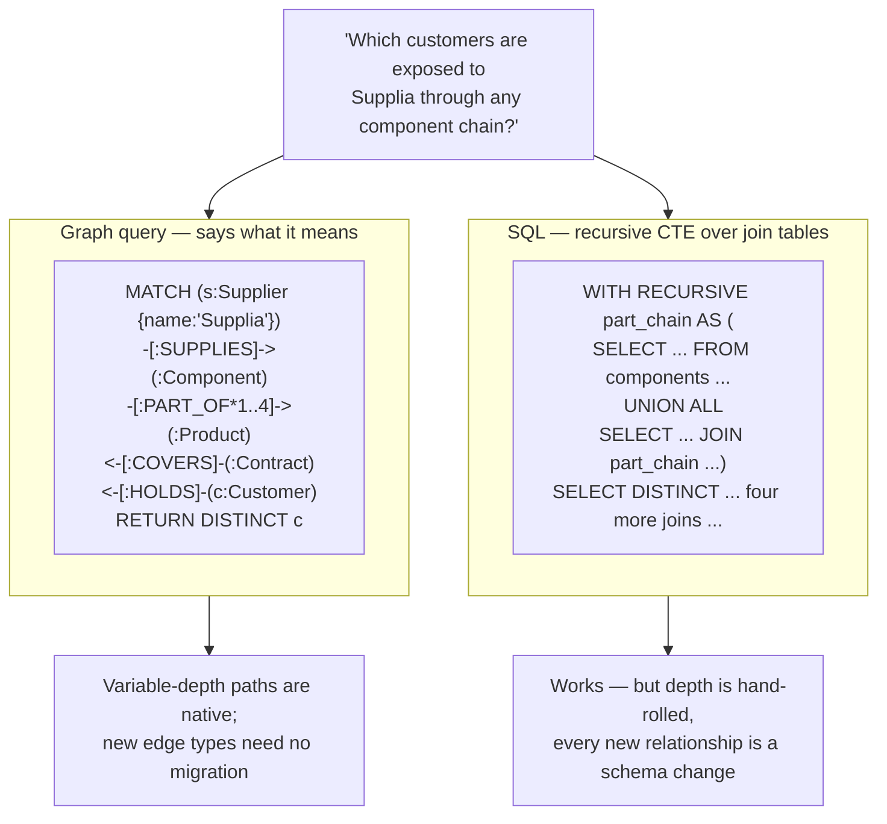

# Storage & querying

*Part of [Knowledge graphs for the product leader](./README.md)*

## TL;DR

Once the graph exists, it has to live somewhere queryable. Three honest options: a
**property graph database** (Neo4j and kin, queried in Cypher/GQL) — the pragmatic
default for product features; an **RDF triple store** (queried in SPARQL) — the
standards-based choice when interoperability, formal semantics, or cross-organization
data exchange matter; or a **graph layer on the database you already run** (recursive
SQL, or graph extensions on Postgres/warehouse) — the right answer more often than
vendors admit, especially below a few million entities and three hops. The technical
dividing line is the **traversal-vs-join** question: graph databases make "follow five
hops from here" fast and *writable*; relational stores make it slow and unreadable —
but if your queries never go deep, that advantage never cashes. The product-leader
mistake to avoid: this is the *least* important decision in the module — teams agonize
over databases while the [pipeline](./building-the-graph.md) and
[ontology](./ontologies-and-data-modeling.md) — which actually determine success — go
under-resourced. Pick boring, pick managed, move on.

> 🎯 **For the product leader**
>
> **Why it matters** — This is where the vendor money is, so it's where the noise is.
> Every graph-database vendor will frame your project as a database choice. It isn't —
> but the choice still sets your latency floor, your ops burden, and a real
> lock-in cost, because query languages don't port cheaply.
>
> **What it changes in your decisions** — You ask for the *query shapes* (how many hops,
> how much fan-out, what latency budget, embedded in which user-facing feature) before
> anyone names a product. Query shapes decide the store; the store never decides the
> product.
>
> **Ask yourself** — *"What's the deepest traversal on our roadmap, at what latency,
> inside which feature — and did we benchmark the boring option on that exact query?"*
>
> **Risk if ignored** — Six months of bake-off theater for a workload Postgres handles;
> or the inverse — a relationship-heavy feature built on SQL that collapses at demo
> scale, taking the roadmap down with it.

## The traversal-vs-join argument, honestly

The core claim for graph databases: relationships are stored as direct pointers, so
following an edge costs the same whether the graph holds a thousand nodes or a billion
(*index-free adjacency*), while each relational join re-finds partners via index lookups
that compound as hops multiply. The claim is true — *for deep, path-shaped queries*.
"All customers exposed to supplier X through any chain of parts" is painful in SQL at
hop four and trivial in Cypher. But for one- and two-hop lookups, aggregations, and
reporting, a tuned relational store is equal or better, with operational maturity graphs
still can't match. There is also a readability dividend that shows up in team velocity:

The variable-depth `*1..4` is the tell: the graph query *states the question*; the SQL
*implements* it. When relationship questions are your product's daily bread, that gap
compounds into feature velocity. When they're occasional, it's a curiosity.

## The three families

| | Property graph | RDF triple store | Graph layer on existing DB |
| --- | --- | --- | --- |
| Mental model | Nodes & edges with property bags — a whiteboard drawing, stored | Everything a triple; global identifiers (IRIs); formal semantics | Your tables, plus recursive queries or a graph extension |
| Query language | Cypher; **GQL** (the 2024 ISO standard descended from it) | SPARQL (W3C standard) | SQL + recursive CTEs, or vendor graph SQL |
| Strengths | Developer-friendly, fast traversals, rich algorithm libraries, biggest talent pool | Interoperability, standard vocabularies, inference/reasoning built in, cross-org data exchange | Zero new infrastructure, one backup/security/ops story, your team already knows it |
| Weaknesses | Historically vendor-flavored (GQL is fixing this); semantics live in your docs, not the store | Steeper learning curve, thinner tooling and talent, reification friction for edge properties | Deep/variable-depth traversal slow and brittle; graph algorithms mostly absent |
| Natural home | Product features: recommendations, fraud, 360° views, [GraphRAG](./knowledge-graphs-and-llms.md) | Regulated and cross-organization domains: pharma, government, publishing, finance reference data | Modest scale, shallow hops, or proving value before buying infrastructure |

Deployment nuance worth knowing exists (native stores vs. multi-model engines vs.
graph-on-warehouse; managed offerings from every major cloud) — but it's an
engineering-owned decision. Your leverage is earlier: *family*, driven by query shapes
and interoperability needs.

## How to run the decision

1. **Write the query shapes down.** Top ten roadmap queries: hops, fan-out, latency
   budget, freshness, and whether they sit inside a user-facing request path or a
   nightly batch. This one page does more than any bake-off.
2. **Benchmark the boring option first.** Load a production-scale sample into what you
   already run. If it holds your latency at your depth — stop; revisit at the next order
   of magnitude. No graph database earns its ops burden below that bar.
3. **If traversal wins, default to a managed property graph.** Largest talent pool,
   best algorithm support, and GQL standardization is steadily lowering the lock-in tax.
   Choose RDF deliberately, for interoperability or regulatory semantics — not by
   default.
4. **Contain the lock-in.** Whatever the store: keep the [ontology](./ontologies-and-data-modeling.md)
   documented store-independently, keep the [pipeline](./building-the-graph.md) writing
   a neutral intermediate format, and keep raw sources replayable. Then the database is
   a component you can swap, not a decision you married. This is the same instinct as
   [avoiding platform lock-in anywhere else](../technical-product-sense/economics-of-infrastructure.md).

One more boundary worth policing: **graph stores serve knowledge; they don't replace
your OLTP systems**. The graph is a connective layer over systems of record — billing
still lives in billing. Teams that try to make the graph the system of record inherit
transaction-processing problems graph databases are bad at, and lose the ability to
rebuild the graph from sources when (not if) the pipeline needs a redo.

## Failure modes

- **Bake-off theater** — six months comparing engines on synthetic benchmarks while the
  real risks (resolution quality, curation staffing) go unexamined.
- **Résumé-driven storage** — a graph database adopted for two-hop lookups Postgres
  served fine; the team now runs an extra distributed system for nothing.
- **The inverse** — "we'll just use SQL" for a product whose core loop is four-hop,
  variable-depth traversal; every new feature is a recursive-CTE archaeology dig.
- **Graph as system of record** — the store that should mirror knowledge starts
  *owning* it; now you have dual-write bugs and no replay path.
- **Unbounded queries in the request path** — a `*1..` traversal with no depth cap or
  timeout ships inside a user-facing endpoint; one dense node (every graph has a
  celebrity) times out the feature.

## Practitioner checklist

- [ ] Do we have the query-shapes page — hops, fan-out, latency, freshness — for the top
      ten roadmap queries?
- [ ] Was the boring option benchmarked on production-scale data before any vendor
      conversation?
- [ ] If we chose a graph store: is it managed, and is the choice justified by named
      queries rather than the roadmap slide?
- [ ] Is the ontology documented outside the database, and can the graph be rebuilt from
      replayable sources?
- [ ] Do request-path queries carry depth caps and timeouts (celebrity nodes exist in
      every domain)?
- [ ] Does the latency budget for graph-backed features trace back to a
      [user-facing performance target](../technical-product-sense/latency-scale-performance.md)?

## Related lessons

- [Reasoning & analytics](./reasoning-and-analytics.md) — the algorithm libraries that
  come with (mostly property-) graph platforms.
- [Building the graph](./building-the-graph.md) — the pipeline that should stay
  store-neutral.
- [The economics of infrastructure](../technical-product-sense/economics-of-infrastructure.md) —
  the build/buy/lock-in instincts applied here.
