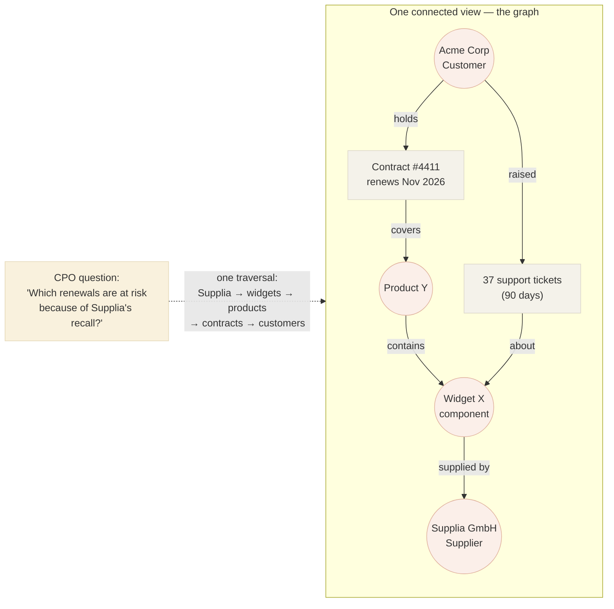

# What is a knowledge graph?

*Part of [Knowledge graphs for the product leader](./README.md)*

## TL;DR

A knowledge graph stores knowledge as **things and the relationships between them** —
`(Acme Corp) —supplies→ (Widget X)`, `(Widget X) —part of→ (Product Y)` — instead of as
rows in disconnected tables or words in disconnected documents. Each fact is a small,
explicit statement (a **triple**: subject → relationship → object), and because facts
share entities, they snap together into one connected web you can *traverse*: from a
customer, hop to their contracts, to the products in them, to the supplier of a failing
part — in one query. That's the entire trick, and it's enough to change what your product
can answer. The strategic shift was named by Google in 2012 — **things, not strings**:
stop matching text, start knowing what the text refers to. The product test is equally
plain: if your most valuable unanswered questions require *joining knowledge across
three or more hops* — or the relationships themselves are the product — you're in
knowledge-graph territory. If not, a well-modeled database is honestly fine.

> 🎯 **For the product leader**
>
> **Why it matters** — "Knowledge graph" is a term you'll hear from vendors, data teams,
> and AI strategy decks, often meaning wildly different things. If you can't state what
> one actually is — explicit entities and relationships, queryable by traversal — you
> can't tell a genuine capability from a rebranded database, or price what building one
> would take.
>
> **What it changes in your decisions** — You stop evaluating "should we have a knowledge
> graph?" (an infrastructure question) and start evaluating "which questions can't we
> answer today because the knowledge is disconnected?" (a product question). The graph is
> justified by the questions, never the other way around.
>
> **Ask yourself** — *"What are the three most valuable questions my product can't answer
> today because the answer lives in more than one system?"*
>
> **Risk if ignored** — You fund a two-year platform project with no killer query
> attached, or you dismiss the idea entirely and watch a competitor answer in one hop
> what takes your team a week of spreadsheet archaeology.

## Things, not strings

Search for "jaguar" in a text index and you get documents containing the string. A
knowledge graph instead knows there are three *things* — an animal, a car brand, a
sports team — each with its own identity, properties, and relationships. Google's 2012
Knowledge Graph launch put a name on this shift, and the phrase is the cleanest summary
of the whole field: **a string is what something is called; a thing is what it is.**

Your company runs on strings today. "Acme Corp" in the CRM, "ACME Inc." in billing,
"acme-corp-2019" in the contract system — three strings, one thing, and no system that
knows it. The knowledge graph move is to mint one identity for the thing and attach every
fact to it:

Every arrow is a stored fact. The question on the left is unanswerable in any single
source system — it *is* answerable, in milliseconds, once the arrows exist. That's the
product argument for knowledge graphs in one picture.

## The anatomy: entities, relationships, triples

Strip away vendor vocabulary and there are only four parts:

- **Entities (nodes)** — the things: customers, products, people, suppliers, documents,
  policies. Each has a stable identity that survives renaming and typos.
- **Relationships (edges)** — typed, directional connections: *supplies*, *owns*,
  *reports to*, *depends on*. The type carries meaning; "connected to" is not a
  relationship, it's a shrug.
- **Properties** — attributes on either: a customer's segment, a contract's renewal
  date, a relationship's start date or confidence score.
- **Triples** — the atomic fact format: *subject → predicate → object*. "Supplia
  supplies Widget X." Every knowledge graph, whatever the technology underneath,
  decomposes into a pile of these small sentences — which is why graphs and language
  models get along so well ([lesson 6](./knowledge-graphs-and-llms.md)).

Two properties of this shape do most of the work. **Facts compose.** Nobody wrote down
"Supplia's recall threatens Acme's renewal" — it *emerges* from four independently
recorded facts. A graph answers questions nobody anticipated when the data was entered;
a table schema answers exactly the questions its designer anticipated. **The schema
bends.** Adding a new relationship type ("is regulated by") doesn't require migrating
tables — you start drawing new arrows. That flexibility is a gift and a hazard, which is
why the [ontology lesson](./ontologies-and-data-modeling.md) comes next.

## What a knowledge graph is *not*

The fastest way to sharpen the concept is to name its neighbours:

| It's not... | Because... | Where that shines instead |
| --- | --- | --- |
| A relational database | Tables *can* store relationships (join tables), but every hop is a join you designed in advance; five-hop paths and "any path between A and B" questions get slow and unwritable | Transactions, reporting, anything with a fixed, known access pattern |
| A vector store | Embeddings capture *similarity* ("these two documents feel alike") — fuzzy, unexplainable, and unauditable; a graph captures *stated facts* with provenance | Semantic search over text, [RAG retrieval](../content/03-rag/rag-architecture.md) |
| A data warehouse / lake | Warehouses centralize *records* for aggregation; they don't resolve identity across sources or make relationships first-class | BI, metrics, large-scale batch analytics |
| An LLM | A model's knowledge is *latent* — statistical, unattributable, frozen at training, and sometimes wrong with confidence; a graph's knowledge is explicit, current, and citable | Language understanding, generation, extraction ([lesson 6](./knowledge-graphs-and-llms.md)) |
| A taxonomy or org chart | Trees allow one parent per node; real knowledge is a web — a product belongs to a category, a supplier, a compliance regime all at once | Simple classification, navigation menus |

The honest summary: a knowledge graph is a *complement* to all of these, not a
replacement for any of them. It typically sits **across** your systems of record as a
connective layer — which is exactly why identity resolution
([lesson 3](./building-the-graph.md)) is the hard part.

## The test: do you actually need one?

Three signals say yes; their absence says no.

1. **Your valuable questions are multi-hop.** "Which customers are exposed to this
   supplier?" "Which features does this regulation touch?" "Who in the org has worked
   with this account before?" If the answer requires chaining three or more
   relationships across systems, tables fight you and graphs don't.
2. **The relationships are the product.** Recommendations ("people who bought X"),
   fraud detection (rings of accounts sharing devices), professional networks,
   supply-chain risk — in these products the edges *are* the inventory.
3. **Many teams keep re-deriving the same connections.** If sales ops, risk, and support
   each maintain their own spreadsheet mapping customers to products to owners, the
   company is paying for the same graph three times, badly.

If none of these hold — your questions are one-hop, your joins are known in advance,
one system of record covers the domain — then a knowledge graph is a solution seeking a
problem, and the [capstone lesson](./knowledge-graphs-as-a-product.md) will tell you to
spend the money elsewhere.

## Failure modes

- **The rebranded database** — a team relabels an existing schema "our knowledge graph"
  for the strategy deck. No shared identity, no traversal, no new questions answerable.
- **Graph for graph's sake** — adopting the technology because it's in the AI zeitgeist,
  with no multi-hop question anywhere in the business case.
- **Boiling the ocean on day one** — trying to model *all* company knowledge before
  shipping anything. Graphs earn trust one answered question at a time.
- **Confusing similarity with knowledge** — treating vector-search neighbours as facts.
  "These two suppliers have similar descriptions" is not "these two suppliers are the
  same company."
- **Ignoring the maintenance tail** — a graph is a living asset; a snapshot built once
  and never refreshed decays into a liability ([lesson 7](./governance-quality-and-trust.md)).

## Practitioner checklist

- [ ] Can I name three high-value questions that are genuinely multi-hop across systems —
      with the business owner who'd pay for each answer?
- [ ] For each, can I sketch the path: which entities, which relationships, how many hops?
- [ ] Do I know which of my systems disagree about the identity of the same real-world
      thing (customer, product, supplier)?
- [ ] Have I checked whether a well-indexed relational model answers the same questions
      acceptably — the boring option, priced honestly?
- [ ] If a vendor says "knowledge graph," can I get them to show me entities,
      relationship types, and one traversal query — not just a diagram?

## Related lessons

- [Ontologies & data modeling](./ontologies-and-data-modeling.md) — deciding what the
  things and arrows *mean*.
- [Building the graph](./building-the-graph.md) — where the identity problem gets solved,
  and paid for.
- [Data & the data model](../technical-product-sense/data-and-the-data-model.md) — the
  relational instincts this lesson builds on.
