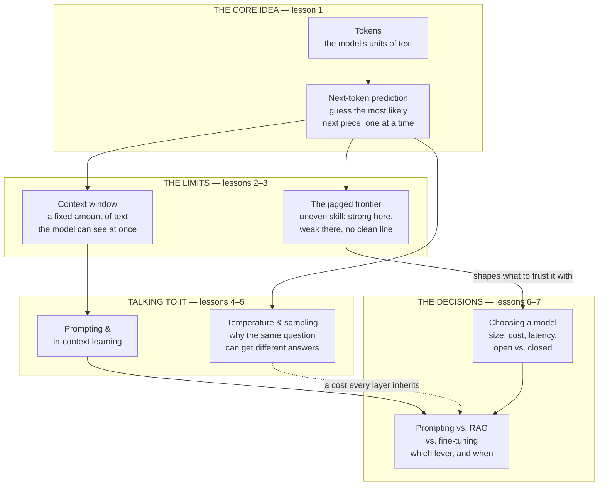

# LLMs for the product leader

*Part of the [Generative AI family](../GENERATIVE_AI_ROADMAP.md).*

A large language model is the engine most of this curriculum's family runs on. It sits
under the chat product, the coding assistant, the support agent, and the summarizer alike.
Yet most product leaders treat it as a black box: text goes in, text comes out, and the
details are "an engineering thing." That gap is expensive. The model's shape decides what
your product can promise, what it costs, and how it fails — and every one of those
decisions is a product decision, not just an engineering one.

This module opens the engine's hood, at the altitude a product leader needs. It teaches
what a model actually does with your words, why it can only see a fixed amount of text at
once, why its skill is uneven in a way that trips up first-time builders, how you talk to
it well, why the same question can get a different answer twice, how to pick the right
model for a job, and when prompting stops being enough. It does not repeat the deep
engineering mechanics — those live in [Inference internals](../content/01-inference-internals/README.md)
and the [strategy tradeoffs module](../content/06-strategy-tradeoffs/README.md). This module
is the map that tells you when to open which of those doors.

## The knowledge graph

An LLM is one idea, applied at scale, with consequences that ripple outward. Every lesson
in this module hangs off this picture:

Read it in three passes. **The core idea**: an LLM does one thing — predict the next
token — and everything else about it follows from that one mechanism. **The limits**:
prediction only works over a fixed window of text, and the skill it produces is uneven in a
way that has no clean edge. **The decisions**: once you understand how to talk to the model
and why its answers vary, you can choose the right model for a job, and know which lever —
a better prompt, retrieval, or fine-tuning — to reach for first.

## The lessons

- [**What an LLM actually is**](./what-is-an-llm.md) — tokens, next-token prediction, and
  the difference between training a model once and running it many times.
- [**The context window**](./the-context-window.md) — why a model can only see a fixed
  amount of text, and why that limit exists at all.
- [**Capabilities & the jagged frontier**](./capabilities-and-the-jagged-frontier.md) —
  why a model can be brilliant at one task and unreliable at an easier one.
- [**Prompting & in-context learning**](./prompting-and-in-context-learning.md) — how to
  talk to a model well, and how it learns a new task without being retrained.
- [**Temperature, sampling & determinism**](./temperature-sampling-and-determinism.md) —
  the dial behind why the same question can get a different answer twice.
- [**Choosing a model**](./choosing-a-model.md) — size, cost, latency, and open versus
  closed, as one real decision.
- [**Prompting vs. RAG vs. fine-tuning**](./prompting-vs-rag-vs-finetuning.md) — the order
  to try the levers in, cheapest first.

Each lesson pairs the mechanics with a **🎯 For the product leader** briefing — why it
matters, the decision it changes, the question to ask your team, and the risk if ignored —
plus a diagram. Where a lesson touches deeper mechanics, it links out: to
[Inference internals](../content/01-inference-internals/README.md) for what happens inside
a single request, and to [Fine-tuning vs. ICL vs. RAG vs. distillation](../content/06-strategy-tradeoffs/finetune-vs-icl-vs-rag.md)
for the engineering-depth version of the final decision.

**📌 Close out the module:** [Recap & real-world examples](./recap.md).
