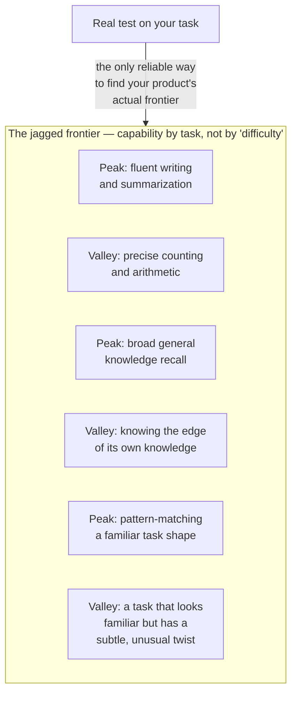

# Capabilities & the jagged frontier

*Part of [LLMs for the product leader](./README.md)*

## TL;DR

A model's skill has no clean edge. It can write a subtle, well-argued essay and then
miscount the words in it. It can pass a hard professional exam and fail a simple logic
puzzle a child would get right. This uneven boundary is called the **jagged frontier**, and
it is not a temporary flaw waiting for the next model version to fix. It follows directly
from how a model gets its skill: by predicting likely next tokens over enormous amounts of
text, which makes it excellent at tasks well represented in that text and unreliable at
tasks that are rare in it, regardless of how easy those tasks look to a person. A product
leader cannot guess where the frontier sits from intuition, and a model's marketing
benchmarks will not tell you either, because your task is not the benchmark. The only
reliable way to know is to test the model on your own real task, with real inputs, before
you build a product around the assumption that it can do it.

> 🎯 **For the product leader**
>
> **Why it matters** — "The model is very capable" is true and almost useless as a planning
> input, because capability is not a single number. A model that scores well on a
> professional exam can still fail at a task that seems far simpler, on your actual data.
>
> **What it changes in your decisions** — You stop reasoning about capability from a
> vendor's headline benchmark or a general impression from using it casually. You test the
> exact task, with your own examples, before you commit a roadmap to it.
>
> **Ask yourself** — *"Have we actually tested this model on our specific task, with our
> real inputs, or are we assuming it can do it because it did something that felt similar?"*
>
> **Risk if ignored** — A team commits a launch date to a capability the model only appears
> to have, discovers the gap in testing or, worse, in production, and has no fallback plan.

## The mental model: a mountain range, not a smooth hill

Picture model capability as a mountain range instead of a smooth, rising hill. A smooth
hill would mean "harder tasks are uniformly harder for the model, easier tasks are
uniformly easier" — which would make capability predictable from difficulty alone. A
mountain range means capability rises and falls unevenly across tasks that look, to a
person, like they should be similarly hard. A model can stand on a tall peak — writing
persuasively, summarizing a long document — right next to a deep valley — counting,
consistent arithmetic, precise negation — with no smooth slope warning you the valley is
coming.

## Why the frontier is jagged, not smooth

The mechanism traces straight back to how the model was trained. Its skill comes from
patterns in enormous amounts of text, and those patterns are not evenly distributed across
every possible task. Writing fluent prose is extremely well represented in training text,
so the model is strong there. Precise, step-by-step counting is comparatively rare and
easy to get subtly wrong in ordinary writing, so the model inherited that unreliability
too. A task's real-world difficulty for a human has no necessary relationship to how well
represented it was in the model's training data — which is exactly why intuition about
"this seems easy" or "this seems hard" fails as a guide to what the model will actually do
well.

## Why benchmarks don't settle it for you

Vendor benchmarks measure performance on a fixed, public set of tasks, and models are often
specifically improved against exactly those tasks. A high benchmark score is real evidence
of capability on tasks like the benchmark's — it is not evidence about your task, which
almost certainly differs in its data, its edge cases, and its stakes. Two products built on
the same model, doing tasks that sound similar from a distance, can land in very different
places on the frontier. The only test that transfers is a test on your own task.

## The product skill this creates: scoping

Because the frontier can't be predicted from outside, the product leader's real skill is
**scoping**: pointing the model at the jobs it demonstrably does well, and building
deterministic checks, human review, or a different tool entirely around the jobs where it
doesn't. This is the same instinct that separates a durable AI feature from a fragile one —
[covered from the product-strategy side in Product sense for AI](../product-sense/product-sense-for-ai.md)
— and it starts with the same discipline every time: test the actual task before betting
the roadmap on an assumption.

## Failure modes

- **Trusting a benchmark as a promise** — assuming a high published score means the model
  will handle your specific task well, without testing your task directly.
- **Assuming difficulty transfers from human intuition** — expecting the model to struggle
  more on tasks that feel hard to a person and succeed easily on tasks that feel simple,
  when the frontier doesn't follow that logic.
- **No fallback for the valley** — building a feature entirely on a capability that turns
  out to sit in a weak spot, with no deterministic check or human review to catch it.
- **One test, called done** — testing a handful of easy examples, calling the capability
  confirmed, and missing the edge cases where the frontier actually dips.

## Practitioner checklist

- [ ] Have we tested this exact task, with real examples from our own data, rather than
      relying on a benchmark or a general impression?
- [ ] Do we know which parts of our feature sit on a capability peak, and which sit closer
      to a valley?
- [ ] For the valleys, do we have a deterministic check, a human review step, or a
      different tool standing in?
- [ ] Have we retested after a model update, instead of assuming the frontier hasn't
      shifted?

## Related lessons

- [What an LLM actually is](./what-is-an-llm.md) — the training mechanism that produces
  the jagged frontier in the first place.
- [Product sense for AI products](../product-sense/product-sense-for-ai.md) — scoping as
  a product-strategy skill, built on this same idea.
- [Evals](../content/04-evals-observability/evals.md) — turning "we tested it" into a
  repeatable, measured practice.
