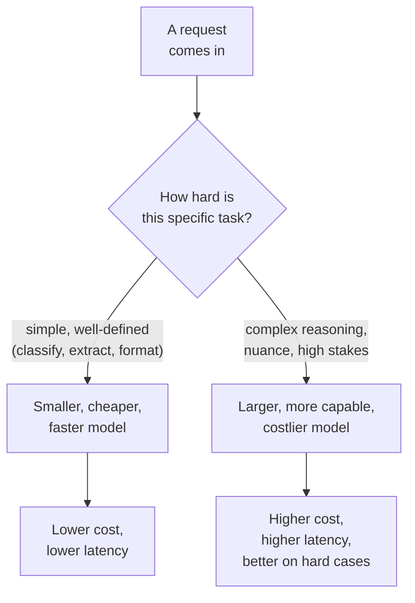

# Choosing a model

*Part of [LLMs for the product leader](./README.md)*

## TL;DR

There is no single best model, only the best model for a specific job, at a specific
price, at a specific speed. Four dimensions do most of the work in that choice. **Size and
capability** — bigger, more capable models handle harder reasoning and nuance better, at a
higher cost per request. **Cost** — priced per token, so the same feature can cost very
different amounts depending on which model answers it. **Latency** — how long a user waits
for a response, which matters enormously for an interactive chat and far less for an
overnight batch job. **Open versus closed** — whether you call a vendor's hosted model over
an API, or run an openly released model on your own infrastructure, trading convenience
for control. The mistake most teams make is picking the single most capable model
available and using it for everything, when most requests in most products do not need
that much capability, and are quietly overpaying, on both money and latency, for a job a
smaller model would do just as well.

> 🎯 **For the product leader**
>
> **Why it matters** — Model choice is not a one-time technical decision made at project
> kickoff. It is an ongoing cost and quality lever, and treating it as settled on day one
> leaves real savings and real speed on the table.
>
> **What it changes in your decisions** — You ask "which model, for which specific request
> type" instead of "which model for the whole product," and you revisit that choice as
> vendors release new options.
>
> **Ask yourself** — *"Are we using our most expensive, most capable model for requests a
> cheaper one would handle just as well?"*
>
> **Risk if ignored** — A product's AI costs scale linearly with usage in a way that never
> gets questioned, because nobody ever asked whether every request actually needed the
> model currently answering it.

## The mental model: hiring for a task, not for a title

Choosing a model is like staffing a task, not filling one permanent role. A simple,
well-defined task doesn't need your most senior, most expensive person; a genuinely hard,
ambiguous one does. A product with many different AI-powered features is really staffing
many different tasks, and the efficient choice is rarely "use the most senior person for
everything."

## The four dimensions

- **Size and capability.** Larger models generally handle ambiguity, nuance, and multi-step
  reasoning better. This is not a straight line — the [jagged frontier](./capabilities-and-the-jagged-frontier.md)
  means a bigger model is not uniformly better at everything — but as a rough rule, harder
  and higher-stakes tasks lean toward more capable models.
- **Cost.** Priced per token, and the difference between the cheapest and most capable
  models available at any time is often a large multiple, not a small percentage. A feature
  running millions of requests a month feels that multiple directly on the bill.
- **Latency.** A chat interface where a user is watching the screen needs a fast response;
  an overnight report generation does not. Larger, more capable models are typically
  slower, so the same capability tradeoff also shows up as a speed tradeoff.
- **Open versus closed.** A closed model is called through a vendor's API: no
  infrastructure to run, automatic updates, but you depend on that vendor's pricing,
  availability, and policies. An openly released model can be run on your own
  infrastructure: more control over cost at scale and over your data's path, at the cost of
  running and maintaining that infrastructure yourself.

## Model routing: the practical answer to "which one?"

The strongest teams do not pick one model for a whole product. They route different
request types to different models based on how hard each one actually is — a pattern
called model routing. A simple classification step goes to a small, cheap, fast model. A
complex, ambiguous customer question goes to a larger, more capable one. This turns model
choice from a single, static decision into a per-request routing rule, and it is usually
where the largest, least painful cost savings in an AI product are found — because most
products send far more simple requests than hard ones, and were paying premium prices for
all of them.

## Choosing without chasing every release

New models arrive often, and each one claims to beat the last on some benchmark. Chasing
every release is its own cost, in engineering time and in the testing debt of re-verifying
a feature against a model that changed. A more sustainable habit: revisit model choice on a
deliberate cadence, evaluate a new option against your own [tested tasks](./capabilities-and-the-jagged-frontier.md),
not against its benchmark score, and switch only when the improvement is real for your
product, not just real in the abstract.

## Failure modes

- **One model for everything** — routing every request, simple or hard, through the same
  expensive, capable model, and paying a premium on the simple majority.
- **Chasing every new release** — re-evaluating and re-integrating a new model every time
  one launches, without a clear, measured reason tied to your own tasks.
- **Choosing by benchmark alone** — picking a model because of a published score, without
  testing it on your own real requests first.
- **Ignoring latency until launch** — discovering only after shipping that a highly capable
  model is too slow for an interactive feature that needed a fast response.

## Practitioner checklist

- [ ] Have we split our product's AI requests by how hard each type actually is, rather
      than sending everything to the same model?
- [ ] Do we have a routing rule that sends simple, well-defined requests to a cheaper,
      faster model?
- [ ] Have we tested a candidate model on our own tasks before switching, rather than
      switching on benchmark scores alone?
- [ ] Is latency budgeted per feature, based on whether a user is actively waiting or not?

## Related lessons

- [Capabilities & the jagged frontier](./capabilities-and-the-jagged-frontier.md) — why
  "more capable" doesn't mean uniformly better at everything.
- [Model routing](../content/02-reliable-outputs/model-routing.md) — the engineering-depth
  spoke on routing requests to the right model automatically.
- [Cost attribution](../content/04-evals-observability/cost-attribution.md) — tracking
  what each model choice actually costs, per feature.
