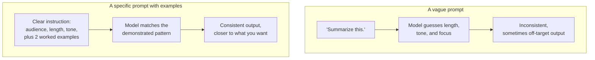

# Prompting & in-context learning

*Part of [LLMs for the product leader](./README.md)*

## TL;DR

A **prompt** is everything you send the model before it starts predicting: instructions,
examples, and the actual request. How you write it changes the quality of what comes back,
often dramatically, with no change to the model itself. The reason this works is
**in-context learning**: a model can pick up a new task on the spot, just from seeing it
described or demonstrated inside the current prompt, without any retraining. Show it three
examples of "messy input, clean output," and it will often produce a clean output for a
fourth input it has never seen — a genuinely different kind of learning than the training
that shaped the model in the first place. Three habits carry most of the practical benefit:
being specific instead of vague, showing examples instead of only describing the task, and
asking the model to reason through steps before giving a final answer. None of this changes
what the model fundamentally is. It changes what the model does with the one chance it gets
on each request.

> 🎯 **For the product leader**
>
> **Why it matters** — Two teams using the identical model can ship features of very
> different quality, because prompting is a real skill with a real, measurable effect —
> not a minor detail to leave entirely to whoever writes the first draft.
>
> **What it changes in your decisions** — You treat prompt design as a product artifact
> worth testing and iterating on, the same way you'd treat a form's copy or an onboarding
> flow, instead of a one-time engineering task that's "done" once it compiles.
>
> **Ask yourself** — *"Have we actually tested a more specific version of this prompt
> against the current one, or are we running with the first draft that seemed to work?"*
>
> **Risk if ignored** — A team ships a mediocre prompt, blames the model for the resulting
> weak output, and never discovers that a clearer prompt or a couple of good examples would
> have fixed it for free.

## The mental model: instructions to a new, extremely capable temp

Imagine handing a task to a new, extremely capable temporary worker who has never seen your
business before and will forget everything the moment the task ends. A vague instruction —
"handle this" — gets an inconsistent result. A specific instruction with a couple of worked
examples gets a result close to what an experienced employee would produce. The temp isn't
getting smarter between these two cases. You are giving them more to work with, inside the
one chance they have.

## In-context learning: teaching without training

The model you call today is frozen; nothing you say changes its underlying weights.
Yet it can still "learn" a task within a single request, by picking up the pattern from
what you show it. This is in-context learning, and it comes in a few common shapes.
**Zero-shot** — you describe the task with no examples, and the model attempts it directly.
**Few-shot** — you show two or three examples of the task done correctly, and the model
follows the demonstrated pattern for the new case. **Chain-of-thought** — you ask the model
to work through its reasoning step by step before giving a final answer, which often
improves accuracy on tasks that need several logical steps, because it gives the model a
chance to build toward the answer instead of guessing it in one leap. None of these
retrain anything. They are all ways of using the one request you have more effectively.

## Three habits that carry most of the benefit

- **Be specific, not vague.** State the audience, the format, the length, and any
  constraints explicitly. A model cannot read your intent from what you left unsaid; it can
  only guess, and guesses vary.
- **Show, don't just tell.** A couple of well-chosen examples of the exact input-and-output
  pattern you want usually beats a longer description of the pattern in the abstract. This
  is few-shot learning, and it is often the single highest-leverage change to a weak
  prompt.
- **Let it reason before it answers.** For anything with more than one logical step, asking
  for reasoning first and a final answer last tends to produce better final answers than
  asking for the answer alone. You are giving the prediction mechanism more steps to build
  on, rather than forcing the best guess in one shot.

## Why this is a product skill, not just an engineering one

A prompt is closer to a piece of copy than a line of code: its wording, tone, and structure
directly shape what a user experiences, and small changes can have an outsized effect. Yet
prompts are often written once by whoever built the first version of a feature and never
revisited, the way copy for a critical screen would be. Treating prompt quality as an
ongoing product concern — tested, versioned, and improved the way you'd improve a landing
page — is one of the cheapest, highest-leverage habits a team can adopt, because it costs
no new infrastructure and no model change.

## Failure modes

- **Vague-by-default prompting** — shipping the first draft of an instruction with no
  examples and no explicit constraints, then treating any inconsistency as a model
  limitation.
- **No examples for a pattern-matching task** — describing a formatting or classification
  task in the abstract when two or three concrete examples would have made the pattern
  unambiguous.
- **Skipping reasoning on multi-step tasks** — asking for a direct final answer on a task
  that needs several logical steps, and getting a worse answer than asking for the
  reasoning first would have produced.
- **Treating the prompt as finished on day one** — never revisiting or testing prompt
  changes after initial launch, even as real usage reveals where it falls short.

## Practitioner checklist

- [ ] Does our prompt state the audience, format, length, and constraints explicitly,
      instead of leaving them implied?
- [ ] Have we tried adding two or three concrete examples to a prompt that currently only
      describes the task?
- [ ] For multi-step tasks, have we tested asking the model to reason before answering?
- [ ] Is prompt quality on our roadmap as something we test and improve, not a one-time
      artifact we wrote once and left alone?

## Related lessons

- [In-context learning](../content/06-strategy-tradeoffs/finetune-vs-icl-vs-rag.md) — the
  engineering-depth spoke on when in-context learning is the right tool versus fine-tuning
  or retrieval.
- [Temperature, sampling & determinism](./temperature-sampling-and-determinism.md) — the
  other lever that shapes what comes back from the same prompt.
- [Planning & reasoning](../agentic-ai/planning-and-reasoning.md) — chain-of-thought and
  related techniques, applied inside an agent's loop.
