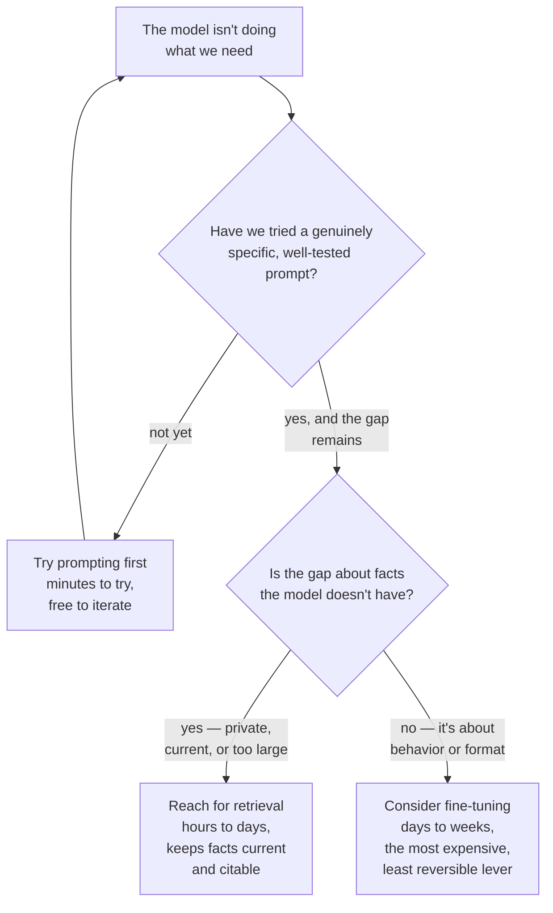

# Prompting vs. RAG vs. fine-tuning

*Part of [LLMs for the product leader](./README.md)*

## TL;DR

You now know the pieces: tokens, the context window, the jagged frontier, prompting, and
sampling. This closing lesson answers the question they all lead to — when a model doesn't
do what you need, which lever do you actually pull? There is a real order, cheapest and
fastest first. Try **a better prompt** before anything else — more specific instructions,
better examples, reasoning steps — because it costs nothing but time and ships in minutes.
If the gap is about **facts** the model doesn't have — private, current, or too large to
paste into a prompt — reach for **retrieval**, not fine-tuning, because facts baked into a
model go stale and can't be cited. If the gap is about **behavior** — a tone, a format, a
narrow skill the prompt can't reliably produce even after real effort — consider
**fine-tuning**, which is slower and costlier than the first two options and should be the
last one you try, not the first. This lesson is intentionally short. The full depth of each
comparison already lives in three places this module points you to, and repeating it here
would only get in the way of the one thing worth adding: the order to try them in.

> 🎯 **For the product leader**
>
> **Why it matters** — Teams reach for fine-tuning far more often than the problem actually
> calls for it, because it feels like the "serious" engineering answer. In most cases, a
> better prompt or a retrieval step solves the same problem faster and cheaper.
>
> **What it changes in your decisions** — Before approving a fine-tuning project, you ask
> whether a genuinely well-tested prompt, or a retrieval step, was tried first and found
> insufficient — not assumed insufficient.
>
> **Ask yourself** — *"Have we actually tried the cheap lever hard, or did we skip straight
> to the expensive one because it felt more serious?"*
>
> **Risk if ignored** — A team spends weeks and a real budget fine-tuning a model to fix a
> problem a rewritten prompt would have solved in an afternoon.

## The mental model: three levers, three different costs

## Why this order, specifically

Each step up this ladder costs more and locks in more. A prompt change ships in minutes and
costs nothing to reverse if it doesn't help. A retrieval step takes real engineering — the
pipeline covered in the [RAG & vector databases module](../rag-vector-databases/README.md)
— but it keeps facts current without touching the model itself, and it can be turned off or
adjusted without retraining anything. Fine-tuning takes the longest, costs the most, and
produces a model version you now have to manage, evaluate, and potentially retrain again
when your needs shift. Trying them in this order means you only pay for the more expensive,
less reversible option when the cheaper ones have genuinely been tried and have genuinely
fallen short — not skipped because they felt too simple to be the "real" answer.

## The one question that routes you correctly

Ask what kind of gap you actually have. **"The model doesn't know something"** is a facts
problem — reach for retrieval. **"The model knows the right facts but writes them in the
wrong voice, format, or style"** is a behavior problem — fine-tuning is a legitimate
candidate, once prompting alone has been genuinely tested and found short. **"The model
does fine most of the time but occasionally misses"** is often still a prompting problem —
more specific instructions or better examples close more of that gap than teams expect
before trying it seriously.

## Where the full depth lives

This lesson deliberately stays at the decision layer. Three lessons elsewhere in this
curriculum go deep on the mechanics behind each comparison, and are worth reading in full
before committing real budget to fine-tuning or a large retrieval build:

- [Fine-tuning vs. ICL vs. RAG vs. distillation](../content/06-strategy-tradeoffs/finetune-vs-icl-vs-rag.md)
  — the engineering-depth comparison of all four approaches, including distillation for
  high-volume narrow tasks.
- [RAG vs. long-context vs. fine-tuning](../rag-vector-databases/rag-vs-long-context-vs-finetuning.md)
  — the same decision from the retrieval side, including when a large context window is
  the simpler answer.
- [Build, buy, or fine-tune](../generative-ai/build-buy-or-fine-tune.md) — the same choice
  at the level of an entire product, rather than a single feature.

## Failure modes

- **Skipping straight to fine-tuning** — treating it as the serious, default engineering
  answer, without a genuine, well-tested attempt at prompting first.
- **Fine-tuning to fix a facts problem** — baking a knowledge base into a model's weights
  when retrieval would keep the same facts current and citable, for less effort.
- **Giving up on prompting too early** — trying one vague version of a prompt, calling it
  insufficient, and moving to a more expensive lever without testing a genuinely specific
  version first.
- **No plan to revisit the choice** — fine-tuning or building a retrieval pipeline once and
  never re-checking whether a newer, more capable base model would now close the gap with
  prompting alone.

## Practitioner checklist

- [ ] Before approving fine-tuning, can we point to a specific, well-tested prompt attempt
      that still fell short?
- [ ] Is the actual gap about facts the model lacks, or about behavior and format it can't
      reliably produce?
- [ ] Have we read the deeper comparison lessons this one points to, before committing
      budget to the more expensive option?
- [ ] Do we revisit this choice periodically, rather than treating it as decided forever?

## Related lessons

- [Prompting & in-context learning](./prompting-and-in-context-learning.md) — the first,
  cheapest lever, in full.
- [Why RAG?](../rag-vector-databases/why-rag.md) — the second lever, for facts problems.
- [Build, buy, or fine-tune](../generative-ai/build-buy-or-fine-tune.md) — the same
  decision, one altitude higher.
