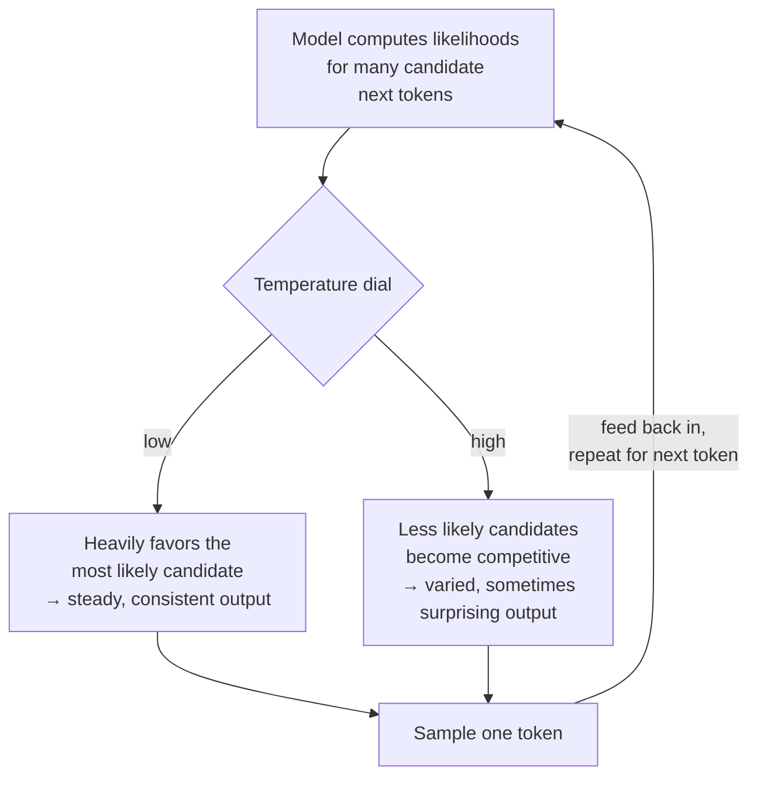

# Temperature, sampling & determinism

*Part of [LLMs for the product leader](./README.md)*

## TL;DR

When a model predicts the next token, it does not compute one fixed answer. It computes a
list of candidate tokens, each with a likelihood, and then **samples** one — picks one,
weighted by those likelihoods, sometimes choosing the most likely candidate and sometimes a
less likely one. **Temperature** is the dial that controls how adventurous that choice is.
A low temperature sticks close to the most likely candidate almost every time, producing
steady, repetitive-feeling output. A high temperature makes less likely candidates more
competitive, producing more varied, sometimes more surprising output — and more chances of
a strange or wrong one. This single mechanism is why the same prompt, sent twice, can come
back worded differently, or occasionally with a different answer entirely. It is not a
malfunction. It is the sampling step working exactly as designed, and understanding it is
what lets a product leader set the dial deliberately instead of accepting whatever a
default happened to be.

> 🎯 **For the product leader**
>
> **Why it matters** — This one setting is the direct mechanical cause of the
> [probabilistic behavior](../generative-ai/probabilistic-software.md) that changes how
> your product must be tested and supported. Knowing where the dial sits, and why, turns a
> mysterious inconsistency into a setting you control.
>
> **What it changes in your decisions** — You choose temperature deliberately, per feature,
> instead of leaving every feature on the same default — low for a feature that must be
> consistent, higher for one that benefits from variety.
>
> **Ask yourself** — *"For this specific feature, do we want the model to be predictable or
> creative — and does our current temperature setting actually match that choice?"*
>
> **Risk if ignored** — A support-reply feature stays on a default meant for creative
> writing, and produces inconsistent answers to the same common question, or a brainstorming
> feature stays on a low, cautious setting and produces flat, repetitive ideas.

## The mental model: a loaded die, with an adjustable weighting

Recall the [probabilistic software](../generative-ai/probabilistic-software.md) idea of a
loaded die instead of a switch. Temperature is the dial that adjusts how loaded the die is.
Turn it down, and the die lands on the most likely face almost every time — close to a
switch, but never quite one. Turn it up, and the other faces become genuinely competitive,
so you see more variety, and more chances of an unusual result.

## Two related dials worth knowing by name

Temperature is the dial product leaders hear about most, but it usually works alongside a
couple of others that shape the same sampling step. **Top-p** (also called nucleus
sampling) narrows the candidate list to only the smallest set of tokens whose combined
likelihood crosses a threshold, before temperature is applied — a way of cutting off the
long tail of very unlikely candidates entirely, rather than just discounting them.
**Top-k** does something similar by keeping only a fixed number of the most likely
candidates. You do not need to master the math behind either to use them well. The
practical takeaway is the same for all three: they are levers that trade consistency for
variety, and a sensible default for one feature can be the wrong default for another.

## Setting the dial deliberately

Different jobs want different points on this dial, and the right choice is a product
decision, not a technical afterthought. **Low temperature** suits tasks where consistency
and reliability matter more than variety: extracting a structured field from a document,
answering a factual support question, generating code that must compile the same way every
time. **Higher temperature** suits tasks where variety is the point: brainstorming names,
drafting several different taglines to choose from, writing in a more exploratory,
creative voice. A single default temperature applied to every feature in a product,
regardless of what each feature actually needs, is a missed lever, not a neutral choice.

## Determinism is a spectrum, not a switch

Even at the lowest possible temperature, a model is not guaranteed to be perfectly
deterministic — some implementation details in how a request is processed can introduce
tiny variations. Treat determinism as a spectrum you move along with the dial, not a
switch you can flip fully on. If your feature genuinely requires the exact same output for
the exact same input every time, the honest answer is usually a cache or a rule-based
check layered on top of the model, not an assumption that temperature alone gets you all
the way to zero variation.

## Failure modes

- **One temperature for every feature** — leaving every feature on the same default,
  regardless of whether that feature wants consistency or variety.
- **Blaming the model for expected variation** — treating a normal, low-probability sampled
  outcome as a bug to chase down and fix in the prompt, when it is the sampling mechanism
  behaving as designed.
- **Assuming zero temperature means fully deterministic** — building a feature that
  requires exact reproducibility on the assumption that the lowest setting guarantees it.
- **Never testing the dial** — shipping with whatever default a library or example code
  happened to use, without testing whether a different setting improves the specific
  feature.

## Practitioner checklist

- [ ] Have we set temperature deliberately, per feature, instead of leaving every feature
      on the same default?
- [ ] For features that need consistency, is temperature set low, and have we tested
      whether that actually gives us the reliability we need?
- [ ] For features that benefit from variety, have we tried a higher setting and compared
      the results?
- [ ] If a feature needs guaranteed exact reproducibility, do we have a cache or a rule-based
      check, rather than relying on temperature alone?

## Related lessons

- [Probabilistic software](../generative-ai/probabilistic-software.md) — the product
  consequence of the mechanism this lesson explains.
- [Prompting & in-context learning](./prompting-and-in-context-learning.md) — the other
  lever that shapes what the model produces.
- [Evals](../content/04-evals-observability/evals.md) — measuring output quality across
  many runs, given that no single run is guaranteed to represent the rest.
