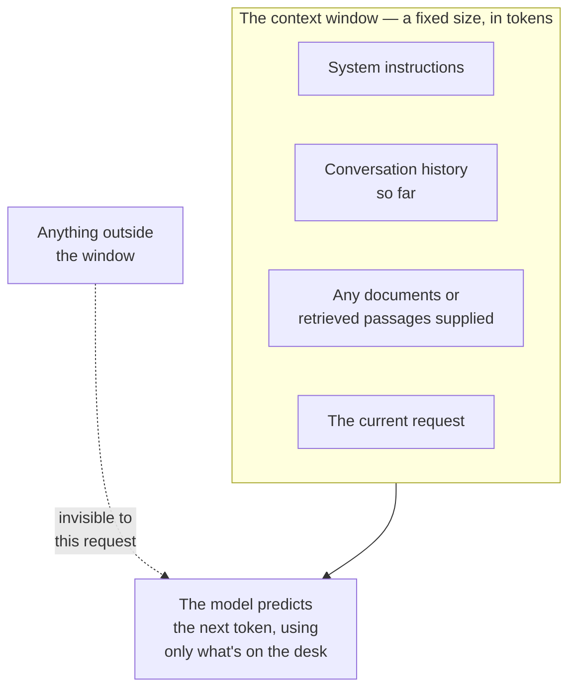

# The context window

*Part of [LLMs for the product leader](./README.md)*

## TL;DR

A model can only consider a fixed amount of text at once, measured in tokens. This is its
**context window**. Everything the model needs for a given request — your instructions, the
conversation so far, any documents you supply — has to fit inside that one window,
because the model genuinely cannot see anything outside it. This is not a policy choice a
vendor could relax with a setting. It follows from how the model computes: comparing every
token to every other token gets more expensive the more tokens there are, so the window has
a real, engineered ceiling. Windows have grown from a few thousand tokens to hundreds of
thousands over a few years, and that growth changed what products are possible — but it
did not remove the limit, and it introduced a new problem: a model can technically fit a
huge amount of text in its window and still perform worse than you'd expect, because
attention spread across more text is attention divided. This lesson is about the window
itself, as a hard constraint. Managing what you deliberately put inside it, once you know
the size you're working with, is its own skill, covered in
[context engineering](../content/00-foundations/context-engineering.md).

> 🎯 **For the product leader**
>
> **Why it matters** — "Just give it more context" sounds like a free upgrade. It is not
> free: it costs more tokens, it costs more latency, and past a certain point it can cost
> you quality, because a model's attention to any one part of a stuffed window is weaker
> than its attention to a lean one.
>
> **What it changes in your decisions** — You treat context window size as a real
> engineering constraint with a real cost curve, the same way you'd treat a database's
> storage limit, instead of an implementation detail to wave away.
>
> **Ask yourself** — *"For our busiest feature, how much of the context window do we
> actually use, and have we tested whether trimming it improves the answer instead of just
> the bill?"*
>
> **Risk if ignored** — A team ships a feature that pastes in everything it might possibly
> need "to be safe," and discovers months later that the feature is both expensive and less
> accurate than a leaner version would have been.

## The mental model: a desk, not a filing cabinet

A context window is a desk, not a filing cabinet. A filing cabinet can hold as much as you
own; you just walk over and pull out what you need. A desk has a fixed surface. Whatever
does not fit on the desk right now is not part of the current work, no matter how relevant
it might be. Every request to a model starts by laying out everything relevant on that
desk — instructions, history, documents — and the model can only work with what is
currently laid out.

## Why the limit exists at all

Inside a model, every token is compared against every other token in the window to decide
what matters for predicting the next one. Double the number of tokens, and that comparison
work grows faster than double — which is why context windows did not simply start at
"unlimited" and why growing them takes real engineering effort, not a configuration change.
The deep mechanics of that cost — attention, memory, and the tricks that make longer
windows practical — live in [Inference internals](../content/01-inference-internals/README.md).
The product-relevant fact is simpler: a bigger window is not free, and someone chose its
size for real, physical reasons.

## Bigger windows solved one problem and revealed another

Early models held a few thousand tokens, barely a few pages. Modern windows can hold
hundreds of thousands, enough for a whole codebase or a long report. That growth genuinely
unlocked new products: reading a full document instead of a fragment, holding a long
conversation without forgetting the start. But a second effect showed up alongside it,
often called "lost in the middle": a model given a huge window does not treat every part of
it equally well. Information placed at the very start or the very end tends to get more
reliable attention than information buried in the middle of a long stuffed prompt. A window
technically large enough to fit everything is not the same as a window that will use
everything equally well.

## The product consequence: window size is a budget, not a target

Treat the window the way you'd treat any limited, costed resource: a budget to spend
deliberately, not a target to fill because it's available. A lean, well-chosen set of
instructions and the specific, relevant passages a task needs will often outperform a
window stuffed with everything that might be relevant, at lower cost and lower latency.
This reframes a common instinct — "the model supports 200,000 tokens, so let's use them" —
into the sharper, more useful question: "what does this specific request actually need to
see, and does adding more help or quietly hurt?"

## Failure modes

- **Filling the window "to be safe"** — pasting in every document that might be relevant,
  paying for tokens the model barely uses well, and sometimes getting a worse answer for
  the extra cost.
- **Ignoring the window as a real limit** — designing a feature that assumes context can
  simply grow forever as the product's needs grow, without a plan for what happens when it
  doesn't fit.
- **Burying the important instruction in the middle** — placing the one instruction that
  matters most in the middle of a long prompt, where attention is weakest, instead of at
  the start or end.
- **Confusing window size with product quality** — choosing a model mainly because it
  advertises a bigger window, without testing whether the feature actually needs it or
  performs better because of it.

## Practitioner checklist

- [ ] Do we know, in tokens, how much of the context window our busiest feature actually
      uses?
- [ ] Have we tested a leaner version of our prompt against our current one, to check
      whether trimming helps quality as well as cost?
- [ ] Are our most important instructions placed at the start or end of the prompt, not
      buried in the middle?
- [ ] When we picked a model partly for its window size, did we verify our feature actually
      benefits from that size?

## Related lessons

- [What an LLM actually is](./what-is-an-llm.md) — why the window is measured in tokens,
  not words.
- [Context engineering](../content/00-foundations/context-engineering.md) — the skill of
  deciding what to put in the window once you know its size.
- [Memory & context](../agentic-ai/context-and-memory.md) — the agent-side view of
  managing a window across a long-running task.
