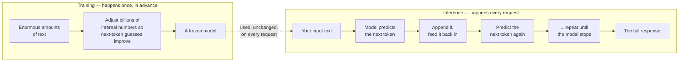

# What an LLM actually is

*Part of [LLMs for the product leader](./README.md)*

## TL;DR

A large language model does one thing: given some text, it predicts the most likely next
small piece of text, called a **token**. It does this once, appends the result, and does it
again, and again, until it decides to stop. A sentence, a paragraph, a whole essay is built
this way, one token at a time. There is no separate "understanding" step and no lookup
table of answers. The skill comes entirely from **training**: the model reads enormous
amounts of text beforehand and adjusts billions of internal numbers so its next-token
guesses get better and better. Once training ends, the model is frozen. Every time your
product calls it afterward is **inference** — using the frozen model to make guesses, not
teaching it anything new. This single mechanism, next-token prediction, explains far more
of an LLM's behavior, and its limits, than any product leader expects on first hearing it.

> 🎯 **For the product leader**
>
> **Why it matters** — Every question you will ask about an LLM later in this module — why
> it forgets, why it's confident and wrong, why the same prompt costs money each time — has
> its root in this one fact: the model predicts the next token, and nothing more.
>
> **What it changes in your decisions** — You stop expecting the model to "know" things the
> way a database knows a row. You start treating it as a very capable guesser, and you
> design your product to check its guesses where being wrong is costly.
>
> **Ask yourself** — *"When our model gives a confident, wrong answer, are we surprised
> because we've been thinking of it as a database instead of a predictor?"*
>
> **Risk if ignored** — A team builds a feature that assumes the model "remembers" a fact
> it was told once, or "knows" something outside its training, and discovers the failure
> only after a customer does.

## The mental model: an extremely well-read guesser

Picture someone who has read a meaningful share of the internet, every book they could get,
and millions of conversations, and who has one skill, honed to an extraordinary degree:
given the start of a sentence, guess the next word. Do that guess over and over, feeding
each guess back in as new input, and you get a full response. That is a large language
model. The guessing is not random — it is shaped by everything the model read — but it is
still a guess, weighted toward what is likely, not verified against what is true.

## Tokens: the model's actual unit of text

A model does not see words the way you do. It sees **tokens** — pieces of text, often
smaller than a word, that a fixed vocabulary breaks language into. "Generative" might split
into "Gener," "ative." A short, common word like "the" is usually one token on its own.
This matters for a product leader for three concrete reasons. **Cost** is charged per
token, both for what you send in and what the model sends back, so token count is a real
line item. **The context window**, covered in the next lesson, is measured in tokens, not
words or characters. **Some tasks that look easy to a human are hard for a model precisely
because of tokens** — counting the letters in a word is awkward for a model that never sees
individual letters, only token chunks that may not align with them.

## Training versus inference: two very different costs

Training happens once, on a huge amount of computing power, and produces the frozen model.
This is why a vendor can spend months and a large budget building a model, then let
millions of people use it. Inference happens every single time your product calls the
model, and it is a much smaller cost per call — but it happens constantly, so it is the
cost that actually shows up on your monthly bill. Confusing the two leads to real
mistakes: teams sometimes think "teaching" the model a new fact by mentioning it once means
the model has learned it permanently, when in fact nothing changes in the frozen model at
all. What changed is only the text you sent for that one request. The next request starts
from the same frozen model, knowing nothing extra unless you send it again.

## Why this mechanism explains so much

Next-token prediction, alone, explains three things that otherwise look mysterious.
**Fluency without guaranteed truth** — the model is optimized to produce likely-sounding
continuations, not verified facts, which is why confident and wrong answers are a normal
output of the mechanism, not a rare bug. **The need for grounding** — because the model has
no memory beyond its training and the current request, any fact that must be current or
specific to your business has to be supplied at request time, which is the entire premise
of retrieval, covered in the [RAG & vector databases module](../rag-vector-databases/README.md).
**Why longer generation costs more** — every additional token is another prediction step,
so a longer answer is not a flat fee, it is proportionally more work.

## Failure modes

- **Treating the model like a database** — expecting it to "know" a fact it was never
  trained on or told this request, instead of recognizing it can only guess.
- **Assuming a mention becomes memory** — believing that telling the model something once
  means it will remember it in a future, separate conversation.
- **Ignoring token cost** — pricing a feature by "one API call" instead of by the number of
  tokens in and out, and being surprised by the bill.
- **Expecting letter-level precision** — asking a model to count characters or reverse a
  word and treating the frequent mistakes as a bug, when they follow directly from how
  tokens work.

## Practitioner checklist

- [ ] Does our team describe the model as a predictor, not a database, in planning
      conversations?
- [ ] Have we checked whether a "fact" our product depends on is actually in the model's
      training, or does it need to be supplied at request time?
- [ ] Is our cost model based on token counts, not a flat per-call assumption?
- [ ] For any task involving exact counting, spelling, or character-level detail, have we
      tested it directly instead of assuming the model handles it like a human would?

## Related lessons

- [The context window](./the-context-window.md) — the limit that follows directly from
  how prediction works.
- [Why RAG?](../rag-vector-databases/why-rag.md) — supplying facts the frozen model does
  not have.
- [Inference internals](../content/01-inference-internals/README.md) — the engineering
  depth behind prefill, decode, and the cost of each token.
