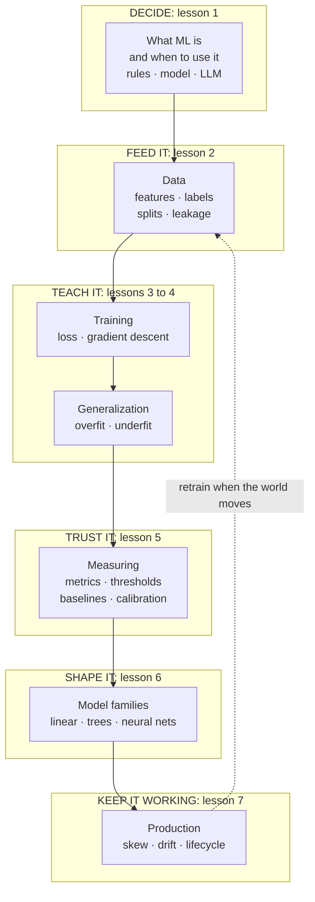

# Machine learning for the product and technology leader

*Part of the [foundation modules](../MACHINE_LEARNING_ROADMAP.md). It opens the series on how learned models work. Tensors and convolutional networks come next.*

Most AI products rest on one idea. A program improves at a task by learning from examples, not by following rules a person wrote. A spam filter, a fraud score, a price forecast and a large language model all work this way. They differ in scale, not in kind.

Product and technology leaders make decisions about this idea every week. Is this a rules problem or a learning problem? Is the data good enough? Is a 94% score real? Why did the model get worse after launch? Those decisions do not need the mathematics. They need a clear picture of the learning loop and of the five ways it fails.

This module gives that picture. Every lesson has two layers. The body is for the leader who decides. A short **Under the hood** section is for the engineer who builds. It shows real code that runs on the Python standard library alone, with no install, and ends in `assert` lines so the claims in the lesson are checked.

**One running example.** A subscription company wants to predict which customers will cancel in the next 30 days. About one customer in five does. The data is invented and generated by code with a fixed seed, so every number in the lessons can be reproduced. Each lesson meets the same dataset and learns one more way it can go wrong.

**A note on scope.** This module does not teach prompting, retrieval, fine-tuning, or how a transformer works. [LLMs](../llms/README.md) covers the model most products call. This module stays one level lower and earlier. It answers the questions that come before and after any model: whether you need one, what it learns from, how it learns, how to trust its score, and how to keep it working. Deep networks get their own modules, on tensors and on convolutional networks.

## Where the depth lives

Each lesson summarizes an idea and points to the lesson that covers it in full.

| If you want the full depth on | Read |
| --- | --- |
| Choosing between prompting, retrieval and fine-tuning for an LLM | [Prompting vs. RAG vs. fine-tuning](../llms/prompting-vs-rag-vs-finetuning.md) |
| Build, buy or fine-tune as a business decision | [Build, buy, or fine-tune](../generative-ai/build-buy-or-fine-tune.md) |
| What training and inference mean for a language model | [What an LLM actually is](../llms/what-is-an-llm.md) |
| Precision and recall for search and retrieval | [Retrieval quality](../rag-vector-databases/retrieval-quality.md) |
| Building an eval set and watching an LLM feature | [Evaluation and observability](../evaluation-and-observability/README.md) |
| Running an online experiment on the product number | [Metrics and experimentation](../technical-product-management/metrics-and-experimentation.md) |
| What training and serving cost over a model's life | [Cost optimization](../cost-optimization/README.md) |
| Operating a system that acts, with limits and a kill switch | [Running an agent in production](../ai-agents/running-an-agent-in-production.md) |

## The knowledge graph



Read it as one loop with a feedback arrow. You **decide** that learning is the right tool. You **feed** it data that matches the future. It **learns** by repeated small corrections, and you check that it **generalizes** to cases it has not seen. You **measure** it against a baseline with a threshold that fits your costs. You **choose a shape** of model that fits the data. Then you **keep it working**, because the world moves and the loop has to run again.

## The lessons

1. [What machine learning is, and when to use it](./what-machine-learning-is.md) — three parts of every learned system, four ways a machine learns, and a test for rules, a trained model or an LLM.
2. [Data: features, labels, splits and leakage](./data-features-labels-and-leakage.md) — what the model learns from, and why a score that looks too good usually is.
3. [Training: loss and gradient descent](./training-loss-and-gradient-descent.md) — the loop that every model uses, and how to read a loss curve.
4. [Generalization: overfitting and the bias–variance tradeoff](./generalization-overfitting-and-bias-variance.md) — why a model fails on new cases, and which of three fixes to buy.
5. [Measuring a model: metrics, thresholds and baselines](./measuring-a-model.md) — accuracy's traps, confusion matrices, cost-based cutoffs and calibration.
6. [Model families: linear models, trees and neural networks](./model-families.md) — what each can see, and backpropagation in one page.
7. [ML in production: drift, skew and the lifecycle](./ml-in-production.md) — the five failure modes after launch, and the monitors that catch them.

Then the [recap and real-world examples](./recap.md), with a self-test.

## Run the code

Every example is in `machine-learning/code/`. Run them all with one command.

```bash
python3 machine-learning/code/test_examples.py
```

The files are `lesson1_rules_vs_learning.py` through `lesson7_drift.py`, with shared pieces in `data.py`, `tree.py` and `mlp.py`. A file that passes proves the numbers quoted in its lesson.
