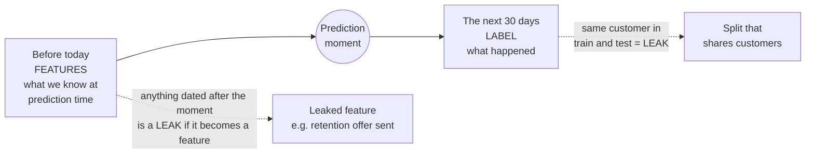

# Data: features, labels, splits and leakage

*Part of [Machine learning for the product and technology leader](./README.md)*

*Last reviewed: 2026-10 · Volatility: medium*

## TL;DR

A model learns only what its data shows. So three data jobs decide most of a project.
First, describe each case with **features**: facts you know at the moment of prediction.
Second, record a **label**: the outcome you want to predict. Third, keep a **test set**
that behaves like the future the model will face.

The third job is the one that fails quietly. When the test is easier than the real world,
the score looks great and the launch disappoints. That gap has a name: **leakage**. Leakage
means the model saw information during training or testing that it will not have when it
matters. The scikit-learn guide puts it this way: leakage uses information that would not
be available at prediction time, so the performance estimate is too optimistic.

> 🎯 **For the product leader**
>
> **Why it matters** — A model that looks 97% accurate in a review can be a coin flip in
> production. The cause is rarely the algorithm. It is how the data was prepared and split.
>
> **What it changes in your decisions** — You treat a very good score as a reason to
> investigate, not to celebrate. You ask how the test set was built before you ask for the
> number.
>
> **Ask your eng team** — *"For every input, what do we know at the moment we predict,
> and was the test split made so that this holds?"*
>
> **Risk if ignored** — You approve a launch on a number that was never real. The failure
> shows up in revenue, not in the review.

## The mental model: a line in time



Draw this line for every model. Everything left of the prediction moment may be a feature.
Everything right of it is the label, or is forbidden. Most leaks are a fact from the right
side that slid into a column on the left.

## Features and labels are product decisions

**A feature** is one fact about a case, such as months as a customer, support tickets in
the last 90 days, or logins last month. A row is the list of features for one case.

**A label** is the outcome. Defining it is a product decision, not a data task. "Cancelled"
could mean any of these: the customer pressed the cancel button, the payment lapsed, or
the account went silent for 60 days. Each definition produces a different model and
serves a different business action.

Labels have four common problems.

- **Delay.** A 30-day churn label does not exist until 30 days pass. You can only train on
  customers old enough to have an outcome. Recent behaviour is the least labelled.
- **Noise.** Labels are often recorded by people or by rules, and both make mistakes.
- **Selection bias.** You see outcomes only for cases you let through. If a rule already
  blocks the riskiest loans, your history has no examples of how those loans would have
  gone.
- **Proxies.** The label you can record is not always the thing you care about. "Clicked"
  stands in for "found it useful". The model learns the proxy.

## Three sets, three jobs

Split the labelled data before you do anything else.

| Set | What it is for | Who looks at it |
| --- | --- | --- |
| **Training** | The model learns its parameters from these rows | The training process, every step |
| **Validation** | You compare model choices: depth, features, settings | The team, many times |
| **Test** | One final check of the chosen model | The team, **once**, at the end |

A set is only honest while you do not use it to make choices. Each time you pick a model
because it did well on the test rows, the test set quietly becomes a training set. This is
why teams keep a validation set for choosing and a test set for reporting. The scikit-learn
guide states the rule plainly: never fit on the test data, and that includes preprocessing
such as scaling.

A model's score on its own training rows says nothing about the future. A model can
memorize them. [Lesson 4](./generalization-overfitting-and-bias-variance.md) shows how.

## Leakage: four ways the test gets easier than life

1. **A feature from the future.** A column recorded after the outcome. In our churn data it
   is "retention offer sent". A company sends that offer after a customer asks to cancel. In
   the history the column predicts churn almost perfectly. On the day you need a prediction,
   it does not exist yet.
2. **The same entity on both sides.** One customer appears in several rows, such as one row
   per month. A random split puts some rows in training and some in the test. The model
   recognises the customer and looks brilliant. The fix is to split by customer, so each
   customer lives on one side only. scikit-learn calls this group-wise splitting.
3. **Preprocessing that peeked.** You scale or select features using all the data, then
   split. The test rows have influenced the training step. The effect is often small.
   The habit still matters. Split first, then learn every transformation from the training
   rows only.
4. **Time that runs backwards.** A random split mixes next year's rows into the training
   set for last year's test. For anything that changes over time, train on the past and test
   on the future.

Researchers Kaufman, Rosset and Perlich called leakage the introduction of information
about the target that should not be legitimately available. They argued it is a data
problem, not a model problem. No algorithm change fixes it.

## A data-readiness checklist

Before a team builds, check the data against this table. A "no" is a finding, not a failure.

| Question | Why it matters |
| --- | --- |
| Is the label defined in one sentence that the business agrees with? | Two definitions mean two models |
| Does each outcome get recorded, and how long after the event? | Delay sets how fresh the training data can be |
| Is every feature available at prediction time, in the same form? | Otherwise it is a leak, or it will break in production |
| Does one customer or device appear on both sides of the split? | Group-level leakage |
| Are the rare cases present in enough numbers? | A model cannot learn 12 examples of fraud |
| Who is missing from the data? | The model will be weakest where the data is thin |
| Are we allowed to use this data for this purpose? | A legal and trust question. See [Governance, audit & compliance](../ai-security-and-guardrails/governance-audit-and-compliance.md) |

## Worked example: two leaks, two collapses

*This example is invented. The data is generated by code with a fixed seed.*

**Leak 1: a feature from the future.** We add the column "retention offer sent" to the
churn data. In the history, about 98% of rows agree with the label. We then run the same
single-rule search as in lesson 1. It picks that column at once.

| Where the score is measured | Balanced accuracy |
| --- | --- |
| On the test rows (the column is present) | **97.3%** |
| In "production" (no offer has been sent yet, so the column is 0 for everyone) | **50.0%** |

The rule is exactly as good as a coin flip when it runs for real. A team that stopped at
97.3% would celebrate. A team that asked "do we know this at prediction time?" would not.

**Leak 2: the same customer on both sides.** We build 300 customers with six monthly
rows each. Their churn is a personal quirk the columns cannot predict, so an honest model
should do poorly. We ask a one-nearest-neighbour model to copy the label of the most
similar row.

| How the rows were split | Accuracy |
| --- | --- |
| Random rows: a customer's other months are in training | **100.0%** |
| By customer: each customer is on one side only | **57.3%** |

The honest score is worse than guessing "stays" for everyone, which would score 72% on this
test set. The model has learned nothing about customers it has not met. The 100% was
memory.

Both leaks share a signature. The score is **too good**. In most real projects a score that
beats the experts by a wide margin means a leak, not a breakthrough.

## Tradeoffs and decisions

- **More data vs. cleaner data.** Doubling noisy labels helps less than fixing the label
  definition. Spend on label quality first.
- **Label speed vs. label truth.** A fast proxy label lets you iterate. A true label arrives
  late. Many teams train on the proxy and audit with the truth.
- **Strict splits vs. data volume.** Splitting by customer or by time shrinks what you can
  use. It is the price of an honest score.
- **Rich features vs. availability.** A powerful feature that takes a day to compute is
  useless for a decision made in a second. Check the latency of every input.

## Failure modes

- **The hindsight column.** A field filled in after the fact becomes a feature.
- **Shared entities across the split.** The same customer, device or document sits on both
  sides.
- **Peeking preprocessing.** Scaling or feature selection runs on all rows before the split.
- **The test set becomes a training set.** The team tries twenty ideas and keeps the one
  with the best test score.
- **Unrepresentative history.** The data covers last year's customers, a policy that has
  since changed, or only the cases a rule let through.

## Under the hood

Split first. Then learn every statistic from the training rows only. This helper standardizes
columns using the training mean and spread, and applies the same numbers to the test rows.

```python
def standardize(train_rows, other_rows_list=()):
    cols = list(zip(*train_rows))
    mean = [sum(c) / len(c) for c in cols]
    sd = [math.sqrt(sum((v - m) ** 2 for v in c) / len(c)) or 1.0 for c, m in zip(cols, mean)]
    apply = lambda rows: [[(v - m) / s for v, m, s in zip(r, mean, sd)] for r in rows]
    return (apply(train_rows),) + tuple(apply(r) for r in other_rows_list)
```

To split by customer, shuffle the customer ids and send every row of a customer to the same
side.

```python
customers = sorted(set(owner))
rng.shuffle(customers)
held_out = set(customers[: len(customers) // 4])
test_idx  = [i for i in idx if owner[i] in held_out]
train_idx = [i for i in idx if owner[i] not in held_out]
```

Four habits catch leaks early.

- **Name the prediction moment** in code. Build features from rows dated before it only.
- **Run a single-feature check.** If one column alone scores far above the full model, read
  its definition.
- **Compare random and grouped splits.** A large gap means the same entity crosses the line.
- **Use a pipeline.** In scikit-learn, a pipeline learns each step on the training part of
  every fold. That removes the preprocessing leak by construction.

The files are `machine-learning/code/lesson2_leakage.py` and `data.py`.

## Practitioner checklist

- [ ] Is the label defined in one sentence, and does the business agree?
- [ ] For each feature, do we know it at prediction time, in the same form?
- [ ] Was the data split before any preprocessing?
- [ ] Is each customer, device or document on one side of the split only?
- [ ] For time-based problems, do we train on the past and test on the future?
- [ ] Is the test set looked at once, at the end?
- [ ] Did we investigate every score that looked too good?
- [ ] Do we know who is missing from the data?

## Related lessons

- [Training: loss and gradient descent](./training-loss-and-gradient-descent.md) — what the
  model does with the training rows.
- [Generalization: overfitting and bias–variance](./generalization-overfitting-and-bias-variance.md)
  — why a score on training rows means little.
- [Measuring a model](./measuring-a-model.md) — which score to report on the honest test.
- [Evaluation and observability](../evaluation-and-observability/README.md) — the same
  discipline for LLM features: an eval set is a test set.
- [Security & privacy sense](../technical-product-sense/security-and-privacy.md) — what you
  may do with the data.

## Sources

- scikit-learn user guide, [Common pitfalls and recommended practices](https://scikit-learn.org/stable/common_pitfalls.html):
  the definition of data leakage, "never call fit on the test data", learning preprocessing
  statistics from the training subset only, and the pipeline as a safeguard. Read from the
  guide's source text in the scikit-learn repository, 2026-10.
- scikit-learn user guide, [Cross-validation](https://scikit-learn.org/stable/modules/cross_validation.html):
  group-wise cross-validation when samples share a group such as a patient. Same reading,
  2026-10.
- Kaufman, Rosset, Perlich and Stitelman, *Leakage in Data Mining: Formulation, Detection, and
  Avoidance*, Transactions on Knowledge Discovery from Data 6(4), article 15, Dec 2012
  (Association for Computing Machinery).
  [doi.org/10.1145/2382577.2382579](https://www.doi.org/10.1145/2382577.2382579). The framing of
  leakage as information about the target that should not be legitimately available, and as a
  data problem. Checked through search-result excerpts, 2026-10.
- The churn data, both leaks and every score are invented. They come from
  `machine-learning/code/lesson2_leakage.py` and can be reproduced with it.
