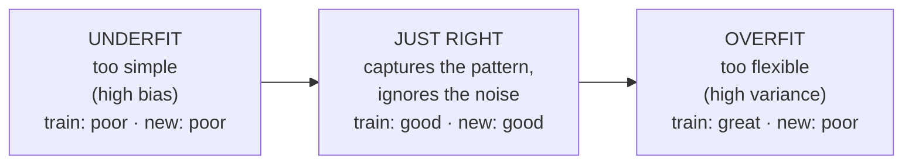

# Generalization: overfitting and the bias–variance tradeoff

*Part of [Machine learning for the product and technology leader](./README.md)*

*Last reviewed: 2026-10 · Volatility: medium*

## TL;DR

A model earns its keep on cases it has never seen. That skill is **generalization**. Two
opposite mistakes damage it.

**Underfitting** means the model is too simple. It misses a real pattern. It scores
poorly on the training rows and on new rows alike. Statisticians call this high **bias**.

**Overfitting** means the model is too flexible. It memorizes the quirks and the noise of
its training rows. It scores very well on rows it has seen and poorly on new ones. This is
high **variance**: the model changes a lot when the training rows change.

The task is to find the middle. Two charts tell you where you are. One plots score against
model complexity. The other plots score against the amount of training data. Together they
say whether to spend on more data, on a simpler model, or on better features.

> 🎯 **For the product leader**
>
> **Why it matters** — "It worked in the demo" and "it works on customers" are different
> claims. The gap between them is overfitting. It is the most common reason an ML feature
> underperforms its prototype.
>
> **What it changes in your decisions** — You ask for the training score and the validation
> score side by side. A big gap says: more data, or a simpler model, will help. A small gap
> with a poor score says: more data will not help, and you need better signals.
>
> **Ask your eng team** — *"What is the gap between training and validation performance,
> and would ten times more data close it?"*
>
> **Risk if ignored** — You fund a data-collection effort that cannot help. Or you ship a
> model that memorized last quarter.

## The mental model: three fits to the same dots



Imagine a scatter of noisy points along a gentle curve. A straight line misses the curve
(underfit). A wiggly line that touches every point follows the noise, and it flies off
between the points (overfit). A smooth curve sits between them.

The scikit-learn guide uses this exact picture. It fits a curve with three models: a
straight line, a degree-4 polynomial and a degree-15 polynomial. The first is too simple,
the second fits well, and the third fits the training points perfectly but misses the true
curve.

## Bias, variance and noise, in plain words

The error on new data has three parts.

- **Bias.** The model's error that stays however you pick the training rows. A model that
  can only draw straight lines is stuck with the bias of a straight line.
- **Variance.** How much the model changes when the training rows change. A flexible model
  that follows each point has high variance. Retrain it on a different sample and it moves.
- **Noise.** Randomness in the world that no model can predict. Whether a customer cancels
  this month depends partly on things nobody recorded. This part sets a ceiling.

Making a model more flexible lowers bias and raises variance. Making it simpler does the
reverse. That is the tradeoff. You pick the point where the total is lowest. Noise stays
either way.

## Chart 1: score against complexity

Train the same kind of model at several levels of flexibility. Score each one on its
training rows and on held-out validation rows. Training error always improves with
flexibility. Validation error improves, then turns.

For a decision tree, the flexibility knob is its depth: how many yes-or-no questions it
may chain. A depth-1 tree asks one question. A depth-12 tree can isolate almost every
training customer in a leaf of their own.

## Chart 2: score against data

Fix the model. Give it more and more training rows. The training score falls, because more
rows are harder to memorize. The validation score rises. The gap between them shrinks.

This chart answers the data question. If the gap is wide and closing as rows grow, more
data helps. If the two lines have met at a poor score, more data will not help. You need a
different model or better features. The scikit-learn guide makes the same point. More
training data lowers variance, and it is worth collecting only if a simpler model cannot
capture the true pattern.

## What to do about it

| What you see | Diagnosis | Try |
| --- | --- | --- |
| Training poor, validation poor, gap small | Underfitting (bias) | A more flexible model; better features; train longer |
| Training great, validation poor, gap large | Overfitting (variance) | More data; a simpler model; regularization; fewer features; early stopping |
| Both good, gap small | A model that generalizes | Ship, then monitor |
| Training good, validation good, production poor | Not overfitting. Leakage or a changed world | [Lesson 2](./data-features-labels-and-leakage.md) and [lesson 7](./ml-in-production.md) |

**Regularization** adds a price for complexity to the loss. A common form penalizes large
weights, so the model prefers a simple explanation unless the data insists. **Early
stopping** ends training when validation loss stops improving. **Averaging many models**
lowers variance, because their individual quirks cancel. The ensemble methods in
[lesson 6](./model-families.md) use this.

## A caution about very large models

The U-shaped picture is the classic one. Modern large models complicate it. In a 2019 paper
in the *Proceedings of the National Academy of Sciences*, Belkin and colleagues showed
a "double descent" pattern. As a model grows past the point where it fits the training data
exactly, the error on new data can fall again. Very large neural networks are often trained
well past that point.

This does not remove the need to measure on held-out data. It means that for big neural
networks, "bigger is automatically worse" is false. For the small, tabular models in most
business ML, the classic picture is still a good guide. In both cases the habit is the
same: judge a model by rows it has not seen.

## Worked example: how deep should the tree be?

*This example is invented. The data is generated by code with a fixed seed.*

We train decision trees on 600 churn customers. We score each on those 600 rows and on 1,500
separate validation rows. The score is balanced accuracy, from lesson 1.

| Tree depth | Score on training rows | Score on validation rows |
| --- | --- | --- |
| 1 | 64.4% | 60.8% |
| 2 | 67.7% | 63.7% |
| 3 | 69.8% | 63.9% |
| **4** | 74.5% | **65.1%** |
| 6 | 79.5% | 63.7% |
| 8 | 83.7% | 59.2% |
| 12 | 95.5% | 54.2% |

Read the two columns. The training score climbs to 95.5%. The depth-12 tree has memorized
nearly every customer. Its validation score is 54.2%, barely above a coin flip. The best
validation score is at depth 4. We choose depth 4 on the validation rows. Only then do we
score 1,500 more rows we have never touched. The result is 66.5%, in line with validation.
That final number is the one to report.

Now fix the depth at 8 and vary the data.

| Training rows | Training score | Validation score | Gap |
| --- | --- | --- | --- |
| 50 | 100.0% | 53.7% | 46.3 points |
| 200 | 94.0% | 55.3% | 38.7 points |
| 800 | 88.3% | 59.7% | 28.6 points |
| 1,600 | 81.9% | 64.6% | 17.3 points |
| 3,000 | 76.3% | 62.6% | 13.7 points |

More data helps. The gap shrinks from 46 points to 14. The comparison to make is this one:
the depth-8 tree trained on 3,000 rows scores 62.6% on validation. The depth-4 tree
trained on only 600 rows scores 65.1%. Five times the data did not rescue the flexible
model. A simpler model on less data won.

One more caution. The validation set has about 270 churners among its 1,500 rows. A
difference of one or two points between two models is inside the noise of that sample. Do
not tune against gaps that small.

## Tradeoffs and decisions

- **Flexibility vs. interpretability.** Simple models generalize more easily and are easier
  to explain. You give up some peak accuracy on large, rich data.
- **More data vs. a simpler model.** Data costs money and time. A simpler model costs
  little. Use chart 2 to see which one helps.
- **Regularization strength.** Too little leaves overfitting. Too much causes underfitting.
  It is one more setting to tune on validation rows.
- **A small validation set vs. a big training set.** Cross-validation rotates the held-out
  part, so every row is used for both jobs in turn. It costs training time.

## Failure modes

- **Judging by training score.** The demo uses the data the model learned from.
- **Tuning on the test set.** Each choice that looks at the test score moves information
  from the test set into the model. Keep it for one final check.
- **Overfitting the validation set.** Try a hundred settings and the best one will look
  good partly by luck. Treat the final test score as the honest one.
- **Collecting data that cannot help.** The gap is small and the score is poor. More rows
  repeat the same failure.
- **Mistaking a changed world for overfitting.** A model that was fine last quarter and is
  poor now is probably drifting. See [lesson 7](./ml-in-production.md).

## Under the hood

The sweep behind chart 1 is a loop. `scores` returns the training score and the validation
score for a model. The file is `machine-learning/code/lesson4_overfitting.py`.

```python
complexity = {}
for depth in (1, 2, 3, 4, 6, 8, 12):
    tree = grow(train[0], train[1], depth, min_leaf=1)
    complexity[depth] = scores(tree, cut, train, valid)       # (train score, validation score)

best_depth = max(complexity, key=lambda d: complexity[d][1])  # choose on validation rows
tree = grow(train[0], train[1], best_depth, min_leaf=1)
final = scores(tree, cut, train, test)[1]                     # test rows are used once
```

Regularization in one line. For a linear model, the loss from [lesson 3](./training-loss-and-gradient-descent.md)
gains a penalty on the size of the weights:

```text
total loss = average loss on the training rows + alpha × (sum of squared weights)
```

A larger `alpha` pulls weights toward zero and makes the model simpler. K-fold
cross-validation splits the labelled rows into `k` parts. It trains on `k − 1` of them and
scores on the part left out, then rotates. If the rows share a group, such as one customer
with many rows, split by group, as in [lesson 2](./data-features-labels-and-leakage.md).

Habits to adopt:

- **Report both scores, always.** One number hides the gap.
- **Pick on validation, report on test.** Touch the test rows once.
- **Plot both charts** for any model you plan to keep.
- **Keep a simple model as a reference.** If a complex model beats it by little, take the
  simple one.

## Practitioner checklist

- [ ] Do we report training and validation scores together?
- [ ] Is the gap between them small, or do we know what is closing it?
- [ ] Have we plotted score against complexity and score against data?
- [ ] Were settings chosen on validation rows, and the test rows scored once?
- [ ] Is there a simpler reference model, and by how much does the chosen model beat it?
- [ ] Would more data change the answer, according to the learning curve?
- [ ] Are differences smaller than the noise of the validation set being ignored?

## Related lessons

- [Data: features, labels, splits and leakage](./data-features-labels-and-leakage.md) — how
  to build a validation set that tells the truth.
- [Measuring a model](./measuring-a-model.md) — which score to compare.
- [Model families](./model-families.md) — models that average away variance.
- [ML in production](./ml-in-production.md) — when a good model stops generalizing to
  today's customers.
- [Evaluation and observability](../evaluation-and-observability/README.md) — the same
  habit of holding data back, for LLM features.

## Sources

- scikit-learn user guide, [Validation curves: plotting scores to evaluate models](https://scikit-learn.org/stable/modules/learning_curve.html):
  generalization error as bias, variance and noise; the three-model polynomial example;
  more training data lowers variance, but only worth collecting if a lower-variance
  estimator cannot approximate the true function. Read from the guide's source text in the
  scikit-learn repository, 2026-10.
- Belkin, Hsu, Ma and Mandal, *Reconciling modern machine-learning practice and the classical
  bias–variance trade-off*, Proceedings of the National Academy of Sciences 116(32),
  15849–15854, 2019. [doi.org/10.1073/pnas.1903070116](https://doi.org/10.1073/pnas.1903070116).
  The "double descent" curve. Checked through search-result excerpts, 2026-10.
- Goodfellow, Bengio and Courville, *Deep Learning* (2016), chapter 5: capacity,
  overfitting, underfitting, regularization and validation sets.
- The churn data, the tree depths and every score are invented. They come from
  `machine-learning/code/lesson4_overfitting.py` and can be reproduced with it.
