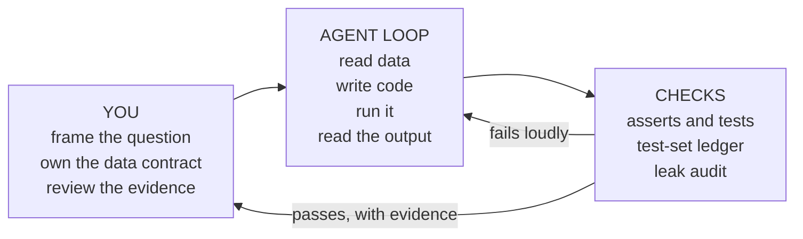

# Learning and doing ML with Claude Code

*Part of [Machine learning for the product and technology leader](./README.md)*

*Last reviewed: 2026-10 · Volatility: fast*

## TL;DR

Claude Code is a coding agent. This lesson uses it from the terminal. It reads files, runs commands, edits code and reads the output. Machine learning (ML) work fits that shape. An experiment is a script that prints a score. So an agent can write it, run it, read the score and try again.

This lesson covers two uses.

- **Doing.** The agent runs the experiments. You set the rules and review the result.
- **Learning.** The agent works as a tutor that runs real code with you. You use it to learn this module faster.

You do not need to guess how far agents in the terminal will go. You need habits that keep a result true, whoever wrote the code. The agent speeds up the loop from [lesson 3](./training-loss-and-gradient-descent.md). It does not change what makes a score honest. The hard parts stay with you: a fair split, a baseline, a leak check and the right metric.

One risk is new. An agent that chases a score will take shortcuts without meaning to. It may tune on the test rows. It may add a column that leaks the answer. So you give it a contract, and checks that fail loudly.

> 🎯 **For the product leader**
>
> **Why it matters** — Agents make experiments cheap, so a team can try many settings quickly. More tries give more chances for a lucky number. A fast team with weak controls ships a worse model with a better-looking score.
>
> **What it changes in your decisions** — You ask for the log, not the headline. You ask how many times the test rows were scored. You ask who reviewed the agent's code, and whether that reviewer saw the agent's reasoning or only the result.
>
> **Ask your eng team** — *"How many times did the agent score the test rows, and where is the log that shows it?"*
>
> **Risk if ignored** — A model that looked like 66% in the report and does 64% in production. Or a leak that no one saw, because the agent reported a number it was never asked to explain.

## The mental model: you hold the contract, the agent runs the loop



Treat the agent as a fast junior who never tires. It is good at the loop: write, run, read, fix. It does not know what your business counts as a fair test. You do. The contract is where you put that knowledge.

The official guidance for Claude Code says the same thing about code in general. Claude "stops when the work looks done", so give it "a check it can run". Without one, you become the verification loop.

## Doing ML with the agent

### 1. Write the contract in `CLAUDE.md`

`CLAUDE.md` is a file that Claude Code reads at the start of every session. Keep it short. Put in the rules that apply to every task. For an ML project, that means the rules from lessons 2 to 5.

```text
# ML rules for this repo
- Data: data/train.csv and data/valid.csv. Never open anything under data/test/.
- Split by customer_id, never by row.
- Always report a baseline first: predict the average, and the best single rule.
- Choose settings on valid. The test rows are scored once, by `python score_test.py`.
- Set seeds. Log every run to runs.log: settings, split, score.
- Show the command you ran and its output. Do not report a number you did not run.
```

`CLAUDE.md` is advice, not enforcement. The Claude Code docs say hooks are the deterministic option: "Unlike CLAUDE.md instructions which are advisory, hooks are deterministic and guarantee the action happens." Use `CLAUDE.md` for what the agent should know. Use a hook or a permission rule for what must never happen. [Memory files](../harness-engineering/phases/04-prompts-and-instructions/02-memory-files/docs/en.md) and [Hooks](../harness-engineering/phases/06-permissions-and-security/02-hooks/docs/en.md) in the harness track show how.

### 2. Keep the final test labels out of reach

A `Read` deny rule such as `Read(./data/test/**)` blocks Claude's file tools from reading that path. The permissions docs say it also covers the shell file commands Claude Code recognizes. It does not cover a script the agent writes and runs. Rules are covered in [Settings.json](../harness-engineering/phases/06-permissions-and-security/03-settings-json/docs/en.md). That track also warns that a hook cannot see inside a script, and that only the operating-system sandbox enforces at that level.

So think of the rule as a guard rail. A Python script the agent writes can open any file the operating system lets it open. The docs point to the sandbox for operating-system-level enforcement. The strongest control is structural. Keep the final test labels where the agent cannot read them, and score them through a step that you or your pipeline run. The example below shows a softer version in code: a ledger that allows one test score.

### 3. Plan first, then run

Claude Code has a plan mode. In plan mode it reads files and answers questions without making changes. You enter it with `Shift+Tab`, or start with `claude --permission-mode plan`. The docs recommend four steps: explore, plan, implement, commit. Use it for ML when the question is open. Ask for the experiment design before any code: which split, which baseline, which metric, which settings to try, and what would change your mind.

For a small, clear task such as "add a column to the table", skip the plan. The docs say the same: if you can describe the change in one sentence, skip planning.

### 4. Close the loop with checks

Give the agent something that returns pass or fail. In ML the checks are the ones you met in this module:

- an `assert` that the loss falls, as in [lesson 3](./training-loss-and-gradient-descent.md);
- a test that no customer appears on both sides of the split;
- a leak audit that flags a single column that predicts the label too well;
- a rule that the test rows are scored once.

The Claude Code docs give a ladder for how hard a check gates the work: ask in the prompt, set a goal for the session, run a Stop hook that blocks the end of a turn until a script passes, or use a second agent to check the first. They also say to have the agent "show evidence rather than asserting success". For ML, evidence is the command, the output and the log line.

### 5. Get an independent review

A reviewer in a fresh context sees only the diff and your criteria. It does not see the reasoning that produced the change. The docs call this an adversarial review and suggest a subagent for it. For ML, point the reviewer at one job: find leakage and any use of the test rows. Tell it to report only gaps that change correctness. The docs warn that a reviewer asked to find gaps "will usually report some, even when the work is sound".

### 6. Run unattended only with guard rails

`claude -p "prompt"` runs Claude Code without an interactive session. That suits a nightly retrain or a batch of experiments. Unattended runs need tight permissions. The docs describe a `dontAsk` permission mode that denies any call that would otherwise ask, and an `--allowedTools` flag that lists what is pre-approved. Start narrow. Widen only when the log shows the agent needs more.

## Learning ML with the agent

The agent can also be your tutor for this module. The risk is the reverse of the one above. If the agent does the exercise, you learn nothing. These habits keep you doing the thinking.

1. **Turn on the Learning style.** Run `/output-style learning`. The docs describe it this way: Claude adds `Insight` blocks and also asks you to write some of the code. It marks the spot with a `TODO(human)` comment and waits. The Explanatory style adds the `Insight` blocks without asking you to write code.
2. **Predict, run, compare.** Before you run a lesson file, write down what you expect. Run `python3 machine-learning/code/lesson4_overfitting.py`. Compare. If you were wrong, ask the agent to explain the gap, then check its answer against the lesson.
3. **Change one knob.** Ask the agent to change the learning rate in lesson 3, or the tree depth in lesson 4. Predict the effect first.
4. **Break it on purpose.** Ask the agent to add a leaky column to the data, as lesson 2 does. Watch which check catches it. Then ask what check would have caught it earlier.
5. **Explain it back.** Say a lesson in your own words and ask the agent to find the holes. Use the recap's test-yourself questions and ask it to grade your answers against the lesson text.
6. **Read code with the agent.** Reference a file with `@` and ask it to walk through the backward pass in `mlp.py` line by line.
7. **Keep a rule.** The agent explains with confidence, and it can be wrong. For a fact that matters, check the lesson or its sources.

## Tradeoffs and decisions

- **Autonomy vs. oversight.** In Manual mode Claude Code asks before most edits and commands. In auto mode a second model reviews actions instead of you. The mode a session starts in depends on your version and settings, so check yours. More autonomy saves attention and raises the cost of a mistake. Match the mode to how reversible the work is.
- **Many experiments vs. an honest score.** The more settings you try, the more the best one looks better than it is. The example below measures it.
- **Scripts vs. notebooks.** A script that ends in asserts gives an agent a pass or fail. A notebook is good for looking at data. Move a result to a script before you trust it.
- **Learning vs. finishing.** Let the agent write the code when you want the result. Use the Learning style and write the key lines when you want the skill.
- **One long session vs. fresh ones.** The docs say a full context window lowers quality, and suggest clearing between unrelated tasks. Keep experiment logs in files, not in the chat.

## Failure modes

- **Tuning on the test rows.** The agent compares many settings and keeps the one with the best test score. The reported number is too good.
- **A leak by convenience.** The agent adds a useful-looking column that only exists after the outcome.
- **A number that was never run.** The report states a score with no command behind it. Ask for the command and the output.
- **A quiet change to the data or the seed.** The score moves and nobody knows why. Log the seed and the split.
- **Review by the author.** The agent that wrote the code also grades it. Use a fresh reviewer.
- **Over-trust in an explanation.** A fluent answer can be wrong. Check it.
- **Skipping the learning.** The exercise is done and you cannot repeat it alone.

## Under the hood

The file is `machine-learning/code/lesson8_agent_guardrails.py`. It uses only the standard library. It builds three controls.

The first is a ledger. It scores a split and writes down every evaluation. The test rows can be scored once.

```python
class Ledger:
    def score(self, split, predict, note=""):
        if split == self.protected and self.count(split) >= 1:
            raise TestSetReused(f"the {split} rows were already scored once: {self.log[-1]}")
        rows, labels = self.splits[split]
        value = balanced_accuracy(predict(rows), labels)
        self.log.append((split, round(value, 4), note))
        return value
```

The second is a measurement. It tries 36 tree settings on invented churn data. It keeps the best one by its test score, then scores that setting on fresh rows that were never used to choose. It repeats this 30 times.

The third is a leak audit. It finds the best single yes-or-no cut for each column and flags any column above 90%.

```python
def leak_audit(rows, labels, names, limit=0.90):
    """Names of columns that predict the label better than `limit` on their own."""
    return [n for n, s in zip(names, column_strength(rows, labels)) if s > limit]
```

## Worked example: how much does the shortcut cost?

*This example is invented. The data is generated by code with a fixed seed.*

**The ledger.** The disciplined loop scores 36 settings on the validation rows and 1 setting on the test rows. Every score in this example is balanced accuracy, from [lesson 1](./what-machine-learning-is.md). The ledger shows 36 validation entries and 1 test entry. The chosen setting is depth 4 with at least 20 rows per leaf. Its test score is 61.1%. The shortcut loop tries to score a second setting on the test rows. The ledger stops it at step 2 of 36.

**The overstatement.** With no ledger, how wrong is a score chosen on the test rows? Over 30 repeats:

| Settings tried | Test-chosen score minus fresh-row score |
| --- | --- |
| 1 | −0.4 points |
| 6 | +1.4 points |
| 36 | +2.5 points |
| 36, chosen on validation (test score of that choice minus fresh-row score) | +0.4 points |

With 36 tries, the test score beat the fresh-row score in 23 of 30 repeats. More tries gave a bigger gap. Choosing on the validation rows left a gap of 0.4 points, which is noise. The gap is modest here. The model is small and the sweep is only 36 settings. An agent that tries hundreds of settings, or a larger search space, has more room to fool you. We did not measure that.

**The leak audit.** On the clean churn data, no column predicts churn above 90% alone. The best is tickets in 90 days, at 62.8%. We then add the column `retention_offer_sent` from [lesson 2](./data-features-labels-and-leakage.md). It alone scores 96.6%. The audit flags it and nothing else. A single column this strong deserves a leak check before it deserves a celebration.

## Practitioner checklist

- [ ] Does the repo have a short `CLAUDE.md` with the split, baseline, metric and test-set rules?
- [ ] Is anything that must never happen enforced by a hook, a permission rule or the sandbox, not only by advice?
- [ ] Are the final test labels out of the agent's reach?
- [ ] Does every experiment write a log line: settings, seed, split, score?
- [ ] Do the checks include a leak audit and a test-scored-once rule?
- [ ] Did a fresh reviewer, not the author agent, look for leakage?
- [ ] Did the agent show the command and output behind each reported number?
- [ ] Are unattended runs limited to the tools they need?
- [ ] For learning: did you predict before you ran, and write the key lines yourself?

## Related lessons

- [Data: features, labels, splits and leakage](./data-features-labels-and-leakage.md) — the leaks the audit looks for.
- [Generalization: overfitting and the bias–variance tradeoff](./generalization-overfitting-and-bias-variance.md) — why the test rows are scored once.
- [Prompting inside coding agents](../prompt-engineering/prompting-inside-coding-agents.md) — the prompt patterns for any coding agent.
- [Plan mode](../harness-engineering/phases/07-planning-and-subagents/02-plan-mode/docs/en.md) and [Supervisor and workers](../harness-engineering/phases/07-planning-and-subagents/04-supervisor-and-workers/docs/en.md) — how the agent features work underneath.
- [Evaluation and observability](../evaluation-and-observability/README.md) — the same discipline for LLM features.
- [Running an agent in production](../ai-agents/running-an-agent-in-production.md) — limits and a kill switch for unattended agents.

## Sources

- Claude Code docs, [Best practices](https://code.claude.com/docs/en/best-practices): verification checks, "stops when the work looks done", show evidence, explore then plan then code, plan mode with `Shift+Tab` or `--permission-mode plan`, `CLAUDE.md`, hooks as deterministic, subagents and the adversarial review step, `/clear`, and non-interactive `claude -p`. Read 2026-10.
- Claude Code docs, [Output styles](https://code.claude.com/docs/en/output-styles): the built-in Explanatory and Learning styles, `TODO(human)`, and `/output-style`. Read 2026-10.
- Claude Code docs, [Permission modes](https://code.claude.com/docs/en/permission-modes): Manual mode, auto mode and which mode a session starts in. Read 2026-10.
- Claude Code docs, [Configure permissions](https://code.claude.com/docs/en/permissions): `Read` deny rules, gitignore-style paths, what they do not cover (a script that opens files itself), and the sandbox as the operating-system control. Read 2026-10.
- Claude Code docs, [Run Claude Code programmatically](https://code.claude.com/docs/en/headless): `claude -p`, `--allowedTools` and the `dontAsk` permission mode. Read 2026-10.
- The harness-engineering lessons linked above, which cite the Claude Code docs for permission rules, hooks and the sandbox.
- These docs change often. Check the page for your version before you rely on a flag or a setting name.
- The churn data, the settings and every score are invented. They come from `machine-learning/code/lesson8_agent_guardrails.py` and can be reproduced with it.
