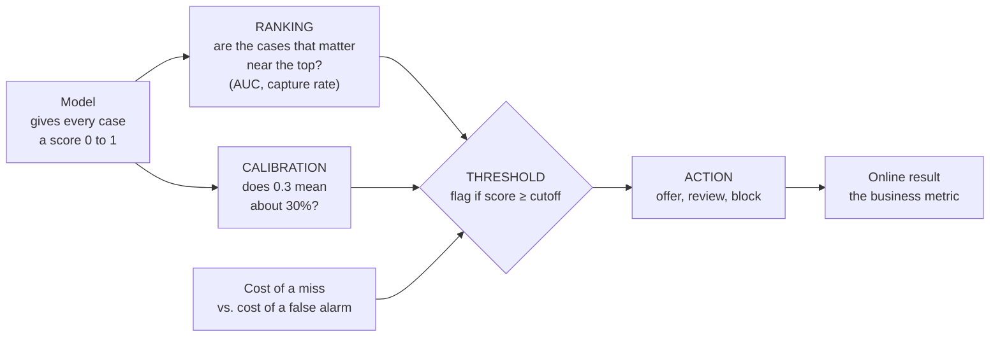

# Measuring a model: metrics, thresholds and baselines

*Part of [Machine learning for the product and technology leader](./README.md)*

*Last reviewed: 2026-10 · Volatility: medium*

## TL;DR

"The model is 83% accurate" is almost never enough to decide anything. A model does two
separate jobs, and each needs its own measure.

The first job is **ranking**. The model gives each case a score. Good ranking puts the
cases that matter, such as customers about to leave, near the top. The second job is
**deciding**. A **threshold** turns the score into an action: flag, block, call. The
scikit-learn guide draws the same line. Learning to predict probabilities is a statistical
problem. Acting on them is a decision problem.

So you need four things. A **baseline** to beat. A **confusion matrix**, which counts each
kind of mistake. A **threshold** chosen from what each mistake costs. And a check that the
scores are honest probabilities, which is called **calibration**. Offline scores are only a
forecast. The final test is a live experiment on the business number you care about.

> 🎯 **For the product leader**
>
> **Why it matters** — The metric the team reports sets what the model optimizes and what
> you approve. A model can lift accuracy by one point and change nothing for the business.
>
> **What it changes in your decisions** — You stop asking "how accurate is it?" You ask what
> a missed case costs, what a false alarm costs, and how many cases your team can act on in
> a week. The threshold follows from those answers.
>
> **Ask your eng team** — *"What is the baseline, what does each kind of error cost, and
> where did we set the threshold and why?"*
>
> **Risk if ignored** — You ship a model with a good-looking score that catches almost
> nothing. Or you flood a team with alerts it cannot work.

## The mental model: score, then cutoff, then action



The model does not decide. The threshold decides. Moving the threshold changes who gets
flagged without changing the model at all.

## The confusion matrix: four kinds of outcome

For a yes-or-no prediction, every case lands in one of four cells. In churn terms:

| | Customer **left** | Customer **stayed** |
| --- | --- | --- |
| **We flagged** | True positive: we caught a leaver | False positive: a wasted offer |
| **We did not flag** | False negative: a leaver slipped through | True negative: correctly left alone |

Two rates come from the matrix.

- **Precision.** Of the customers we flag, what share really leave? It measures how clean
  the flagged list is.
- **Recall.** Of the customers who leave, what share did we flag? It measures how many we
  catch.

Raise the threshold and the list gets shorter. Recall never rises, and precision usually
does. Lower it and the reverse happens. In practice you trade one for the other. You choose
a point on the curve.

[Retrieval quality](../rag-vector-databases/retrieval-quality.md) uses the same two words
for a search system. The idea is the same.

## Why accuracy misleads

**Accuracy** is the share of cases the model gets right. When one outcome is rare, it
flatters a model that does nothing. About 18% of our example customers leave. A program that
predicts "nobody leaves" is right 81.7% of the time, and it catches no one.

Use measures that separate the two kinds of case. **Balanced accuracy**, from lesson 1,
averages the catch rate and the leave-alone rate. **Precision and recall** describe the
flagged list. **AUC** and **capture rate**, below, describe ranking.

## Ranking quality: AUC and capture rate

**AUC**, the area under the receiver operating characteristic curve, has a plain meaning. Pick one customer who left and
one who stayed at random. AUC is the chance the model scored the leaver higher. A coin flip
gives 0.5. Perfect gives 1.0. AUC does not depend on any threshold.

**Capture rate at the top** answers a capacity question. Your retention team can call only
so many customers. If it can call the top 10% by score, what share of all leavers does that
list hold? A random list holds 10%. A good model holds much more.

## The threshold comes from the cost of each mistake

Suppose a missed leaver costs the company $60 in lost margin, and a retention offer sent to
a customer who would have stayed costs $15. These numbers are invented. A false negative
costs four times a false positive.

If the model's scores are well calibrated, and a correct decision costs nothing, a simple
rule gives the best cutoff. Flag a customer when the chance of leaving is at least

`cost of a false alarm ÷ (cost of a false alarm + cost of a miss)`

Here that is 15 ÷ (15 + 60) = 0.20. Flag anyone with a risk of 20% or more. The cutoff is a
business fact, not a modelling choice. It moves when your costs move.

The scikit-learn guide notes that its default cutoff of 0.5 is hard-coded and "most
certainly not ideal for most use cases". It offers a tool, `TunedThresholdClassifierCV`, to
tune the cutoff against a score you choose.

## Calibration: do the probabilities mean what they say?

A model is **calibrated** when its scores behave like probabilities. Among the customers it
scores near 0.3, about 30% should leave. The scikit-learn guide gives this test with an
example at 0.8.

Calibration matters when you use the number itself. You add the scores to forecast how many
customers will leave. You compute the cutoff from costs, as above. Or you show a risk figure
to a person. A model can rank perfectly and still report scores that are too high or too
low. Ranking measures like AUC cannot see this.

## Offline versus online

Everything above is **offline**: scored on past data you hold out. It forecasts, and it
cannot prove that the product improves. Two gaps remain.

- **The score may not match the goal.** A churn model predicts who will leave. It does not
  say whom an offer will keep. Some customers would have stayed anyway. Others would leave
  whatever you do. The offer pays off only on those it changes. Measuring that takes an
  experiment with a control group.
- **The world differs from the data.** Live traffic, new customers and your own actions
  change the picture.

So run an online test. Split live customers into a group that gets the model-driven action
and a group that does not. Compare the business number, such as retained revenue.
[Metrics and experimentation](../technical-product-management/metrics-and-experimentation.md)
covers how.

## Worked example: from an 83% score to a cost-based cutoff

*This example is invented. The data and the costs are made up. The code is in
`machine-learning/code/lesson5_metrics.py`.*

We use the kind of churn model from lesson 3. This time we make 8,000 invented customers.
We train on 4,000 of them and score the other 4,000, which the model has never seen. Of
those, 734 left, which is 18.3%.

**Step 1: accuracy.** At the default cutoff of 0.5, accuracy is 83.1%. The do-nothing
baseline scores 81.7%. The model looks only 1.4 points better.

**Step 2: the confusion matrix at 0.5.**

| | Left | Stayed |
| --- | --- | --- |
| Flagged | 109 | 52 |
| Not flagged | 625 | 3,214 |

Precision is 67.7%: 109 of the 161 flagged really leave. Recall is only 14.9%: the model
catches 109 of 734 leavers. It misses 85% of them. Accuracy hid this.

**Step 3: ranking.** AUC is 0.76. The top 10% by score holds 30.7% of all leavers, about
three times a random list.

**Step 4: pick the cutoff from costs.** We try every cutoff from 0.01 to 0.99 and add up
the invented costs.

| Policy | Flagged | Leavers caught | Total cost |
| --- | --- | --- | --- |
| Do nothing | 0 | 0 of 734 | $44,040 |
| Cutoff 0.5 (the default) | 161 | 109 of 734 | $38,280 |
| **Cutoff 0.19** | 1,420 | 490 of 734 | **$28,590** |

The best cutoff, 0.19, sits close to the 0.20 the formula gave. It costs $15,450 less than doing nothing. At that cutoff precision
falls to 34.5% and recall rises to 66.8%. The list is dirtier, and the policy is far
cheaper. The cheapest policy is not the most accurate one. It is the one that matches the
costs.

**Step 5: calibration.** We take the same scores and square each one. The ranking does not
change, so AUC stays at 0.76. The calibration error, the average gap between the stated
risk and the observed rate, jumps from 1.4 points to 13.1 points. A team that checked only
AUC would not see that the numbers had become untrue.

The next stop is an online test, because $28,590 is still a forecast on invented costs and
a model that cannot tell who an offer will save.

## Tradeoffs and decisions

- **Precision vs. recall.** Pick by the cost of each error and by your team's capacity to
  act. A fraud team that can review 200 cases a day needs a different cutoff from one that
  can review 20,000.
- **One cutoff vs. tiers.** Many products use two cutoffs: act automatically above one,
  send to a person between them, and ignore below.
- **Global vs. per-segment metrics.** An average can hide a segment where the model fails.
  Score important segments on their own.
- **A better metric vs. a simpler story.** AUC, lift and cost each tell the truth about a
  different thing. Choose the one that matches the decision.

## Failure modes

- **Accuracy on a rare outcome.** A useless model scores 80% or more.
- **The default cutoff.** Nobody chose 0.5. It came with the library.
- **Reporting only AUC.** Ranking can be perfect while the probabilities are wrong.
- **No baseline.** A score has no meaning without a comparison.
- **Optimizing the proxy.** The offline metric rises while the business number does not move.
- **Ignoring capacity.** The list is longer than the team can work, so the model's best
  cases are never reached.
- **No control group.** You cannot tell the effect of the action from the effect of the
  model.

## Under the hood

The core functions are short. `confusion` counts the four cells. `best_threshold` tries every
cutoff and keeps the cheapest.

```python
def confusion(pred, truth):
    tp = sum(1 for p, t in zip(pred, truth) if p == 1 and t == 1)
    fp = sum(1 for p, t in zip(pred, truth) if p == 1 and t == 0)
    fn = sum(1 for p, t in zip(pred, truth) if p == 0 and t == 1)
    tn = sum(1 for p, t in zip(pred, truth) if p == 0 and t == 0)
    return tp, fp, fn, tn

def total_cost(pred, truth):
    _, fp, fn, _ = confusion(pred, truth)
    return fn * COST_MISSED_CHURNER + fp * COST_WASTED_OFFER

def best_threshold(scores, truth):
    best = None
    for i in range(1, 100):
        t = i / 100
        c = total_cost([1 if s >= t else 0 for s in scores], truth)
        if best is None or c < best[1]:
            best = (t, c)
    return best
```

AUC is computed from ranks: count how often a random leaver outscores a random stayer. For
calibration, group the scores into ten bands, and in each band compare the average score
with the observed rate. Weight the gaps by band size.

Practical habits:

- **Choose the threshold on validation rows**, then report cost on the test rows.
- **Version the cutoff** with the model. A model with a new cutoff is a new release.
- **Log scores, not just flags.** You can change the cutoff later without retraining.
- **Plot the calibration table** for any model whose number a person will read.

## Practitioner checklist

- [ ] Is there a baseline, scored on the same data with the same function?
- [ ] Do we have the confusion matrix, not only a single score?
- [ ] Did we write down the cost of a miss and the cost of a false alarm?
- [ ] Was the cutoff chosen from those costs, on validation rows?
- [ ] Do we know how many cases the team can act on each week?
- [ ] Are the scores calibrated, if anyone reads them as probabilities?
- [ ] Did we check key segments, not only the average?
- [ ] Is there an online test with a control group planned?

## Related lessons

- [Generalization](./generalization-overfitting-and-bias-variance.md) — why these scores
  must come from held-out rows.
- [ML in production](./ml-in-production.md) — keeping the numbers true after launch.
- [Retrieval quality](../rag-vector-databases/retrieval-quality.md) — precision and recall
  for search.
- [Evaluation and observability](../evaluation-and-observability/README.md) — an eval set
  for LLM features, which plays the role the test set plays here.
- [Metrics and experimentation](../technical-product-management/metrics-and-experimentation.md)
  — the online test.

## Sources

- scikit-learn user guide, [Tuning the decision threshold for class prediction](https://scikit-learn.org/stable/modules/classification_threshold.html):
  the split between the statistical problem and the decision problem, the hard-coded 0.5
  cutoff and its limits, and `TunedThresholdClassifierCV`. Read from the guide's source text
  in the scikit-learn repository, 2026-10.
- scikit-learn user guide, [Model evaluation](https://scikit-learn.org/stable/modules/model_evaluation.html):
  balanced accuracy as the average recall per class, and its use on imbalanced data. Same
  reading.
- scikit-learn user guide, [Probability calibration](https://scikit-learn.org/stable/modules/calibration.html):
  the definition of a well-calibrated classifier, with the 0.8 example. Same reading.
- The churn data, the costs ($60 and $15), the cutoff and every score are invented. They come
  from `machine-learning/code/lesson5_metrics.py` and can be reproduced with it.
