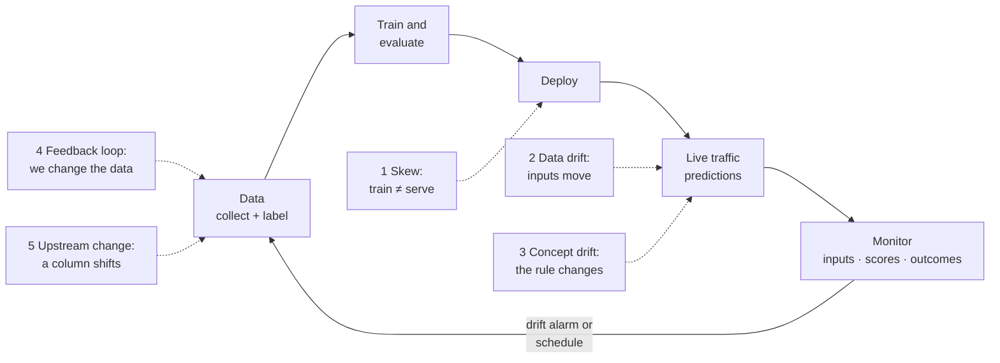

# ML in production: drift, skew and the lifecycle

*Part of [Machine learning for the product and technology leader](./README.md)*

*Last reviewed: 2026-10 · Volatility: medium*

## TL;DR

Launch is the middle of the story. A normal feature keeps working until someone changes
the code. An ML feature can get worse with no code change at all, because its inputs and
the world around it change.

Five problems cause most production failures. **Training-serving skew:** the model sees
different inputs live than it saw in training. **Data drift:** the mix of incoming cases
changes. **Concept drift:** the link between the inputs and the outcome changes. **Feedback
loops:** the model's own actions change the data it learns from later. **Silent upstream
changes:** a column changes meaning and nothing crashes.

The defense is a lifecycle, not a better model. Watch the inputs, the scores and the
outcomes. Decide in advance when to retrain and who owns the decision. Treat the
surrounding system as the product. The ML code is one part of it.

> 🎯 **For the product leader**
>
> **Why it matters** — A model's accuracy is a measurement taken at one moment. The product
> promise is for every moment after. Most of the cost of ML sits after launch.
>
> **What it changes in your decisions** — You budget for monitoring and retraining before
> you approve the build. You assign an owner. You ask for the alarm that would tell you the
> model has decayed.
>
> **Ask your eng team** — *"If this model got worse next Tuesday, which alarm fires, who
> gets it, and what do they do?"*
>
> **Risk if ignored** — Revenue decays quietly for months. The first alarm is a customer
> complaint, a finance review, or an audit.

## The mental model: a loop with five weak points



A model is not a file you ship once. It is a loop. Each arrow is a handoff between people
or systems, and each can break.

## The model is a small part of the system

Sculley and colleagues at Google described this in a 2015 paper on the "hidden technical
debt" of ML systems. ML makes the usual maintenance costs of software worse, and adds new
ones. Their list of risk factors includes entanglement, hidden feedback loops, undeclared
consumers, data dependencies, configuration problems and changes in the external world.

The paper's sharpest idea is the changing-anything-changes-everything (CACE) principle.
If you change the distribution of one input, the model may reweigh all the others. So you
cannot fix one feature in isolation, and you cannot treat a model as a set of independent
parts.

## Five failure modes

### 1. Training-serving skew

The model trained on one version of the inputs and serves on another. The code that builds
features for training is not the same code that builds them live. Units differ, defaults
differ, or a lookup is stale. Nothing crashes. The numbers are just wrong.

Google's *Rules of Machine Learning* treats this as its own family of problems. It advises
saving the features the model used at serving time and using that log for training, and it
has a rule to measure the gap between training and serving. A strong habit is to share one
feature-building code path between training and serving.

### 2. Data drift

The cases arriving now do not look like the cases the model trained on. Growth brings new
customers. A new channel brings a different mix. The model's rules may still be right. It
has just not seen these cases.

### 3. Concept drift

The link between inputs and outcome changes. A price rise changes why people cancel. A new
fraud tactic makes yesterday's pattern useless. Gama and colleagues surveyed this problem in
2014. The model's inputs may look unchanged while its answers get worse. This is harder to
detect, because you need outcomes to see it.

### 4. Feedback loops

The model's action changes the data it will later learn from. If you only offer discounts to
customers the model flags, you will never learn what the unflagged customers would have
done. If a recommender shows only what it already favors, it trains on the clicks it caused.
The model slowly confirms itself.

### 5. Silent upstream changes

Another team renames a field, changes a unit, adds a new category, or starts filling a blank
with a default. Your model reads the new values as if they were old. Sculley and colleagues
call the teams that use your output without telling you "undeclared consumers", and the
reverse problem is as common.

## Monitoring: inputs, scores and outcomes

Watch three layers. They answer different questions and arrive at different speeds.

| Layer | What you watch | Example alarm | Speed |
| --- | --- | --- | --- |
| **Inputs** | The spread of each input and the share of missing values, against training | Population stability index above a limit on any key column | Immediate |
| **Scores** | The spread of the model's outputs | The average predicted risk jumps, or the share flagged doubles | Immediate |
| **Outcomes** | Real results against predictions | AUC or precision on recent labelled cases falls | Delayed by the label delay |

The first two layers are fast and cannot prove the model is wrong. The third proves it, and
arrives late. A 30-day churn label means the first accurate reading is a month behind. So
teams run all three. Fast alarms trigger a look. Slow outcomes confirm it.

The **population stability index (PSI)** compares the live spread of one input to its
spread in training. Cut the training values into ten equal bands. Count what share of live
values lands in each. The score is zero when the shares match and grows as they diverge. A
common habit treats 0.1 as "look" and 0.25 as "act". That is a convention from credit-risk
work, not a standard. Tune it on your own history.

## Retraining is a decision

Retraining brings a model back up to date. It is also a release, with all the risks of one.
Plan three things.

- **Triggers.** Retrain on a schedule, on a drift alarm, on a fall in measured performance,
  or on a mix. A schedule is simple and wastes effort when nothing changed. An alarm is
  efficient and needs good monitoring.
- **Safe rollout.** Run the new model in **shadow mode**: it scores live traffic, nobody
  acts on it, and you compare it with the old one. Then send it a small share of traffic,
  called a **canary**. Keep a one-step rollback.
- **Versions.** Record the data, the code and the settings for every model. Without that you
  cannot reproduce it or explain a past decision.

Retraining does not cure everything. If the world changed so that the problem is harder, a
retrained model will still do worse than at launch. The example below shows this.

## Ownership

A model without an owner decays. Name one person or team who sees the alarms, can retrain,
and can switch the model off. Write a short runbook. State what happens when the model is
unavailable, such as a default rule. Teams call the practice around all of this MLOps. It is
the same discipline as running any other service, extended with data and models.

## Worked example: a unit slip, then six months of drift

*This example is invented. The data is generated by code with a fixed seed.*

**Skew.** We train the churn model on customers whose tenure is in months. It scores an AUC
of 0.727 on a held-out set, the offline number. At launch, the serving system sends tenure
in **days** by mistake. No error appears. The same model's AUC on live traffic is 0.621.
That is a loss of 10.6 points.

The input monitor would have caught it on day one. The PSI for tenure is 7.51. The PSI for
tickets, which did not change, is 0.00. A single check on input spread points straight at
the broken column.

**Drift.** Now the customer base changes over six months. New customers arrive faster,
logins fall, and support tickets stop being such a strong signal. We score the original
model on each month's new customers.

| Month | AUC of the original model | PSI of tenure | PSI of logins |
| --- | --- | --- | --- |
| 0 | 0.756 | 0.00 | 0.01 |
| 1 | 0.720 | 0.01 | 0.04 |
| 2 | 0.697 | 0.06 | 0.09 |
| 3 | 0.647 | 0.15 | 0.22 |
| 4 | 0.639 | 0.29 | 0.36 |
| 5 | 0.611 | 0.49 | 0.44 |

Look at what each layer saw. The AUC fell from month 1. A real team would see that only
after the 30-day label delay. The input check stayed quiet longer. The logins PSI crossed
0.1 in month 3 and tenure crossed 0.25 in month 4, by which time the AUC was down 11 and 12
points. One reason is that part of this drift is concept drift. The tickets column spreads
the same as before. It just predicts less. A PSI check cannot see that. So neither fast
alarms nor slow outcomes are enough on their own. You need both.

**Retraining.** We retrain on the newest data and score a fresh sample from that period. The
old model scores 0.594. The retrained model scores 0.613. Retraining helped by about two
points. It did not bring the model back to 0.756. The new customers are simply harder to
predict. That is a product fact for the roadmap, not a modelling fix: when the world gets
less predictable, a better model is not always available.

## Tradeoffs and decisions

- **Retrain often vs. rarely.** Frequent retraining keeps the model fresh and creates more
  releases to test. Rare retraining is stable and risks long decay.
- **Alarm sensitivity vs. noise.** Tight limits catch drift early and cry wolf. Loose limits
  stay quiet and miss it.
- **Automate the retrain vs. keep a person in the loop.** Automation is fast. A person
  catches a retrain that learned from a broken input.
- **Fresh vs. reproducible.** Always training on the latest data makes results hard to
  repeat. Pin the data version for every model.
- **Monitoring cost vs. coverage.** You cannot watch everything. Start with the inputs and
  scores that matter most.

## Failure modes

- **No owner.** The model keeps running and nobody sees it decay.
- **Monitoring only accuracy.** Outcomes arrive late, so the first alarm is far too late.
- **Two feature code paths.** Training and serving build inputs in different places.
- **Retraining on broken data.** An upstream error becomes the new training set.
- **A feedback loop nobody modelled.** The system confirms its own mistakes.
- **No fallback.** The model fails and there is no default rule to fall back on.

## Under the hood

The PSI function is short. Bin edges come from the training values. The live share in each
bin is compared with the training share.

```python
def psi(expected, actual, bins=10):
    ordered = sorted(expected)
    edges = [ordered[int(len(ordered) * i / bins)] for i in range(1, bins)]

    def shares(values):
        counts = [0] * bins
        for v in values:
            counts[sum(1 for e in edges if v > e)] += 1
        return [max(c / len(values), 1e-4) for c in counts]   # floor avoids log(0)

    e, a = shares(expected), shares(actual)
    return sum((ai - ei) * math.log(ai / ei) for ei, ai in zip(e, a))
```

A skew test can run before every release. Replay a sample of real requests through the
training feature code and the serving feature code and compare the outputs.

```python
for request in sample_of_live_requests:
    assert train_features(request) == serve_features(request)   # same inputs, same numbers
```

The files are `machine-learning/code/lesson7_drift.py` and `data.py`. Habits that pay off:

- **Log the features and the score** for every live prediction. You need them to debug, to
  compute PSI, and to retrain on what the model actually saw.
- **Join outcomes back** when they arrive, keyed to the prediction. That gives you the slow
  signal.
- **Alert on missing data**, not just on changed data. A column that goes blank is the
  commonest silent failure.
- **Version everything**: data snapshot, feature code, model file, and cutoff.

## Practitioner checklist

- [ ] Is there a named owner and a runbook?
- [ ] Do training and serving share one feature code path, with a test that proves it?
- [ ] Do we monitor inputs, scores and outcomes?
- [ ] Do we know the label delay, and what we watch while we wait?
- [ ] Are there written triggers for retraining?
- [ ] Is new-model rollout done in shadow mode or on a canary, with a rollback?
- [ ] Are data, code, settings and cutoff versioned for every model?
- [ ] Is there a fallback rule if the model is switched off?
- [ ] Have we asked how our own actions change the data we will learn from?

## Related lessons

- [Measuring a model](./measuring-a-model.md) — the scores you monitor.
- [Data: features, labels, splits and leakage](./data-features-labels-and-leakage.md) — the
  same discipline before launch.
- [Evaluation and observability](../evaluation-and-observability/README.md) — monitoring
  for LLM features.
- [Running an agent in production](../ai-agents/running-an-agent-in-production.md) — limits,
  approvals and a kill switch for a system that acts.
- [Cost optimization](../cost-optimization/README.md) — what training and serving cost over
  a model's life.

## Sources

- Sculley et al., *Hidden Technical Debt in Machine Learning Systems*, Advances in Neural
  Information Processing Systems 28 (2015), 2503–2511.
  [papers.nips.cc/paper/5656-hidden-technical-debt-in-machine-learning-systems](https://papers.nips.cc/paper/5656-hidden-technical-debt-in-machine-learning-systems.pdf).
  The risk factors (entanglement, hidden feedback loops, undeclared consumers, data
  dependencies, configuration issues, changes in the external world) and the CACE
  principle. Checked through the abstract and search-result excerpts, 2026-10.
- Zinkevich, M. *Rules of Machine Learning: Best Practices for ML Engineering*, Google.
  [developers.google.com/machine-learning/guides/rules-of-ml](https://developers.google.com/machine-learning/guides/rules-of-ml).
  The advice to save the features used at serving time and train on them (Rule 29), and the
  rule to measure training-serving skew (Rule 37). Checked through search-result excerpts,
  2026-10.
- Gama, Žliobaitė, Bifet, Pechenizkiy and Bouchachia, *A survey on concept drift
  adaptation*, Computing Surveys 46(4), article 44, 2014 (Association for Computing Machinery).
- PSI thresholds of 0.1 and 0.25: a habit from credit-risk practice. This lesson gives them
  as a convention, not a standard. No primary standard was found.
- The data, the unit mismatch, the six months of drift and every score are invented. They
  come from `machine-learning/code/lesson7_drift.py` and can be reproduced with it.
