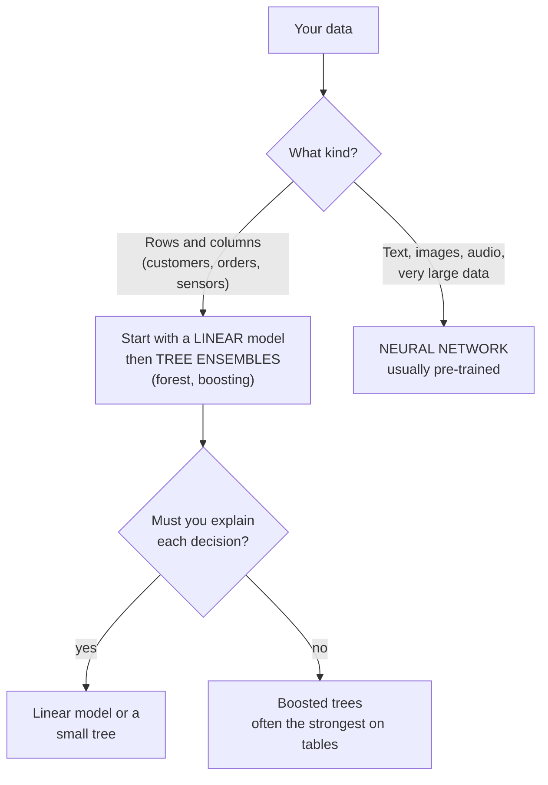

# Model families: linear models, trees and neural networks

*Part of [Machine learning for the product and technology leader](./README.md)*

*Last reviewed: 2026-10 · Volatility: medium*

## TL;DR

Most models fall into three families. Each one can find a different shape of pattern.

- **Linear models** add up weighted facts. "Each support ticket adds this much risk."
  They are fast, readable and hard to overfit. They cannot see that two facts matter only
  together.
- **Tree models** ask a chain of yes-or-no questions. They handle mixed data and
  interactions with little preparation. One tree overfits easily. So practitioners combine
  many trees, by averaging them (a *random forest*) or by adding them one at a time, each
  correcting the last (*gradient boosting*).
- **Neural networks** stack layers of weighted sums with bends between them. They can learn
  almost any shape and they learn their own features. They need a lot of data and compute.
  They are the engine behind images, speech and language models.

Match the family to the data. For rows and columns, such as customer tables, start with a
linear model and a tree ensemble. For text, images and audio, use a neural network, usually
one that someone has already trained.

> 🎯 **For the product leader**
>
> **Why it matters** — The family sets four things you care about: how accurate the model
> can get, how well you can explain it, what it costs to train and serve, and how much data
> you need.
>
> **What it changes in your decisions** — You ask for the simplest model that gets close to
> the best one. Each step up in complexity must buy a gain you can name.
>
> **Ask your eng team** — *"Which family did we choose, and how much better is it than a
> linear model on the same data?"*
>
> **Risk if ignored** — You pay for a deep network on a small table that a simpler model
> would beat. Or you ship an unexplainable model where a regulator expects an explanation.

## The mental model: what each family can see



A model can only find patterns its shape allows. A straight line cannot draw a circle. This
is why the family matters before any tuning.

## Linear models

A linear model scores a case as a weighted sum of its features, plus a starting value. In
the churn model of lesson 3, the weight on support tickets is positive and the weight on
tenure is negative. A person can read the weights and check them against common sense. A
linear model is also fast to train and to serve.

Two limits matter.

- **Straight-line effects only.** Each feature pushes the score the same way at every
  level. The model cannot learn "tickets matter only for new customers" unless an engineer
  adds that combined feature by hand.
- **Scaling.** The features usually need standardizing, as in lesson 3.

Logistic regression is the linear model for yes-or-no questions. It has a useful extra: the
scikit-learn guide notes that it is more likely than most models to return well-calibrated
probabilities by itself. [Lesson 5](./measuring-a-model.md) explains why that matters.

## Trees and their ensembles

A **decision tree** splits the cases with a question such as "tickets in 90 days at most
2?", then splits each group again. At the end each leaf holds a group of similar cases and
the share of them that left. Trees need little data preparation. They accept mixed kinds of
columns. They find interactions on their own. You can draw one and read it.

A single deep tree memorizes, as lesson 4 showed. Two ensemble ideas fix that.

- **Random forest.** Grow many trees, each on a random sample of the rows and a random
  subset of the columns. Average their answers. The quirks of each tree cancel, so variance
  drops. Leo Breiman described the method in 2001.
- **Gradient boosting.** Build small trees one after another. Each new tree is trained on
  the mistakes the ensemble still makes. Add them up with a small weight. Jerome Friedman
  described the idea in 2001. The tool XGBoost, published by Chen and Guestrin in 2016,
  made it popular in competitions and in industry.

On tables, boosted trees are the usual strong baseline. A 2022 benchmark paper by
Grinsztajn, Oyallon and Varoquaux found that tree-based models remained state of the art on
medium-sized tabular data, about 10,000 rows. They did so even without counting the trees'
speed advantage. The authors traced it to how neural networks cope with irregular targets
and with uninformative columns. Do not read this as a law. Read it as the reason to try
trees before a deep network on a table.

## Neural networks

A **neural network** is a stack of layers. Each layer computes weighted sums of the layer
before it. Then a bend, called an **activation function**, is applied to each result. The
bend is what lets the network draw curves. Without it, many layers would collapse into one
straight-line model.

The layers between the input and the output are **hidden layers**. The network is free to
decide what each hidden unit should detect. That is why networks learn their own features.
A network for images learns edges first and shapes later. A network for text learns word
patterns. Nobody tells it what to look for.

The costs are real. A network needs a lot of data and compute. Its decisions are hard to
explain. It has many settings to tune. In return it handles data that rows and columns
cannot hold: pictures, speech, free text. A large language model is a very large neural
network of a specific design, trained as in [What an LLM actually is](../llms/what-is-an-llm.md).
Two modules that follow this one cover how networks handle numbers in bulk (tensors) and
how they see images (convolutional networks).

## Backpropagation in one page

Training a network uses the loop from lesson 3. The gradient for a network is harder to
compute than for a linear model, because each weight sits behind several layers.
**Backpropagation** is the method. David Rumelhart, Geoffrey Hinton and Ronald Williams
described it in a 1986 paper in *Nature*.

It has two passes.

1. **Forward.** Push an input through the layers to get a prediction. Save each layer's
   output on the way.
2. **Backward.** Start with the slope of the loss at the output. Use the chain rule to
   pass that slope back through each layer. At each weight, the slope equals the slope
   arriving from above, times the value that went in.

That is all it is. The chain rule applied from the end to the start. Libraries do it
automatically, which is why you rarely write it. The code under the hood does it by hand
for a small network. It then checks the answer against a slow numerical slope.

## Choosing a family

| Situation | A good first choice | Why |
| --- | --- | --- |
| A customer or transaction table, thousands to millions of rows | Logistic or linear regression, then boosted trees | Strong, fast, and cheap to run. Boosting often wins on tables |
| Few rows, many columns | A regularized linear model | Less able to memorize |
| You must justify each decision to a customer or a regulator | A linear model or a small tree | You can state the reasons |
| Interactions matter and you cannot name them | A tree ensemble | It finds them |
| Free text, images, speech | A pre-trained neural network | You lack the data to train one from scratch |
| Millions of examples of one repeated perception task | Your own neural network | Scale pays for itself |

## Worked example: when the shape of the model decides

*This example is invented. The data is generated by code with a fixed seed.*

**Data A: the churn table.** The same 8,000 customers as lesson 5. We compare a logistic
model and a decision tree on rows neither has seen, using AUC.

| Model | AUC |
| --- | --- |
| Logistic regression | 0.760 |
| Decision tree, depth 4 | 0.704 |

The simple linear model wins here. That is partly by design: we generated the churn data
from a weighted sum, so a weighted sum fits it. Real data is messier. The point is not that
linear always wins. It is that a plain model can be hard to beat, and it is cheap to try
first.

**Data B: an interaction.** Each case has two scores between −1 and 1. The label is 1 when
the two scores have the **same sign**. Alone, neither score says anything. Only the pair
does. We add 5% label noise. We train on 300 cases and test on 400.

| Model | Accuracy on unseen cases |
| --- | --- |
| Logistic regression | 47.3% |
| Decision tree, depth 5 | 90.8% |
| Neural network, 6 hidden units, 25 parameters | 89.5% |

The linear model is at coin-flip level. It cannot express "same sign". The tree and the
network can. The loss of the network fell from 0.911 to 0.217 in 800 steps.

Two honest notes. A tree of depth 3 reaches only 81% here. This either-or pattern gives no
useful first question, because a greedy tree picks the best single split and no single split
helps. The tree needs depth to find the pair. And the gradient check for the network agrees
with the numerical slope to about 2 parts in 10 billion, which is how we know the hand-written
backpropagation is right.

## Tradeoffs and decisions

- **Accuracy vs. explainability.** The strongest model on a table is often a boosted
  ensemble that no person can read in full. Tools can give feature importances. They are
  summaries, not reasons.
- **Cost to train vs. cost to serve.** A boosted ensemble trains in minutes and serves in
  milliseconds. A large network can cost far more at both ends.
- **Feature engineering vs. data volume.** Linear and tree models reward careful features.
  Neural networks trade that effort for more data.
- **Your own model vs. a pre-trained one.** For language and vision, starting from a
  trained network beats training your own. For your private tabular data, there is no such
  option, and you train.

## Failure modes

- **A deep network on a small table.** Cost and risk rise and accuracy does not.
- **A linear model on interacting signals.** It cannot see the pattern and reports a weak
  model as if the problem were hard.
- **Complexity creep.** Each extra layer or tree adds a little accuracy and a lot of upkeep.
- **An unexplainable model in a regulated decision.** A buyer or regulator asks for the
  reasons, and you have none.
- **Benchmark chasing.** A family wins a public leaderboard on data unlike yours.
- **Uncalibrated scores.** Boosted trees and networks can rank well and give poor
  probabilities. Check calibration before you use the number.

## Under the hood

The core of the tiny network is the backward pass. It is `machine-learning/code/mlp.py`.
Read it against the two-pass description above.

```python
def gradients(self, rows, labels):
    n = len(rows)
    g_w1 = [[0.0] * len(self.w1[0]) for _ in self.w1]
    g_b1, g_w2, g_b2 = [0.0] * len(self.b1), [0.0] * len(self.w2), 0.0
    for x, y in zip(rows, labels):
        h, p = self.forward(x)                              # forward pass, saving the hidden values h
        d_out = p - y                                       # slope of the loss at the output
        for j, a in enumerate(h):
            g_w2[j] += d_out * a / n                        # output weight: slope times its input
            d_hidden = d_out * self.w2[j] * (1 - a * a)     # pass the slope back through tanh
            g_b1[j] += d_hidden / n
            for i, v in enumerate(x):
                g_w1[j][i] += d_hidden * v / n              # hidden weight: slope times its input
        g_b2 += d_out / n
    return g_w1, g_b1, g_w2, g_b2
```

The gradient check is a standard habit. Nudge one weight up and down by a tiny amount,
measure how the loss moves, and compare with the backward pass.

```python
numeric = (loss_with(w + eps) - loss_with(w - eps)) / (2 * eps)
assert abs(numeric - analytic) / (abs(numeric) + abs(analytic)) < 1e-5
```

Practical habits:

- **Fit the simplest model first** and keep its score as the reference.
- **Tune trees on validation rows.** Depth, number of trees and learning rate each change
  how much the model overfits.
- **Check calibration** of any tree or network whose score a person reads.
- **Use a library for real work.** Scikit-learn covers linear models, forests and boosting.
  Deep-learning libraries compute gradients for you.

## Practitioner checklist

- [ ] Did we start with a linear model and record its score?
- [ ] Is there a reason the chosen family beats the simple one by a margin we can name?
- [ ] Does the data type fit the family: tables to trees, perception tasks to networks?
- [ ] Must we explain each decision, and does the model allow it?
- [ ] Do we know the training cost, the serving cost and the latency?
- [ ] Are the scores calibrated, if anyone reads them as probabilities?
- [ ] Could a pre-trained model replace training our own?

## Related lessons

- [Training: loss and gradient descent](./training-loss-and-gradient-descent.md) — the loop
  that every family uses.
- [Generalization](./generalization-overfitting-and-bias-variance.md) — why ensembles
  average away variance.
- [What an LLM actually is](../llms/what-is-an-llm.md) — a very large neural network.
- [Choosing a model](../llms/choosing-a-model.md) — the same decision for language models.
- [Build, buy, or fine-tune](../generative-ai/build-buy-or-fine-tune.md) — when to start
  from someone else's trained network.

## Sources

- Breiman, L. *Random Forests*, Machine Learning 45(1), 5–32, 2001.
  [doi.org/10.1023/A:1010933404324](https://doi.org/10.1023/A:1010933404324).
- Friedman, J. H. *Greedy function approximation: A gradient boosting machine*, The Annals of
  Statistics 29(5), 1189–1232, 2001.
  [doi.org/10.1214/aos/1013203451](https://doi.org/10.1214/aos/1013203451).
- Chen, T. and Guestrin, C. *XGBoost: A Scalable Tree Boosting System*, Proceedings of the
  22nd International Conference on Knowledge Discovery and Data Mining, 2016.
- Grinsztajn, L., Oyallon, E. and Varoquaux, G. *Why do tree-based models still outperform
  deep learning on typical tabular data?*, NeurIPS 2022 Datasets and Benchmarks Track.
  [neurips.cc/virtual/2022/poster/55627](https://neurips.cc/virtual/2022/poster/55627). The
  headline finding for medium-sized data (about 10,000 samples). Checked through search-result
  excerpts, 2026-10.
- Rumelhart, D. E., Hinton, G. E. and Williams, R. J. *Learning representations by
  back-propagating errors*, Nature 323, 533–536, 1986.
  [doi.org/10.1038/323533a0](https://doi.org/10.1038/323533a0).
- scikit-learn user guide, [Probability calibration](https://scikit-learn.org/stable/modules/calibration.html):
  logistic regression is more likely to return well-calibrated predictions by itself. Read
  from the guide's source text in the scikit-learn repository, 2026-10.
- Goodfellow, Bengio and Courville, *Deep Learning* (2016), chapter 6: feed-forward
  networks and back-propagation.
- The data, the models and every score are invented. They come from
  `machine-learning/code/lesson6_model_families.py` and can be reproduced with it.
