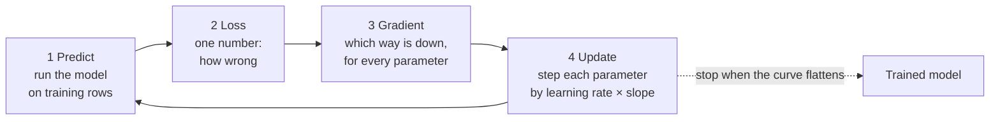

# Training: loss and gradient descent

*Part of [Machine learning for the product and technology leader](./README.md)*

*Last reviewed: 2026-10 · Volatility: medium*

## TL;DR

Training is a loop with four steps. The model makes predictions. A **loss** function turns
the mistakes into one number. The loop works out which way to nudge each parameter to lower
that number. It nudges them a small step. Then it repeats, often thousands of times.

The nudging method is **gradient descent**. The **gradient** is the slope of the loss with
respect to each parameter. The loop walks downhill. The size of each step is the **learning
rate**.

The tradeoff is speed against stability. Big steps cover ground fast and can overshoot.
Small steps are safe and can take forever. Training cost grows with three things: the number
of examples, the number of parameters and the number of passes over the data. The loop in
this lesson is the same loop that trains a large language model. The scale is different. The
idea is not.

> 🎯 **For the product leader**
>
> **Why it matters** — Training cost and training time are product constraints. They decide
> how often you can refresh a model and how many ideas you can try. The loss curve is the
> one chart that tells you whether training worked.
>
> **What it changes in your decisions** — You read two lines on one chart, training loss and
> validation loss, and you know whether to spend on more data, more training, or a simpler
> model. You stop treating "we trained it" as a result.
>
> **Ask your eng team** — *"Show me the training and validation loss curves. Did they
> flatten, and did they move together?"*
>
> **Risk if ignored** — You approve a model that trained badly. Or you pay for another week
> of training on a curve that flattened days ago.

## The mental model: walking downhill in fog

Picture a hiker on a hillside in thick fog. The hiker cannot see the valley. The hiker can
feel the slope under their feet. So they step downhill, feel the slope again, and step again.



The loss is the height of the ground. Each parameter is a direction you can walk. The
model starts at a random spot. Training is the walk down.

## The loss: the number training chases

A **loss** scores one prediction against the truth. Lower is better. The average loss over
all training rows is the number training tries to shrink.

The choice of loss is a product decision in technical clothing. The model will chase
whatever the loss rewards.

- **Squared error** suits numbers, such as a price. A miss of 10 counts four times a miss
  of 5. Big misses hurt most.
- **Log loss** suits probabilities. It measures how surprised the model was by the truth. A
  model that says "2% chance" for something that happens is punished hard. A coin-flip
  prediction scores 0.693.
- **A custom loss** can encode the business. If a missed churner costs four times a wasted
  offer, the loss can weigh them so. [Lesson 5](./measuring-a-model.md) shows the same
  idea applied after training.

## Gradient descent in one knob

The smallest training run has one parameter, `w`. Say the loss is the squared distance from
the best value, 3. The slope is `2 × (w − 3)`. With a learning rate of 0.1, each step moves
`w` by 0.1 times the slope, downhill.

| Step | `w` | Slope | New `w` |
| --- | --- | --- | --- |
| 0 | 0.00 | −6.00 | 0.60 |
| 1 | 0.60 | −4.80 | 1.08 |
| 2 | 1.08 | −3.84 | 1.46 |
| 3 | 1.46 | −3.07 | 1.77 |
| 4 | 1.77 | −2.46 | 2.02 |

Two things show up. The steps shrink on their own, because the slope shrinks as `w`
approaches 3. And `w` has not arrived after five steps. It needs many more. Real models
have millions or billions of parameters. Each step moves all of them at once, using the
slope for each.

## The learning rate: the one setting everyone tunes

The learning rate is the step multiplier. It is the most-tuned setting in training.

- **Too small.** Progress is slow. The model looks stuck. You pay for compute and learn
  nothing.
- **Too large.** Steps overshoot the valley. The loss jumps up and down, or grows without
  limit. The run is wasted.
- **About right.** The loss falls quickly at first, then flattens.

An **epoch** is one pass over all the training rows. Real systems often update on small
groups of rows, called **mini-batches**, so one epoch holds many updates. Mini-batch methods
are noisy, and they scale to data that does not fit in memory. Momentum carries part of the
last step into the next one. Adam adapts the step size on the fly. The scikit-learn guide
says Adam "can automatically adjust the amount to update parameters based on adaptive
estimates of lower-order moments". Its authors, Kingma and Ba, describe it as computing
individual adaptive learning rates for different parameters.

## Reading a loss curve

Plot the loss against the number of epochs, for the training rows and the validation rows.

| What you see | What it usually means | What to do |
| --- | --- | --- |
| Both fall, then flatten together | Training converged | Stop. More epochs buy little |
| Still falling at the end | Stopped too early, or the rate is small | Train longer, or raise the rate |
| Jumps up and down, or rises | The learning rate is too large | Lower it |
| Training falls, validation rises | The model memorizes the training rows | Lesson 4: simplify, add data, stop early |
| Flat from the first epoch | A bug, a rate far too small, or features carrying no signal | Check the data pipeline first |

A test engineers like: train on a handful of rows and check that the loss reaches nearly
zero. If a model cannot memorize ten rows, something in the code is wrong.

## What training costs

Three things multiply.

1. **Examples.** Each pass reads all the training rows.
2. **Parameters.** Each step updates every one.
3. **Passes.** The number of epochs, plus every repeat run when you tune settings.

A small churn model trains in seconds on a laptop. A frontier language model trains on
large clusters of specialist chips for a very long time. The loop is identical. This is why the
data-and-parameter scale of a model, covered in [What an LLM actually is](../llms/what-is-an-llm.md),
sets its price. It is also why experiments matter: a team that can try ten ideas a day
learns faster than a team that can try one a week.

## Worked example: training a churn model

*This example is invented. The data is generated by code with a fixed seed.*

We train a logistic regression on the 4,000-customer churn data from lesson 1. It has four
parameters, one per column, plus one bias. We standardize the columns first, using the
training rows only (lesson 2). We use a learning rate of 0.5 and 150 epochs.

| Epoch | Average loss on training rows |
| --- | --- |
| 1 | 0.636 |
| 10 | 0.453 |
| 150 | 0.403 |

The loss started near the coin-flip value of 0.693 and fell fast, then flattened. On the
1,000 held-back rows the loss is 0.424. A model that always predicts the average churn rate
scores 0.482. So the model learned something real, and it did so without overfitting.

The learned weights, on standardized columns, are readable:

| Column | Weight | Reading |
| --- | --- | --- |
| tenure_months | −0.70 | Longer-tenured customers cancel less |
| tickets_90d | +0.69 | More support tickets mean more cancellations |
| logins_30d | −0.41 | More logins mean fewer cancellations |
| monthly_spend | +0.13 | A small effect |

Flagging customers whose predicted risk is at or above the average churn rate gives a
balanced accuracy of 67.4% on the test rows. The best hand-written rule scored 58.9%. The
model won by combining four weak signals. Lesson 5 shows how to pick the cutoff on purpose.

Now change only the learning rate.

| Learning rate | Result |
| --- | --- |
| 0.01 | After 150 epochs the loss is 0.563. Still far from done |
| 0.5 | After 150 epochs the loss is 0.403. Converged |
| 60 | In 20 epochs the loss swings between 0.92 and 3.69 and never settles |

Same data, same model, same code. One number decides whether the run works.

## Tradeoffs and decisions

- **Learning rate: speed vs. stability.** Teams often run a short search over a few rates.
  That is cheap next to a bad long run.
- **Training longer vs. overfitting.** More epochs keep lowering the training loss and can
  raise the validation loss. Stop when validation stops improving. This is called early
  stopping.
- **More parameters vs. more data.** A larger model can fit more. It also needs more data to
  avoid memorizing. Cost grows with both.
- **Train from scratch vs. start from a trained model.** Starting from an existing model and
  adjusting it is far cheaper. That is the idea behind fine-tuning, covered in
  [Build, buy, or fine-tune](../generative-ai/build-buy-or-fine-tune.md).

## Failure modes

- **Divergence.** The rate is too large and the loss becomes huge or undefined.
- **Silent stall.** The loss barely moves. The rate is too small or a pipeline bug feeds the
  model noise.
- **Wrong objective.** The loss is easy to compute but does not match what the product
  needs. The model improves the loss and nothing else.
- **Training that cannot be repeated.** No fixed random seed, no recorded settings. A good
  result cannot be reproduced and a bad one cannot be debugged.
- **Stopping on the wrong curve.** The team watches only the training loss and misses the
  rise in validation loss.

## Under the hood

This is the whole loop for logistic regression, from `machine-learning/code/lesson3_gradient_descent.py`.
The `err` line is the gradient for this model: prediction minus truth.

```python
def train_logistic(rows, labels, lr=0.5, epochs=150):
    n, d = len(rows), len(rows[0])
    weights, bias, curve = [0.0] * d, 0.0, []
    for _ in range(epochs):
        grad_w, grad_b = [0.0] * d, 0.0
        for x, y in zip(rows, labels):
            err = sigmoid(sum(w * v for w, v in zip(weights, x)) + bias) - y
            for j in range(d):
                grad_w[j] += err * x[j]
            grad_b += err
        weights = [w - lr * g / n for w, g in zip(weights, grad_w)]   # step downhill
        bias -= lr * grad_b / n
        curve.append(log_loss(weights, bias, rows, labels))
    return weights, bias, curve
```

For a model with one layer, the gradient has a short closed form, as above. A deep network
has many layers. Its gradient comes from **backpropagation**, which applies the chain rule
from the output back to the input, one layer at a time. [Lesson 6](./model-families.md)
writes that out by hand for a small network and checks it against a numerical slope. The
Tensors module that follows shows how libraries compute it for you.

Habits that save time:

- **Fix the seed and log the settings.** Save the learning rate, epochs, data version and code
  version with every run.
- **Plot both curves every run.** Training loss alone hides overfitting.
- **Overfit a tiny batch first.** It tests the whole loop in seconds.
- **Watch for a loss of `nan`.** It means a step overshot. Lower the rate.

## Practitioner checklist

- [ ] Do we have training and validation loss curves for every run?
- [ ] Did the validation curve flatten, and did it move with the training curve?
- [ ] Does the loss match what the product needs?
- [ ] Did we try more than one learning rate?
- [ ] Are the random seed, data version and settings recorded for each run?
- [ ] Do we know what one training run costs, and how often we plan to repeat it?
- [ ] Could we start from an existing model in place of training from scratch?

## Related lessons

- [Generalization: overfitting and the bias–variance tradeoff](./generalization-overfitting-and-bias-variance.md)
  — what the validation curve is for.
- [Model families](./model-families.md) — backpropagation for a small neural network.
- [What an LLM actually is](../llms/what-is-an-llm.md) — training versus inference at scale.
- [Cost optimization](../cost-optimization/README.md) — where training and serving spend
  goes.

## Sources

- scikit-learn user guide, [Neural network models (supervised)](https://scikit-learn.org/stable/modules/neural_networks_supervised.html):
  gradient descent as the update `w ← w − η × slope`, the learning rate as the step size,
  backpropagation as the way the gradients are computed, and Adam as an optimizer that adapts
  the update size from adaptive estimates of lower-order moments. Read from the guide's
  source text in the scikit-learn repository, 2026-10.
- scikit-learn user guide, [Model evaluation](https://scikit-learn.org/stable/modules/model_evaluation.html):
  log loss, also called cross-entropy loss, defined on probability estimates. Same reading.
- Kingma and Ba, *Adam: A method for stochastic optimization* (International Conference on Learning Representations, 2015),
  [arXiv:1412.6980](https://arxiv.org/abs/1412.6980). The optimizer named in the scikit-learn
  guide, and the source of "individual adaptive learning rates for different parameters".
  The guide cites this paper. arXiv was blocked when checked.
- Goodfellow, Bengio and Courville, *Deep Learning* (2016), chapters 4 and 8:
  gradient-based optimization and optimization for training.
- The churn data, the weights, the loss values and the learning-rate results are invented.
  They come from `machine-learning/code/lesson3_gradient_descent.py` and can be reproduced
  with it.
