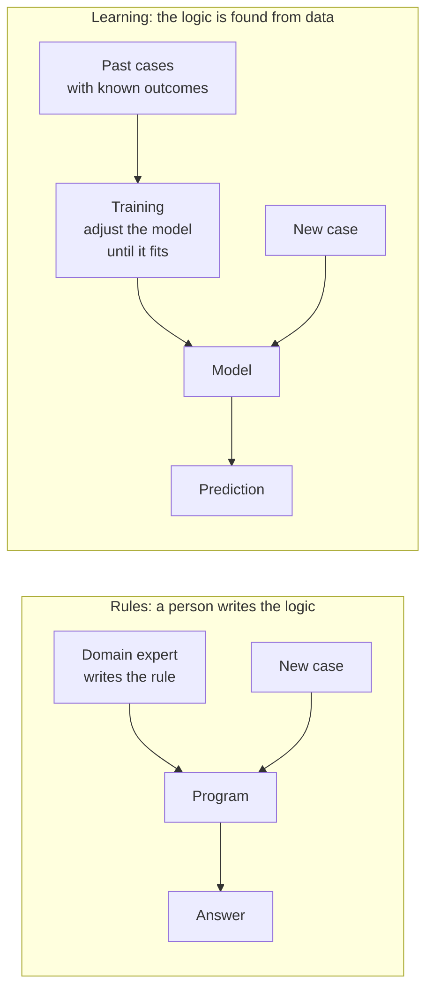

# What machine learning is, and when to use it

*Part of [Machine learning for the product and technology leader](./README.md)*

*Last reviewed: 2026-10 · Volatility: medium*

## TL;DR

A normal program follows rules a person wrote. A machine learning (ML) program finds its
own rules from examples. You show it past cases with known outcomes. It adjusts itself
until its answers match those outcomes. Then it applies what it found to new cases.

Tom Mitchell gave the classic definition in 1997. A program learns from experience if its
score on a task improves as it gets more experience. Three words carry the idea: a *task*,
an *experience* (data), and a *score*. If you cannot name all three, you do not have an ML
problem yet.

The core tradeoff is simple to state. Rules are exact, cheap and easy to audit, but you
must write them. A learned model finds patterns you could not write down, but you must feed
it data and test it hard. Most of the work in a real ML project sits in the data and the
testing, not in the model.

> 🎯 **For the product leader**
>
> **Why it matters** — "Add AI" is not a requirement. Behind each such request sits a
> choice between rules, a model trained on your data, and a model someone else already
> trained. The wrong choice costs months.
>
> **What it changes in your decisions** — You ask for a baseline first: the best simple
> rule, or doing nothing. A model must beat the baseline by enough to pay for its data,
> its upkeep and its risk.
>
> **Ask your eng team** — *"What is the best rule we could write in an afternoon, and how
> much better than that is the model?"*
>
> **Risk if ignored** — You fund a model that beats nothing. Or you hand-write rules for a
> problem with a thousand weak signals, and the rules never catch up.

## The mental model: two ways to build a decision



The two sides produce the same kind of thing: an answer for a new case. They differ in
where the logic comes from. On the left, a person decides. On the right, the data decides.
That is why data quality becomes a product concern. The data is now part of the logic.

## Three parts of every learned system

Every ML system has the same three parts. Learn to point at each one.

- **Data.** The past cases. Each case has *features*, the facts you know at prediction
  time, such as how long a customer has subscribed. Many cases also have a *label*, the
  outcome you want to predict, such as "cancelled within 30 days".
- **Model.** A function with adjustable numbers, called *parameters*. A tiny model may have
  two. A large language model (LLM) has billions. The parameters are the "knobs" that
  training sets.
- **Objective.** A score that says how wrong the model is. Training turns the knobs to make
  that score better. The objective is a product decision in disguise. The model will chase
  whatever you score, even if it is not what you meant.

*Training* is the process of setting the parameters. *Inference* is using the finished
model on a new case. Training is slow and costly and happens in advance. Inference is fast
and happens on every request. [What an LLM actually is](../llms/what-is-an-llm.md) shows
the same split at large scale.

## Four ways a machine learns

| Kind | What the data looks like | Example | Where you meet it |
| --- | --- | --- | --- |
| **Supervised** | Cases with labels | Customer history with "cancelled" or "stayed" | Churn, fraud, price and demand forecasts |
| **Unsupervised** | Cases with no labels | Raw purchase logs | Grouping customers into segments, finding outliers |
| **Self-supervised** | The data supplies its own labels | Text where the model predicts the next word | The first stage of training a language model |
| **Reinforcement** | A score for actions over time | A reward for winning a game | Game play, robotics, tuning a model with human feedback |

Most business ML is supervised. It needs labels, and labels cost money: someone must record
the outcome, and the outcome must arrive. A churn label does not exist until 30 days pass.
This delay shapes the whole project.

A language model is trained mostly by self-supervised learning. No one hand-labels each
sentence, because the next word in a real text is the label. That is why such models could
grow so large. The labels were free. Later stages add human-written examples and feedback.
[LLMs](../llms/README.md) covers that path.

## Rules, a trained model, or an LLM

Three tools solve problems that look alike. Use a short test to pick one.

| If the situation is... | Reach for | Why |
| --- | --- | --- |
| The logic fits on a page and rarely changes | **Rules** | Exact, cheap, easy to audit and explain |
| Many weak signals, recorded outcomes, structured data, a score or a category as the answer | **A model trained on your data** | It finds weights no one could write by hand |
| Free text, images or speech, no labelled history, wording that varies | **A pre-trained model such as an LLM**, steered by prompts or retrieval | It already learned language or vision at scale. You do not have the data to repeat that |
| High stakes and a duty to explain every decision | **Rules first.** A model may advise, with a person deciding | Auditability is a feature you can lose |

Four questions sort a new problem.

1. **Can you write the rule?** If an expert can state it in a page, write it.
2. **Do you have the outcomes?** A trained model needs many past cases with known results.
   If you have none, you may need a pre-trained model, or a way to collect them first.
3. **What does a wrong answer cost, and can a person check it?** A wrong movie suggestion
   costs a click. A wrong credit decision costs a customer and may breach a law.
4. **Will the world change under it?** A model trained on last year's customers can fail on
   this year's. [Lesson 7](./ml-in-production.md) covers this.

Google's *Rules of Machine Learning*, written by engineer Martin Zinkevich, opens with
Rule 1: do not be afraid to launch a product without machine learning. The reasoning is
practical. ML needs data. Without good data, a model often loses to simple heuristics. A
rule also gives you a baseline, and a baseline is how you learn whether a model was worth
building.

For the choice between prompting, retrieval and fine-tuning once you have decided to use
an LLM, see [Prompting vs. RAG vs. fine-tuning](../llms/prompting-vs-rag-vs-finetuning.md)
and [Build, buy, or fine-tune](../generative-ai/build-buy-or-fine-tune.md). This lesson sits
one step earlier. It asks whether the problem needs a learned model at all.

## Worked example: a rule, a learned rule, and doing nothing

*This example is invented. The data is generated by code with a fixed seed. It is not
real customer data.*

A subscription company wants to predict which customers will cancel in the next 30 days.
About 18% of customers cancel. We have 4,000 customers: 3,000 to learn from and 1,000 held
back for testing.

We compare three approaches, using one score called **balanced accuracy**. It is the
average of two rates: the share of cancelling customers we catch, and the share of staying
customers we leave alone. A program that does nothing scores 50%, the same as a coin flip.
Plain accuracy would score "do nothing" at about 82%, which hides the problem. Lesson 5
explains why.

| Approach | Where the logic came from | Balanced accuracy |
| --- | --- | --- |
| Do nothing (predict that nobody cancels) | No logic at all | 50.0% |
| Hand-written rule: "3 or more support tickets in 90 days" | A product manager's instinct | 58.9% |
| Learned rule: the best single yes-or-no cut found by search | The data | 59.7% |

The learned rule picked the same column the manager picked, tickets in the last 90 days.
It chose "2 or more" in place of "3 or more". It beat the hand-written rule by under one
point. On this problem, a single rule teaches us little.

That is the lesson. ML does not win by finding a cleverer cut on one column. It wins when
many weak signals must be combined. Lesson 3 trains a model that combines four columns. It
scores 67.4% on the same test. The extra 8.5 points over the hand rule come from combining
signals. You would never write that rule by hand, because the weights have no natural round
numbers. One caution: we generated this data from a weighted sum of four columns. So
combining them was bound to win here. On your own data, the baseline is how you find out.

The baseline did its job. It told us a single column was nearly worthless and that the
payoff was in combination. A team that skipped the baseline would not know what its model
bought.

## Tradeoffs and decisions

- **Rules vs. a model.** Rules cost engineering time up front and again at every change. A
  model costs data, training, testing and monitoring. Rules win when the logic is stable and
  small. Models win when signals are many, weak and shifting.
- **Build vs. buy.** A pre-trained model, reached by an API, gives results in days. Your own
  model gives control over data and cost per call. Use a pre-trained model when the task is
  language or vision. Build your own when you have unique data and a stable, repeated task.
- **Accuracy vs. explainability.** The most accurate model is often the hardest to explain.
  Lesson 6 gives the options.
- **Time to first value vs. time to trust.** A prototype takes days. A model you can run
  without watching it takes quarters. Plan both.

## Failure modes

- **ML where a rule would do.** The team builds a model for logic one analyst could write
  in an hour. Upkeep and risk arrive. The gain does not.
- **No baseline.** The model scores 80% and nobody knows if that is good, because nobody
  scored the simple rule.
- **No labels, or labels that arrive too late.** The team starts without a plan to record
  outcomes. The first usable label arrives after the budget ends.
- **The objective is not the goal.** The model is scored on clicks, and the product wanted
  satisfied customers. The model finds more clicks and fewer satisfied customers.
- **A model treated as finished.** It launches and nobody owns it. [Lesson 7](./ml-in-production.md)
  shows how it decays.

## Under the hood

The smallest learner is a search. This function tries every column, every cut point and
both directions, and keeps the rule with the best score. The program is the search. The
rule is what it found. The file is `machine-learning/code/lesson1_rules_vs_learning.py`.

```python
def learn_stump(rows, labels):
    best = (-1, None)
    for f in range(len(rows[0])):                      # every column
        for cut in sorted({r[f] for r in rows}):       # every cut point seen in the data
            for sign in (1, -1):                       # "at least" and "at most"
                pred = [1 if sign * (r[f] - cut) >= 0 else 0 for r in rows]
                score = balanced_accuracy(pred, labels)
                if score > best[0]:
                    best = (score, (f, cut, sign))
    return best[1]
```

Real training does the same thing in spirit: define a score, search for the parameters that
improve it, and stop. The search differs. A decision stump can try every option. A model
with millions of parameters cannot, so it follows the slope of the score, as
[lesson 3](./training-loss-and-gradient-descent.md) shows. Three habits matter to an
engineer here.

- **Score on rows the model never saw.** The score above uses the 1,000 held-back rows.
  [Lesson 2](./data-features-labels-and-leakage.md) explains why this is not optional.
- **Fix the random seed.** Every number in this module can be reproduced. Do the same in
  your own experiments, so a change in score means a change in the model.
- **Run the baseline in the same harness.** The do-nothing and hand-written rules use the
  same scoring function. If the model's harness differs, the comparison is meaningless.

## Practitioner checklist

- [ ] Can we name the task, the data and the score in one sentence each?
- [ ] Have we written and scored the best simple rule or the do-nothing baseline?
- [ ] Do we have recorded outcomes, and how long after an event does each outcome arrive?
- [ ] Have we said what a wrong answer costs, and whether a person can check it?
- [ ] Did we compare rules, a model trained on our data, and a pre-trained model?
- [ ] Is the score we optimize the thing the product actually needs?
- [ ] Does a named person own the model after launch?

## Related lessons

- [Data: features, labels, splits and leakage](./data-features-labels-and-leakage.md) — what
  the model learns from, and how to keep the test honest.
- [Training: loss and gradient descent](./training-loss-and-gradient-descent.md) — how the
  knobs get set.
- [What an LLM actually is](../llms/what-is-an-llm.md) — the same learning loop at very
  large scale.
- [Build, buy, or fine-tune](../generative-ai/build-buy-or-fine-tune.md) — the next
  decision once you choose a pre-trained model.
- [The method (first principles)](../first-principles/the-method.md) — a way to test
  whether the problem is what you think it is.

## Sources

- Mitchell, T. *Machine Learning* (McGraw-Hill, 1997), chapter 1: the definition of a
  program that learns from experience E with respect to a task T and a score P.
- Zinkevich, M. *Rules of Machine Learning: Best Practices for ML Engineering*, Google.
  [developers.google.com/machine-learning/guides/rules-of-ml](https://developers.google.com/machine-learning/guides/rules-of-ml).
  Rule 1 ("Don't be afraid to launch a product without machine learning") and its
  reasoning that ML needs data and that simple heuristics are a strong baseline. Checked
  2026-10 through a search summary, since the page itself was blocked.
- scikit-learn user guide, [Model evaluation](https://scikit-learn.org/stable/modules/model_evaluation.html):
  balanced accuracy as the average of recall on each class. Read from the guide's source
  text in the scikit-learn repository, 2026-10.
- The churn data, the rule, the learned rule and every score are invented. They come from
  `machine-learning/code/` and can be reproduced with
  `python3 machine-learning/code/lesson1_rules_vs_learning.py`.
