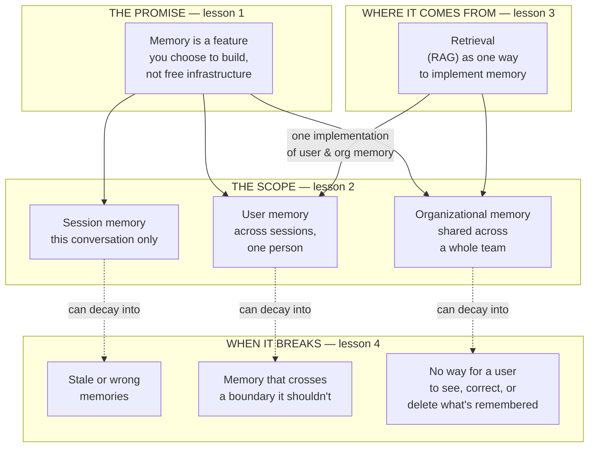

# Memory & context for the product leader

*Part of the [Generative AI family](../GENERATIVE_AI_ROADMAP.md).*

A model remembers nothing between calls. Anything it appears to "remember" — the earlier
turns of a chat, a preference from last week, a company's house style — was put back in
front of it, deliberately, by your product. Whether and how to do that is one of the
highest-leverage product decisions in any AI feature, and it is easy to get backwards:
teams either build no memory at all, forcing users to repeat themselves forever, or build
memory carelessly, and end up with a feature that resurfaces something a user assumed was
forgotten, in front of the wrong audience.

**A note on scope.** The engineering mechanics of context and memory — the context window
as a scarce resource, compaction, offloading, tool-result hygiene, the full memory
hierarchy — are already developed in real depth in two places in this curriculum:
[Context engineering](../content/00-foundations/context-engineering.md) and
[Context & memory](../agentic-ai/context-and-memory.md). Rebuilding that ground here
would only restate it. This module exists instead to answer the question those two
lessons don't lead with: **memory as a product decision** — what to promise a user, what
it costs in trust, and where it fails as a business risk, not just an engineering one.
It's shorter than most modules in this family for exactly that reason: four lessons, not
six, because the honest amount of genuinely new ground is four lessons' worth. For the
broader strategic argument — context engineering as an operating discipline beyond
memory specifically, including specs, governance, and evals — see
[Context engineering for the product leader](../context-engineering/README.md).

## The knowledge graph

Memory is a set of promises your product makes about what it will and won't carry
forward. Every lesson in this module hangs off this picture:

Read it in three passes. **The promise**: memory is something your product decides to
offer, with a cost and a risk attached, not a default a model gives you for free. **The
scope**: memory comes in different shapes — one conversation, one person, one whole
organization — and each shape carries a different product and privacy contract.
**The risk**: every one of those shapes fails in a specific, predictable way, and the
failure is almost always a trust problem before it's a technical one.

## The lessons

- [**Memory as a product decision**](./memory-as-a-product-decision.md) — why offering
  memory at all is a choice with a cost and a promise attached, not free infrastructure.
- [**Session, user & organizational memory**](./session-user-and-organizational-memory.md)
  — the three shapes memory takes, and why each one needs its own answer to "who can see
  this, and for how long."
- [**Retrieval as memory**](./retrieval-as-memory.md) — the bridge between this module and
  [RAG & vector databases](../rag-vector-databases/README.md): fetching relevant knowledge
  at the moment it's needed is one of the most common ways memory actually gets built.
- [**When memory goes wrong**](./when-memory-goes-wrong.md) — staleness, leakage, and the
  right to be forgotten: the trust failures a memory feature has to be designed against
  from day one.

Each lesson pairs the product framing with a **🎯 For the product leader** briefing —
why it matters, the decision it changes, the question to ask your team, and the risk if
ignored — plus a diagram. For the engineering depth behind every mechanic mentioned here,
follow the spokes into [Context engineering](../content/00-foundations/context-engineering.md)
and [Context & memory](../agentic-ai/context-and-memory.md).

**📌 Close out the module:** [Recap & real-world examples](./recap.md).
