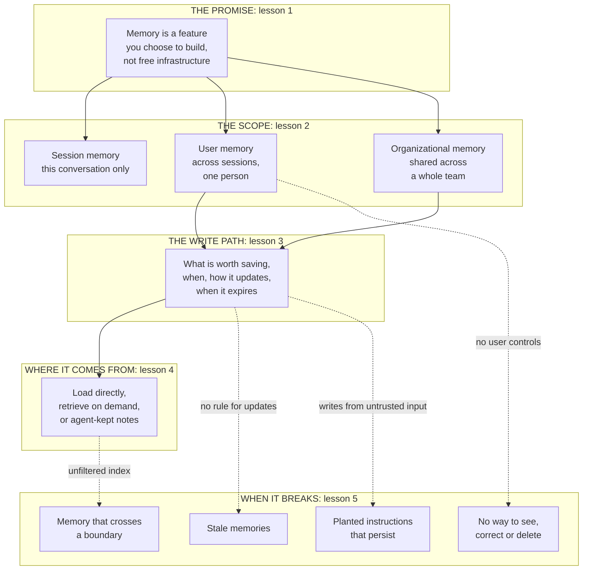

# Memory & context for the product leader

*Part of the [Generative AI family](../GENERATIVE_AI_ROADMAP.md).*

A model remembers nothing between calls. Anything it appears to "remember" — the earlier
turns of a chat, a preference from last week, a company's house style — was put back in
front of it, deliberately, by your product. Whether and how to do that is one of the
highest-leverage product decisions in any AI feature, and it is easy to get backwards:
teams either build no memory at all, forcing users to repeat themselves forever, or build
memory carelessly, and end up with a feature that resurfaces something a user assumed was
forgotten, in front of the wrong audience.

**A note on scope.** The engineering mechanics of context and memory are already covered
in depth in two places: [Context engineering](../content/00-foundations/context-engineering.md)
and [Context & memory](../agentic-ai/context-and-memory.md). They cover the context window
as a scarce resource, compaction, offloading, and the memory hierarchy. This module does
not repeat them. It answers what those lessons do not lead with: **memory as a product
decision**. What do you promise a user? How is a memory written and kept? What does it cost
in trust? Where does it fail as a business risk?

It has five lessons. Four cover the decision and its risks. One, on the write path, covers
ground that no other lesson in this curriculum does. For the wider argument about context
as an operating discipline, including specs, governance and evals, see
[Context engineering for the product leader](../context-engineering/README.md).

## Where the depth lives

Each lesson summarises an idea and points to the lesson that covers it in full.

| If you want the full depth on | Read |
| --- | --- |
| The context window, compaction, offloading | [Context engineering](../content/00-foundations/context-engineering.md) |
| The memory hierarchy for agents | [Context & memory](../agentic-ai/context-and-memory.md) |
| Chunking, embeddings, retrieval quality | [RAG & vector databases](../rag-vector-databases/README.md) |
| Isolating tenants and users | [Multi-tenant isolation](../content/05-safety-multitenancy/multi-tenant-isolation.md) |
| Prompt injection and defences | [Safety, security & governance](../agentic-ai/safety-security-and-governance.md) |
| Owning shared context across features | [Context governance at scale](../context-engineering/context-governance-at-scale.md) |

## The knowledge graph

Memory is a set of promises your product makes about what it will and will not carry
forward. Every lesson hangs off this picture:

```mermaid
flowchart TB
  subgraph PROMISE["THE PROMISE: lesson 1"]
    DECIDE["Memory is a feature<br/>you choose to build,<br/>not free infrastructure"]
  end
  subgraph SCOPE["THE SCOPE: lesson 2"]
    SESSION["Session memory<br/>this conversation only"]
    USER["User memory<br/>across sessions,<br/>one person"]
    ORG["Organizational memory<br/>shared across<br/>a whole team"]
  end
  subgraph WRITE["THE WRITE PATH: lesson 3"]
    WORTH["What is worth saving,<br/>when, how it updates,<br/>when it expires"]
  end
  subgraph SOURCE["WHERE IT COMES FROM: lesson 4"]
    RETRIEVE["Load directly,<br/>retrieve on demand,<br/>or agent-kept notes"]
  end
  subgraph RISK["WHEN IT BREAKS: lesson 5"]
    STALE["Stale memories"]
    LEAK["Memory that crosses<br/>a boundary"]
    NODELETE["No way to see,<br/>correct or delete"]
    POISON["Planted instructions<br/>that persist"]
  end
  DECIDE --> SESSION & USER & ORG
  USER --> WORTH
  ORG --> WORTH
  WORTH --> RETRIEVE
  WORTH -.->|"no rule for updates"| STALE
  RETRIEVE -.->|"unfiltered index"| LEAK
  USER -.->|"no user controls"| NODELETE
  WORTH -.->|"writes from untrusted input"| POISON
```

Read it in four passes. **The promise**: memory is something your product decides to
offer, with a cost and a risk. **The scope**: one conversation, one person, or a whole
organization, each with a different contract. **The write and read paths**: how memory
gets in, and how it comes back. **The risk**: every shape fails in a predictable way, and
the failure is usually a trust problem before it is a technical one.

## The lessons

- [**Memory as a product decision**](./memory-as-a-product-decision.md) — why offering
  memory is a choice with a cost and a promise, and the four-part question that scopes it.
- [**Session, user & organizational memory**](./session-user-and-organizational-memory.md)
  — the three shapes, and why each needs its own answer to "who sees this, and for how
  long?"
- [**Writing and maintaining memory**](./writing-and-maintaining-memory.md) — what is
  worth saving, when to save it, how new facts replace old ones, and when memories expire.
- [**Retrieval as memory**](./retrieval-as-memory.md) — the three designs (load, retrieve,
  keep notes) and how to choose. Bridges to [RAG](../rag-vector-databases/README.md).
- [**When memory goes wrong**](./when-memory-goes-wrong.md) — staleness, leakage, the
  right to be forgotten, and poisoning, with a test for each.

Each lesson has a **🎯 For the product leader** briefing, a labelled worked example, an
"Under the hood" section for engineers, and a Sources list.

**📌 Close out the module:** [Recap & real-world examples](./recap.md), which ends with a
self-test.
