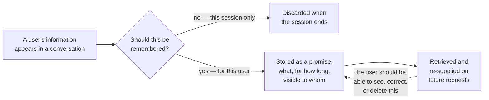

# Memory as a product decision

*Part of [Memory & context for the product leader](./README.md)*

## TL;DR

A model has no memory of its own. Every time it seems to remember something — what you
said five minutes ago, a preference from your last visit — your product engineered that
by putting the relevant information back in front of it. Memory, in an AI product, is
never free infrastructure that comes with the model. It is a feature your team builds,
with a real engineering cost, a real ongoing storage and privacy cost, and a real promise
made to the user about what will and won't be carried forward. Framing it this way changes
the first question a product leader should ask about any AI feature: not "does it have
memory?" but "have we decided, on purpose, what this feature should remember, for whom,
and for how long — and does our product actually deliver on that decision?"

> 🎯 **For the product leader**
>
> **Why it matters** — Memory is one of the few AI capabilities that reads as "magic" to
> users when it works and as a genuine trust violation when it works in a way nobody
> intended. Both outcomes come from the same underlying mechanism; only the product
> decision around it differs.
>
> **What it changes in your decisions** — You treat "should this feature remember
> anything, and what" as an explicit product spec, with an owner and a written answer —
> not an emergent property of whatever the engineering team happened to wire up.
>
> **Ask yourself** — *"If a user asked us, in plain language, 'what do you remember about
> me, and for how long,' could we give them a true, specific answer today?"*
>
> **Risk if ignored** — A feature either frustrates users by forgetting things they
> reasonably expected it to keep, or unsettles them by remembering things they assumed
> were forgotten — and nobody on the team can say which behavior was actually intended.

## The mental model: a promise, not a switch

"Memory" is not a single feature you turn on. It's closer to a set of specific promises:
*this* detail will carry forward within a conversation, *that* detail will carry forward
across visits, *this other* detail never leaves the current session. Each promise has a
cost (engineering to build it, storage to hold it, a burden to keep it accurate) and a
risk (privacy exposure, staleness, the discomfort of being remembered too well). Treating
memory as a bundle of specific promises, rather than one on/off capability, is what turns
a vague feature request into something a team can actually design and test.

## Why this needs a deliberate answer, not a default

Two default failure patterns show up constantly, and both trace back to memory being
treated as an afterthought rather than a spec. **The goldfish product** — nothing is ever
remembered, so a user re-explains their situation every single time, and a feature that
could feel personal instead feels indifferent. **The oversharing product** — everything a
user ever said gets stored and resurfaced indiscriminately, including things the user
would never have expected to persist, and the first time that surfaces at the wrong
moment, the trust cost is far larger than the convenience the memory ever bought. Neither
extreme is a technical failure. Both are the predictable result of nobody deciding, on
purpose, what should be remembered.

## The question that actually scopes the feature

Before any engineering work starts, a memory feature needs an honest answer to four parts
of one question: **what** specifically gets remembered (a preference, a fact, a whole
transcript), **for whom** (this user only, everyone on their team, no one — session only),
**for how long** (forever, until explicitly cleared, on a rolling expiry), and **who can
see or edit it** (only the user, an admin, nobody but the system). A feature that can
answer all four specifically is ready to build. A feature where the answer to any of them
is "we'll figure that out later" is not — and "we'll figure it out later" is exactly how
oversharing and goldfish products both get built.

## Why users notice this more than most AI behavior

Most AI quality problems are graded on a curve — a slightly awkward summary or an
imperfect answer is forgiven as "the AI being the AI." Memory failures are graded
differently, because they read as personal. Being remembered correctly feels like being
understood; being remembered incorrectly, or having something resurface that felt private,
feels like a violation, not a bug. This asymmetry is why memory deserves more product
rigor per feature than most AI capabilities get, even though the underlying engineering —
covered in full in [Context engineering](../content/00-foundations/context-engineering.md)
and [Context & memory](../agentic-ai/context-and-memory.md) — is the same discipline
behind any AI feature's context management.

## Failure modes

- **No decision, by default** — shipping a feature where memory behavior emerged from
  implementation details, with no one able to state what was actually promised to users.
- **The goldfish product** — remembering nothing, forcing users to repeat themselves every
  session, when a specific, scoped memory would have removed real friction.
- **The oversharing product** — storing and resurfacing everything indiscriminately, with
  no visible boundary a user could anticipate.
- **A promise with no owner** — a memory feature that exists in the product but has no one
  accountable for what it stores, how long, or whether it's still accurate.

## Practitioner checklist

- [ ] For each AI feature: can we state specifically what it remembers, for whom, for how
      long, and who can see or edit it?
- [ ] Is there a named owner for the memory feature's behavior, not just its
      implementation?
- [ ] Have we tested what a user would actually experience if they asked "what do you
      remember about me"?
- [ ] Have we deliberately chosen where on the spectrum — nothing remembered, everything
      remembered — each feature sits, rather than inheriting a default?

## Related lessons

- [Session, user & organizational memory](./session-user-and-organizational-memory.md) —
  the three shapes this decision actually takes.
- [Context & memory](../agentic-ai/context-and-memory.md) — the engineering-depth spoke
  on memory hierarchy and context engineering.
- [When memory goes wrong](./when-memory-goes-wrong.md) — what happens when this decision
  is skipped.
